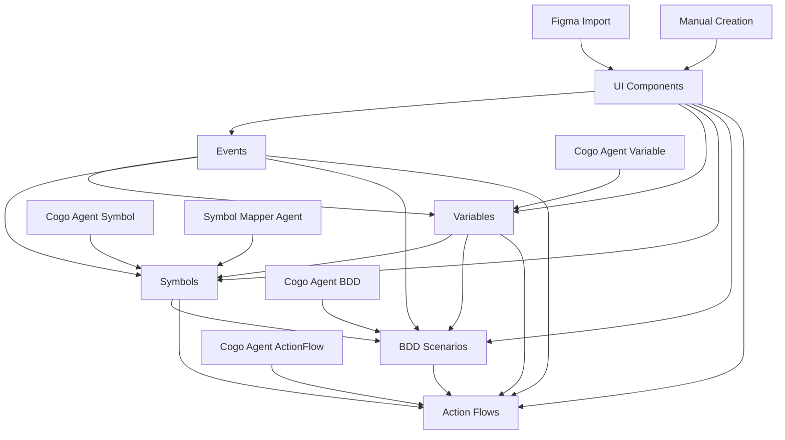

# CreateGo System - Event Management & Development Flow

## Event Management

Events are configured through the IDE and stored in component options:

```json
{
  "text": "Button",
  "events": {
    "onTap": {
      "payload": null,
      "metadata": null,
      "eventType": "onTap",
      "description": null,
      "actionFlowId": null,
      "eventActionId": "onTapLogin"
    }
  },
  "fontSize": 16,
  "fontFamily": "Roboto",
  "isRightIcon": false,
  "isFilledButton": true
}
```

**Supported Event Types:**
- `onTap`
- `onLongPress`

## Development Flow - Step by Step

### Step 1: UI Creation
- **Context needed**: None
- **Process**: 
  1. User creates components manually OR imports from Figma
  2. Components automatically stored in database
- **Storage**: `components` table

### Step 2: Event Configuration
- **Context needed**: UI components
- **Process**:
  1. User adds events to UI components
  2. Events link to ActionFlows via `actionFlowId`
- **Storage**: `components.options.events` (JSONB field)

### Step 3: Variable Generation
- **Context needed**: UI components + events
- **Process**:
  1. Cogo Agent (Variable) generates suggested variables based on UI + events context
  2. User accepts/rejects suggestions
- **Storage**: `variables` table
- **Reference**: See variable examples in [`variable-data.json`](./variable-data.json)
- **Example**:
```json
{
  "idx": 2,
  "id": 408,
  "created_at": "2025-07-17 16:42:48.440805+00",
  "key": "#_dataAction.auth_login",
  "type": 100,
  "value": [],
  "project_id": 145,
  "is_list": false,
  "scope": "dataAction",
  "symbol_id": null,
  "object_value": "{\"id\": \"#_dataAction.auth_login\", \"body\": {\"email\": \"#loginId\", \"password\": \"#loginPwd\"}, \"label\": \"auth-login\", \"method\": \"POST\", \"values\": [], \"baseUrl\": \"POST https://raiaiojtwcfuwjgxwzxx.supabase.co\", \"headers\": {\"Content-Type\": \"application/json\", \"Authorization\": \"Bearer {authJwt}\"}, \"endPoint\": \"/functions/v1/auth-login\", \"dataActionType\": \"REST\"}",
  "persisted": false
}
```

### Step 4: Symbol Creation
- **Context needed**: UI components + events + variables
- **Process**:
  1. Cogo Agent (Symbol) generates suggested symbols based on UI + events + variables context
  2. User can map symbols to variables manually
  3. OR use symbol mapper agent for automatic mapping
- **Storage**: `symbols` table
- **Reference**: See symbol examples in [`symbol-data.json`](./symbol-data.json)
- **Example**:
```json
{
  "idx": 0,
  "id": 61,
  "type": "variable",
  "name": "#loginId",
  "tracking_no": "VAR-001",
  "data": "{\"value\": null, \"dataType\": \"string\", \"isRequired\": false, \"boundVariables\": [{\"id\": 404, \"key\": \"#_appData.loginId\", \"type\": 1, \"scope\": \"appData\", \"isList\": false}]}",
  "project_id": 145,
  "created_at": "2025-07-16 09:46:17.68076+00"
}
```

### Step 5: BDD Scenario Generation
- **Context needed**: UI components + events + variables + symbols
- **Process**:
  1. Cogo Agent (BDD) generates Gherkin scenarios based on UI + events + variables + symbols context
  2. User reviews and accepts scenarios
- **Storage**: `bdd_scenarios` table
- **Reference**: See BDD examples in [`bdd-scenarios-data.json`](./bdd-scenarios-data.json)
- **Example**:
```json
{
  "idx": 0,
  "id": 1,
  "created_at": "2025-01-27 10:00:00.000000+00",
  "name": "User Authentication - Login Success",
  "description": "As a user I want to authenticate with valid credentials So that I can access my wallet and manage my accounts",
  "tags": ["authentication", "login", "wallet"],
  "project_id": 145,
  "gherkin_text": "Feature: User Authentication\nAs a user\nI want to authenticate with the system\nSo that I can access my wallet and manage my accounts\n\nScenario: Successful Login\nGiven I am on the login page\nAnd I have valid credentials\nWhen I enter my email \"#loginId\" as \"user@example.com\"\nAnd I enter my password \"#loginPwd\" as \"password123\"\nAnd I click the login button\nThen the system should authenticate me via \"authLogin\" action\nAnd my user data should be saved to \"#user\"\nAnd my wallet data should be saved to \"#wallets\"\nAnd my session should be saved to \"#session\"\nAnd I should be redirected to the home page"
}
```

### Step 6: Action Flow Generation
- **Context needed**: UI components + events + variables + symbols + BDD scenarios
- **Process**:
  1. Cogo Agent (Action Flow) generates action flow logic based on all previous elements as context
  2. User reviews and accepts action flows
- **Storage**: `action_flows` table
- **Reference**: See action flow examples in [`actionflow-data.json`](./actionflow-data.json)
- **Example**:
```json
{
  "idx": 0,
  "id": 216,
  "name": "logintest",
  "is_flow": true,
  "body": "{\"id\": \"\", \"label\": \"\", \"steps\": [{\"id\": \"51ff08f1-898b-4ad4-889c-af23718a0060\", \"label\": \"loginDataShow\", \"params\": {\"title\": \"로그인정보\", \"message\": \"#loginUser.user.id\"}, \"actionId\": \"showPopup\", \"actionType\": \"basic\", \"description\": \"\", \"executionMode\": \"async\"}], \"flowId\": \"\", \"actionId\": \"\", \"description\": \"\", \"executionMode\": \"asyncMode\"}",
  "project_id": 145,
  "description": "",
  "tags": [],
  "symbol_id": null,
  "folder_id": null,
  "is_folder": false
}
```

## Context Flow Diagram



## Database Tables Summary

| Element | Table | Key Field | Context for AI |
|---------|-------|-----------|----------------|
| UI Components | `components` | `options` (JSONB) | Base context for all generations |
| Events | `components.options.events` | N/A | Required for variable generation |
| Variables | `variables` | `key` | Required for symbol generation |
| Symbols | `symbols` | `name` | Required for BDD generation |
| BDD Scenarios | `bdd_scenarios` | `gherkin_text` | Required for action flow generation |
| Action Flows | `action_flows` | `body` (JSONB) | Final output |