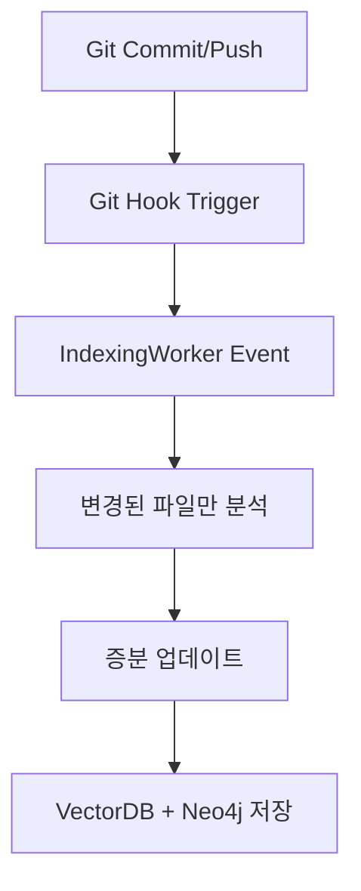
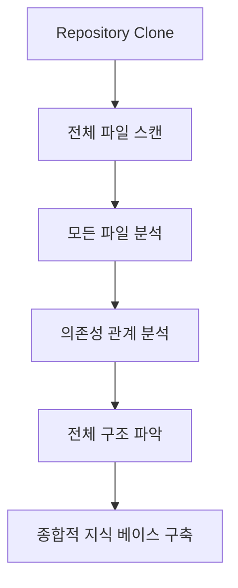

# Git Hooks vs Repository 전체 분석 방법론 비교

## 📋 분석 개요

**작성일**: 2025-08-06  
**분석 대상**: Git Hooks 기반 이벤트 분석 vs Repository 전체 분석  
**목적**: 두 분석 방법론의 차이점과 각각의 장단점 분석  

---

## 🔄 **Git Hooks 기반 이벤트 분석**

### **동작 방식**


### **특징**
- **트리거**: Git Hooks (pre-commit, post-commit, pre-push)
- **범위**: 변경된 파일만 (Incremental Analysis)
- **실행**: 실시간 이벤트 기반
- **목적**: 지식 베이스 실시간 업데이트

### **현재 구현 (IndexingWorker)**
```typescript
// src/agents/cogo-indexing-worker.ts
export class IndexingWorker extends BaseAgent {
  // 1. Git Hook 이벤트 수신
  private async handleIndexingRequest(message: any): Promise<void> {
    if (message.type === 'file_changed') {
      await this.indexSingleFile(message.filePath);
    }
  }

  // 2. 단일 파일 분석
  async indexSingleFile(filePath: string): Promise<void> {
    const fileInfo = await this.scanFileSystem(filePath);
    await this.processFile(fileInfo);
  }

  // 3. 파일 처리 (청킹 + 임베딩)
  private async processFile(fileInfo: FileInfo): Promise<void> {
    // 파일을 청킹하여 벡터 저장
    await this.chunkAndStoreFile(fileInfo);
    
    // AST 분석 (현재는 placeholder)
    if (this.isLanguageSupported(fileInfo.language)) {
      await this.analyzeAndStoreAST(fileInfo);
    }
  }
}
```

### **장점**
- ✅ **실시간성**: 코드 변경 즉시 반영
- ✅ **효율성**: 변경된 파일만 처리
- ✅ **자동화**: Git 워크플로우와 통합
- ✅ **리소스 절약**: 전체 프로젝트 스캔 불필요

### **단점**
- ❌ **부분적 분석**: 전체 컨텍스트 부족
- ❌ **의존성 누락**: 변경되지 않은 관련 파일 분석 안됨
- ❌ **초기 설정 필요**: Git Hooks 설정 필요
- ❌ **이벤트 손실**: Hook 설정 실패 시 분석 누락

---

## 📁 **Repository 전체 분석**

### **동작 방식**


### **특징**
- **트리거**: 수동 요청 또는 스케줄링
- **범위**: 전체 Repository (Comprehensive Analysis)
- **실행**: 배치 처리 기반
- **목적**: 완전한 프로젝트 이해

### **구현 예시**
```typescript
// Repository 전체 분석 시스템
export class RepositoryAnalyzer {
  async analyzeFullRepository(repoPath: string): Promise<AnalysisResult> {
    // 1. 전체 파일 시스템 스캔
    const allFiles = await this.scanEntireRepository(repoPath);
    
    // 2. 파일 간 의존성 분석
    const dependencies = await this.analyzeDependencies(allFiles);
    
    // 3. 프로젝트 구조 분석
    const structure = await this.analyzeProjectStructure(allFiles);
    
    // 4. 전체 컨텍스트에서 코드 분석
    const codeAnalysis = await this.analyzeCodeWithContext(allFiles, dependencies);
    
    // 5. 종합적 지식 그래프 구축
    const knowledgeGraph = await this.buildComprehensiveKnowledgeGraph(
      allFiles, dependencies, structure, codeAnalysis
    );
    
    return {
      files: allFiles,
      dependencies,
      structure,
      codeAnalysis,
      knowledgeGraph
    };
  }
}
```

### **장점**
- ✅ **완전성**: 전체 프로젝트 컨텍스트 파악
- ✅ **의존성 분석**: 파일 간 관계 완전 분석
- ✅ **구조적 이해**: 프로젝트 아키텍처 파악
- ✅ **일관성**: 전체적인 일관된 분석

### **단점**
- ❌ **시간 소요**: 전체 프로젝트 스캔 시간
- ❌ **리소스 집약**: 대용량 프로젝트 처리 부담
- ❌ **실시간성 부족**: 즉시 반영되지 않음
- ❌ **비용**: 전체 분석 비용

---

## 🔍 **방법론적 차이점 분석**

### **1. 분석 범위 (Scope)**

| 구분 | Git Hooks | Repository 전체 |
|------|-----------|-----------------|
| **범위** | 변경된 파일만 | 전체 프로젝트 |
| **깊이** | 파일 단위 | 프로젝트 단위 |
| **컨텍스트** | 제한적 | 완전한 컨텍스트 |
| **의존성** | 직접적 의존성만 | 전체 의존성 그래프 |

### **2. 실행 방식 (Execution)**

| 구분 | Git Hooks | Repository 전체 |
|------|-----------|-----------------|
| **트리거** | 이벤트 기반 | 수동/스케줄링 |
| **실행** | 실시간 | 배치 처리 |
| **빈도** | 매번 변경 시 | 주기적/요청 시 |
| **지연시간** | 즉시 | 분석 시간만큼 |

### **3. 데이터 처리 (Data Processing)**

| 구분 | Git Hooks | Repository 전체 |
|------|-----------|-----------------|
| **처리 방식** | 증분 업데이트 | 전체 재처리 |
| **저장 방식** | 추가/수정 | 전체 교체 |
| **일관성** | 부분적 | 완전한 일관성 |
| **복구** | 어려움 | 용이함 |

### **4. 성능 특성 (Performance)**

| 구분 | Git Hooks | Repository 전체 |
|------|-----------|-----------------|
| **응답 시간** | 빠름 (초 단위) | 느림 (분-시간 단위) |
| **리소스 사용** | 낮음 | 높음 |
| **확장성** | 높음 | 제한적 |
| **안정성** | 이벤트 의존 | 독립적 |

---

## 🎯 **사용 시나리오별 권장사항**

### **Git Hooks 기반 분석이 적합한 경우**
- ✅ **개발 중 실시간 피드백** 필요
- ✅ **소규모-중간 규모** 프로젝트
- ✅ **빠른 응답 시간** 중요
- ✅ **Git 워크플로우** 중심 개발
- ✅ **리소스 제약** 환경

### **Repository 전체 분석이 적합한 경우**
- ✅ **프로젝트 초기 설정** 시
- ✅ **대규모 프로젝트** 분석
- ✅ **완전한 아키텍처 이해** 필요
- ✅ **의존성 관계 완전 분석** 필요
- ✅ **정기적인 전체 검토** 필요

---

## 🔧 **하이브리드 접근 방안**

### **최적의 조합**
```typescript
export class HybridAnalysisSystem {
  // 1. 초기 전체 분석
  async initializeRepository(repoPath: string): Promise<void> {
    console.log('🚀 Initial comprehensive repository analysis...');
    const fullAnalysis = await this.repositoryAnalyzer.analyzeFullRepository(repoPath);
    await this.knowledgeBase.initialize(fullAnalysis);
  }

  // 2. Git Hooks 기반 증분 업데이트
  async handleGitEvent(event: GitEvent): Promise<void> {
    console.log('📝 Handling Git event for incremental update...');
    const changes = await this.detectChanges(event);
    await this.incrementalAnalyzer.processChanges(changes);
  }

  // 3. 주기적 전체 재분석
  async scheduleFullReanalysis(): Promise<void> {
    setInterval(async () => {
      console.log('🔄 Scheduled full repository reanalysis...');
      await this.initializeRepository(this.repoPath);
    }, 24 * 60 * 60 * 1000); // 24시간마다
  }
}
```

### **하이브리드 시스템의 장점**
- ✅ **초기 완전성**: 전체 분석으로 완전한 이해
- ✅ **실시간성**: Git Hooks로 즉시 반영
- ✅ **일관성**: 주기적 전체 재분석으로 일관성 유지
- ✅ **효율성**: 증분 업데이트로 리소스 절약

---

## 📊 **성능 비교 분석**

### **처리 시간 비교**
```
Git Hooks (증분):
├── 파일 변경 감지: 1ms
├── 단일 파일 분석: 100-500ms
├── 벡터 저장: 50-200ms
└── 총 시간: 151-701ms

Repository 전체:
├── 파일 스캔: 1-10초
├── 전체 파일 분석: 10-300초
├── 의존성 분석: 5-60초
├── 지식 그래프 구축: 10-120초
└── 총 시간: 26-490초
```

### **메모리 사용량 비교**
```
Git Hooks (증분):
├── 단일 파일 로드: 1-10MB
├── 임베딩 생성: 50-200MB
├── 벡터 저장: 10-50MB
└── 총 메모리: 61-260MB

Repository 전체:
├── 전체 파일 로드: 100MB-2GB
├── 의존성 그래프: 50-500MB
├── 지식 그래프: 100MB-1GB
└── 총 메모리: 250MB-3.5GB
```

---

## 🚀 **결론 및 권장사항**

### **현재 상황 분석**
- **IndexingWorker**: Git Hooks 기반 증분 분석 구현됨
- **하이브리드 파싱**: Repository 전체 분석 기능 필요
- **통합 필요**: 두 방식을 조합한 하이브리드 시스템

### **개발 우선순위**
1. **Phase 1**: Repository 전체 분석 시스템 구현
2. **Phase 2**: 기존 IndexingWorker와 통합
3. **Phase 3**: 하이브리드 분석 시스템 완성
4. **Phase 4**: 성능 최적화 및 모니터링

### **최종 권장사항**
**하이브리드 접근 방식**을 채택하여:
- **초기 설정**: Repository 전체 분석으로 완전한 이해
- **개발 중**: Git Hooks 기반 증분 업데이트
- **정기적**: 전체 재분석으로 일관성 유지

이를 통해 **완전성**과 **실시간성**을 모두 확보할 수 있습니다.

---

**작성자**: COGO Agent (AI Assistant)  
**작성일**: 2025-08-06  
**상태**: 📋 분석 완료 - 개발 계획 수립 준비 