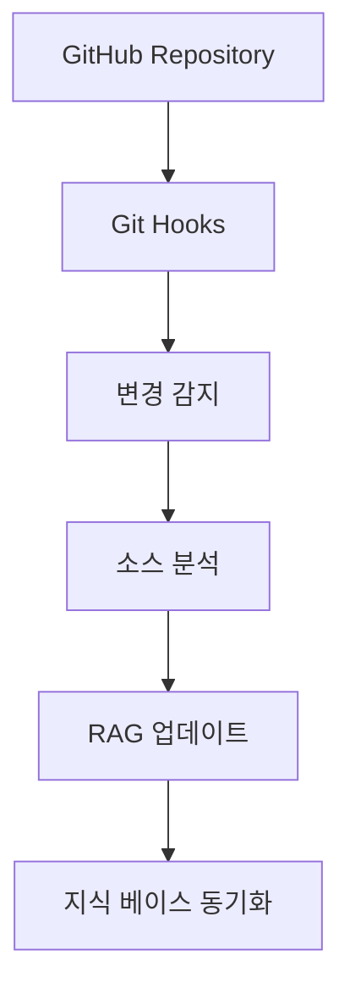

# Single Source of Truth: GitHub + Git 정보 RAG 통합

## 📋 개요

**작성일**: 2025-08-06  
**목적**: Single Source of Truth 유지를 위한 GitHub 소스 관리와 Git 정보 추적  
**핵심**: RAG 시스템에 프로젝트 정보와 Git 정보 통합  

---

## 🎯 **Single Source of Truth의 핵심 요소**

### **1. 소스 변경 추적 (Source Change Tracking)**


### **2. 버전 관리 통합 (Version Control Integration)**
- **Git Commit History**: 모든 변경사항 추적
- **Branch Management**: 브랜치별 상태 관리
- **Merge Tracking**: 병합 이력 및 충돌 해결
- **Tag Management**: 릴리스 버전 관리

### **3. 프로젝트 메타데이터 (Project Metadata)**
- **Repository 정보**: URL, 설명, 라이선스
- **Contributor 정보**: 개발자, 기여도
- **Issue/PR 정보**: 문제점, 개선사항
- **Release 정보**: 버전, 변경사항

---

## 🔧 **Git 정보 RAG 통합 스키마**

### **1. Git 정보 저장 테이블 (Supabase)**

```sql
-- Git Repository 정보 테이블
CREATE TABLE IF NOT EXISTS git_repositories (
    id UUID DEFAULT gen_random_uuid() PRIMARY KEY,
    repo_url VARCHAR(500) UNIQUE NOT NULL,
    repo_name VARCHAR(255) NOT NULL,
    description TEXT,
    language VARCHAR(100),
    framework VARCHAR(100),
    license VARCHAR(100),
    stars INTEGER DEFAULT 0,
    forks INTEGER DEFAULT 0,
    last_commit_hash VARCHAR(40),
    last_commit_date TIMESTAMP WITH TIME ZONE,
    branch_count INTEGER DEFAULT 0,
    contributor_count INTEGER DEFAULT 0,
    metadata JSONB DEFAULT '{}',
    created_at TIMESTAMP WITH TIME ZONE DEFAULT NOW(),
    updated_at TIMESTAMP WITH TIME ZONE DEFAULT NOW()
);

-- Git Commit 정보 테이블
CREATE TABLE IF NOT EXISTS git_commits (
    id UUID DEFAULT gen_random_uuid() PRIMARY KEY,
    repo_id UUID REFERENCES git_repositories(id) ON DELETE CASCADE,
    commit_hash VARCHAR(40) NOT NULL,
    author_name VARCHAR(255) NOT NULL,
    author_email VARCHAR(255),
    commit_date TIMESTAMP WITH TIME ZONE NOT NULL,
    commit_message TEXT NOT NULL,
    files_changed INTEGER DEFAULT 0,
    lines_added INTEGER DEFAULT 0,
    lines_deleted INTEGER DEFAULT 0,
    branch_name VARCHAR(255),
    parent_hashes VARCHAR(40)[],
    metadata JSONB DEFAULT '{}',
    created_at TIMESTAMP WITH TIME ZONE DEFAULT NOW()
);

-- Git 파일 변경 정보 테이블
CREATE TABLE IF NOT EXISTS git_file_changes (
    id UUID DEFAULT gen_random_uuid() PRIMARY KEY,
    commit_id UUID REFERENCES git_commits(id) ON DELETE CASCADE,
    file_path VARCHAR(1000) NOT NULL,
    change_type VARCHAR(20) NOT NULL, -- 'added', 'modified', 'deleted', 'renamed'
    old_path VARCHAR(1000),
    lines_added INTEGER DEFAULT 0,
    lines_deleted INTEGER DEFAULT 0,
    file_size_before INTEGER,
    file_size_after INTEGER,
    language VARCHAR(50),
    complexity_change JSONB,
    created_at TIMESTAMP WITH TIME ZONE DEFAULT NOW()
);

-- Git Branch 정보 테이블
CREATE TABLE IF NOT EXISTS git_branches (
    id UUID DEFAULT gen_random_uuid() PRIMARY KEY,
    repo_id UUID REFERENCES git_repositories(id) ON DELETE CASCADE,
    branch_name VARCHAR(255) NOT NULL,
    is_default BOOLEAN DEFAULT false,
    is_protected BOOLEAN DEFAULT false,
    last_commit_hash VARCHAR(40),
    last_commit_date TIMESTAMP WITH TIME ZONE,
    ahead_count INTEGER DEFAULT 0,
    behind_count INTEGER DEFAULT 0,
    created_at TIMESTAMP WITH TIME ZONE DEFAULT NOW(),
    updated_at TIMESTAMP WITH TIME ZONE DEFAULT NOW()
);

-- Git Issue/PR 정보 테이블
CREATE TABLE IF NOT EXISTS git_issues (
    id UUID DEFAULT gen_random_uuid() PRIMARY KEY,
    repo_id UUID REFERENCES git_repositories(id) ON DELETE CASCADE,
    issue_number INTEGER NOT NULL,
    issue_type VARCHAR(20) NOT NULL, -- 'issue', 'pull_request'
    title VARCHAR(500) NOT NULL,
    description TEXT,
    state VARCHAR(20) NOT NULL, -- 'open', 'closed', 'merged'
    author_name VARCHAR(255),
    assignees VARCHAR(255)[],
    labels VARCHAR(100)[],
    created_at TIMESTAMP WITH TIME ZONE,
    updated_at TIMESTAMP WITH TIME ZONE,
    closed_at TIMESTAMP WITH TIME ZONE,
    metadata JSONB DEFAULT '{}'
);

-- Git 정보 벡터 저장 테이블
CREATE TABLE IF NOT EXISTS git_knowledge_vectors (
    id UUID DEFAULT gen_random_uuid() PRIMARY KEY,
    repo_id UUID REFERENCES git_repositories(id) ON DELETE CASCADE,
    content_type VARCHAR(50) NOT NULL, -- 'commit_message', 'issue_description', 'file_content'
    content TEXT NOT NULL,
    embedding vector(1536),
    metadata JSONB DEFAULT '{}',
    created_at TIMESTAMP WITH TIME ZONE DEFAULT NOW()
);

-- 인덱스 생성
CREATE INDEX IF NOT EXISTS idx_git_commits_repo_hash ON git_commits(repo_id, commit_hash);
CREATE INDEX IF NOT EXISTS idx_git_file_changes_commit ON git_file_changes(commit_id);
CREATE INDEX IF NOT EXISTS idx_git_branches_repo ON git_branches(repo_id);
CREATE INDEX IF NOT EXISTS idx_git_issues_repo_number ON git_issues(repo_id, issue_number);
CREATE INDEX IF NOT EXISTS idx_git_knowledge_vectors_embedding ON git_knowledge_vectors USING hnsw (embedding vector_cosine_ops);
```

### **2. Git 정보 그래프 모델 (Neo4j)**

```cypher
// Repository 노드
CREATE (r:Repository {
  id: $repoId,
  name: $repoName,
  url: $repoUrl,
  description: $description,
  language: $language,
  framework: $framework,
  stars: $stars,
  forks: $forks,
  lastCommitHash: $lastCommitHash,
  lastCommitDate: $lastCommitDate
});

// Commit 노드
CREATE (c:Commit {
  id: $commitId,
  hash: $commitHash,
  message: $commitMessage,
  authorName: $authorName,
  authorEmail: $authorEmail,
  commitDate: $commitDate,
  filesChanged: $filesChanged,
  linesAdded: $linesAdded,
  linesDeleted: $linesDeleted
});

// Branch 노드
CREATE (b:Branch {
  id: $branchId,
  name: $branchName,
  isDefault: $isDefault,
  isProtected: $isProtected,
  lastCommitHash: $lastCommitHash
});

// Issue/PR 노드
CREATE (i:Issue {
  id: $issueId,
  number: $issueNumber,
  type: $issueType,
  title: $title,
  description: $description,
  state: $state,
  authorName: $authorName,
  createdAt: $createdAt,
  updatedAt: $updatedAt
});

// File 노드
CREATE (f:File {
  id: $fileId,
  path: $filePath,
  language: $language,
  size: $size,
  complexity: $complexity
});

// 관계 정의
CREATE (r:Repository)-[:HAS_COMMIT]->(c:Commit);
CREATE (r:Repository)-[:HAS_BRANCH]->(b:Branch);
CREATE (r:Repository)-[:HAS_ISSUE]->(i:Issue);
CREATE (c:Commit)-[:CHANGES_FILE]->(f:File);
CREATE (c:Commit)-[:ON_BRANCH]->(b:Branch);
CREATE (c:Commit)-[:PARENT_OF]->(child:Commit);
CREATE (i:Issue)-[:REFERENCES_FILE]->(f:File);
CREATE (i:Issue)-[:RELATES_TO]->(other:Issue);

// 인덱스 생성
CREATE INDEX FOR (r:Repository) ON (r.name, r.language);
CREATE INDEX FOR (c:Commit) ON (c.hash, c.commitDate);
CREATE INDEX FOR (b:Branch) ON (b.name);
CREATE INDEX FOR (i:Issue) ON (i.number, i.state);
CREATE INDEX FOR (f:File) ON (f.path, f.language);
```

---

## 🔄 **Git 정보 수집 및 동기화 시스템**

### **1. Git 정보 수집기 (Git Information Collector)**

```typescript
// src/services/GitInformationCollector.ts
export class GitInformationCollector {
  private gitService: GitService;
  private knowledgeManager: IntegratedKnowledgeManager;
  
  constructor() {
    this.gitService = new GitService();
    this.knowledgeManager = new IntegratedKnowledgeManager();
  }

  /**
   * Repository 전체 정보 수집
   */
  async collectRepositoryInfo(repoUrl: string): Promise<RepositoryInfo> {
    console.log(`🔍 Collecting repository information: ${repoUrl}`);
    
    const repoInfo = await this.gitService.getRepositoryInfo(repoUrl);
    
    // 1. 기본 Repository 정보 저장
    await this.saveRepositoryInfo(repoInfo);
    
    // 2. Commit 히스토리 수집
    const commits = await this.gitService.getCommitHistory(repoUrl);
    await this.saveCommitHistory(repoInfo.id, commits);
    
    // 3. Branch 정보 수집
    const branches = await this.gitService.getBranchInfo(repoUrl);
    await this.saveBranchInfo(repoInfo.id, branches);
    
    // 4. Issue/PR 정보 수집
    const issues = await this.gitService.getIssuesAndPRs(repoUrl);
    await this.saveIssueInfo(repoInfo.id, issues);
    
    // 5. RAG 시스템에 통합
    await this.integrateWithRAG(repoInfo, commits, branches, issues);
    
    return repoInfo;
  }

  /**
   * Git 이벤트 기반 실시간 업데이트
   */
  async handleGitEvent(event: GitEvent): Promise<void> {
    console.log(`📝 Handling Git event: ${event.type}`);
    
    switch (event.type) {
      case 'push':
        await this.handlePushEvent(event);
        break;
      case 'pull_request':
        await this.handlePullRequestEvent(event);
        break;
      case 'issue':
        await this.handleIssueEvent(event);
        break;
      case 'commit':
        await this.handleCommitEvent(event);
        break;
    }
  }

  /**
   * RAG 시스템 통합
   */
  private async integrateWithRAG(
    repoInfo: RepositoryInfo,
    commits: CommitInfo[],
    branches: BranchInfo[],
    issues: IssueInfo[]
  ): Promise<void> {
    // 1. Commit 메시지를 RAG에 저장
    for (const commit of commits) {
      await this.knowledgeManager.storeKnowledge(
        commit.message,
        {
          type: 'git_commit',
          repoId: repoInfo.id,
          commitHash: commit.hash,
          author: commit.authorName,
          date: commit.commitDate,
          filesChanged: commit.filesChanged,
          storeInVector: true,
          storeInGraph: true
        }
      );
    }

    // 2. Issue/PR 설명을 RAG에 저장
    for (const issue of issues) {
      await this.knowledgeManager.storeKnowledge(
        `${issue.title}\n\n${issue.description}`,
        {
          type: 'git_issue',
          repoId: repoInfo.id,
          issueNumber: issue.number,
          issueType: issue.type,
          state: issue.state,
          author: issue.authorName,
          storeInVector: true,
          storeInGraph: true
        }
      );
    }

    // 3. Repository 메타데이터를 RAG에 저장
    await this.knowledgeManager.storeKnowledge(
      `Repository: ${repoInfo.name}\nDescription: ${repoInfo.description}\nLanguage: ${repoInfo.language}\nFramework: ${repoInfo.framework}`,
      {
        type: 'git_repository',
        repoId: repoInfo.id,
        repoUrl: repoInfo.url,
        language: repoInfo.language,
        framework: repoInfo.framework,
        storeInVector: true,
        storeInGraph: true
      }
    );
  }
}
```

### **2. Git 웹훅 핸들러 (Git Webhook Handler)**

```typescript
// src/services/GitWebhookHandler.ts
export class GitWebhookHandler {
  private gitCollector: GitInformationCollector;
  private indexingWorker: IndexingWorker;
  
  constructor() {
    this.gitCollector = new GitInformationCollector();
    this.indexingWorker = new IndexingWorker();
  }

  /**
   * GitHub Webhook 처리
   */
  async handleGitHubWebhook(payload: any, eventType: string): Promise<void> {
    console.log(`📡 Received GitHub webhook: ${eventType}`);
    
    switch (eventType) {
      case 'push':
        await this.handlePushWebhook(payload);
        break;
      case 'pull_request':
        await this.handlePullRequestWebhook(payload);
        break;
      case 'issues':
        await this.handleIssuesWebhook(payload);
        break;
      case 'create':
        await this.handleCreateWebhook(payload);
        break;
      case 'delete':
        await this.handleDeleteWebhook(payload);
        break;
    }
  }

  /**
   * Push 이벤트 처리
   */
  private async handlePushWebhook(payload: any): Promise<void> {
    const { repository, commits, ref } = payload;
    
    // 1. Git 정보 업데이트
    await this.gitCollector.handleGitEvent({
      type: 'push',
      repoUrl: repository.html_url,
      branch: ref.replace('refs/heads/', ''),
      commits: commits,
      timestamp: new Date()
    });

    // 2. 변경된 파일 인덱싱
    const changedFiles = this.extractChangedFiles(commits);
    for (const file of changedFiles) {
      await this.indexingWorker.indexSingleFile(file);
    }
  }

  /**
   * Pull Request 이벤트 처리
   */
  private async handlePullRequestWebhook(payload: any): Promise<void> {
    const { repository, pull_request, action } = payload;
    
    await this.gitCollector.handleGitEvent({
      type: 'pull_request',
      repoUrl: repository.html_url,
      prNumber: pull_request.number,
      action: action,
      title: pull_request.title,
      description: pull_request.body,
      author: pull_request.user.login,
      timestamp: new Date()
    });
  }
}
```

---

## 🔍 **Git 정보 기반 RAG 검색**

### **1. Git 컨텍스트 검색 (Git Context Search)**

```typescript
// src/services/GitContextSearch.ts
export class GitContextSearch {
  private knowledgeManager: IntegratedKnowledgeManager;
  private gitService: GitService;

  constructor() {
    this.knowledgeManager = new IntegratedKnowledgeManager();
    this.gitService = new GitService();
  }

  /**
   * Git 히스토리 기반 코드 검색
   */
  async searchCodeWithGitContext(query: string, repoUrl?: string): Promise<SearchResult> {
    console.log(`🔍 Searching code with Git context: ${query}`);
    
    // 1. 기본 코드 검색
    const codeResults = await this.knowledgeManager.searchKnowledge({
      content: query,
      type: 'code',
      context: { domain: 'git', maxResults: 10 }
    });

    // 2. Git 컨텍스트 정보 추가
    const enrichedResults = await this.enrichWithGitContext(codeResults, repoUrl);

    return enrichedResults;
  }

  /**
   * Commit 히스토리 기반 변경 추적
   */
  async trackChangesInFile(filePath: string, repoUrl: string): Promise<ChangeHistory> {
    const commits = await this.gitService.getFileCommitHistory(repoUrl, filePath);
    
    const changeHistory: ChangeHistory = {
      filePath,
      totalCommits: commits.length,
      firstCommit: commits[commits.length - 1],
      lastCommit: commits[0],
      contributors: this.extractContributors(commits),
      changeFrequency: this.calculateChangeFrequency(commits),
      complexityEvolution: this.trackComplexityEvolution(commits, filePath)
    };

    return changeHistory;
  }

  /**
   * Issue/PR 기반 코드 영향도 분석
   */
  async analyzeCodeImpact(issueNumber: number, repoUrl: string): Promise<ImpactAnalysis> {
    const issue = await this.gitService.getIssue(repoUrl, issueNumber);
    const relatedCommits = await this.gitService.getIssueRelatedCommits(repoUrl, issueNumber);
    
    const impactAnalysis: ImpactAnalysis = {
      issueNumber,
      title: issue.title,
      description: issue.description,
      affectedFiles: this.extractAffectedFiles(relatedCommits),
      contributors: this.extractContributors(relatedCommits),
      timeline: this.buildTimeline(issue, relatedCommits),
      complexity: this.analyzeComplexityImpact(relatedCommits)
    };

    return impactAnalysis;
  }
}
```

### **2. Git 메타데이터 기반 검색 쿼리**

```typescript
// Git 정보를 활용한 고급 검색 쿼리
export class GitEnhancedSearch {
  /**
   * 특정 개발자가 작성한 코드 검색
   */
  async searchByAuthor(authorName: string, query: string): Promise<SearchResult> {
    return await this.knowledgeManager.searchKnowledge({
      content: query,
      type: 'all',
      context: {
        gitAuthor: authorName,
        maxResults: 20
      }
    });
  }

  /**
   * 특정 브랜치의 코드 검색
   */
  async searchByBranch(branchName: string, query: string): Promise<SearchResult> {
    return await this.knowledgeManager.searchKnowledge({
      content: query,
      type: 'all',
      context: {
        gitBranch: branchName,
        maxResults: 15
      }
    });
  }

  /**
   * 특정 기간의 변경사항 검색
   */
  async searchByDateRange(startDate: Date, endDate: Date, query: string): Promise<SearchResult> {
    return await this.knowledgeManager.searchKnowledge({
      content: query,
      type: 'all',
      context: {
        gitDateRange: { start: startDate, end: endDate },
        maxResults: 25
      }
    });
  }
}
```

---

## 📊 **Single Source of Truth 유지 전략**

### **1. 데이터 일관성 보장**

```typescript
// src/services/GitDataConsistency.ts
export class GitDataConsistency {
  /**
   * Git 정보와 RAG 시스템 동기화
   */
  async synchronizeGitWithRAG(repoUrl: string): Promise<SyncResult> {
    const startTime = Date.now();
    const syncResult: SyncResult = {
      success: false,
      syncedCommits: 0,
      syncedIssues: 0,
      syncedFiles: 0,
      errors: [],
      duration: 0
    };

    try {
      // 1. Git에서 최신 정보 수집
      const gitInfo = await this.collectLatestGitInfo(repoUrl);
      
      // 2. RAG 시스템과 비교
      const ragInfo = await this.getRAGGitInfo(repoUrl);
      
      // 3. 차이점 식별 및 업데이트
      const differences = this.identifyDifferences(gitInfo, ragInfo);
      
      // 4. 증분 업데이트 수행
      for (const diff of differences) {
        await this.applyDifference(diff);
        syncResult.syncedCommits += diff.commits?.length || 0;
        syncResult.syncedIssues += diff.issues?.length || 0;
        syncResult.syncedFiles += diff.files?.length || 0;
      }

      syncResult.success = true;
      syncResult.duration = Date.now() - startTime;

    } catch (error) {
      syncResult.errors.push(error.message);
    }

    return syncResult;
  }

  /**
   * 데이터 무결성 검증
   */
  async validateDataIntegrity(repoUrl: string): Promise<IntegrityReport> {
    const gitInfo = await this.collectLatestGitInfo(repoUrl);
    const ragInfo = await this.getRAGGitInfo(repoUrl);
    
    const integrityReport: IntegrityReport = {
      totalCommits: gitInfo.commits.length,
      syncedCommits: ragInfo.commits.length,
      syncRate: (ragInfo.commits.length / gitInfo.commits.length) * 100,
      missingCommits: this.findMissingCommits(gitInfo.commits, ragInfo.commits),
      outdatedData: this.findOutdatedData(gitInfo, ragInfo),
      recommendations: this.generateRecommendations(gitInfo, ragInfo)
    };

    return integrityReport;
  }
}
```

### **2. 실시간 동기화 모니터링**

```typescript
// src/monitoring/GitSyncMonitor.ts
export class GitSyncMonitor {
  private syncInterval: NodeJS.Timeout | null = null;
  private lastSyncTime: Date | null = null;
  private syncStats: SyncStats = {
    totalSyncs: 0,
    successfulSyncs: 0,
    failedSyncs: 0,
    averageSyncTime: 0,
    lastError: null
  };

  /**
   * 실시간 동기화 시작
   */
  startRealtimeSync(repoUrl: string, intervalMinutes: number = 5): void {
    console.log(`🔄 Starting real-time Git sync for: ${repoUrl}`);
    
    this.syncInterval = setInterval(async () => {
      try {
        const startTime = Date.now();
        await this.performSync(repoUrl);
        
        this.syncStats.totalSyncs++;
        this.syncStats.successfulSyncs++;
        this.syncStats.averageSyncTime = 
          (this.syncStats.averageSyncTime + (Date.now() - startTime)) / 2;
        
        this.lastSyncTime = new Date();
        
      } catch (error) {
        this.syncStats.failedSyncs++;
        this.syncStats.lastError = error.message;
        console.error('❌ Git sync failed:', error);
      }
    }, intervalMinutes * 60 * 1000);
  }

  /**
   * 동기화 상태 모니터링
   */
  getSyncStatus(): SyncStatus {
    return {
      isRunning: this.syncInterval !== null,
      lastSyncTime: this.lastSyncTime,
      stats: this.syncStats,
      nextSyncTime: this.calculateNextSyncTime()
    };
  }
}
```

---

## 🚀 **구현 로드맵**

### **Phase 1: Git 정보 수집 시스템 (1주)**
- [ ] Git API 클라이언트 구현
- [ ] Repository 정보 수집기 구현
- [ ] Commit 히스토리 수집기 구현
- [ ] Issue/PR 정보 수집기 구현

### **Phase 2: RAG 통합 시스템 (1주)**
- [ ] Git 정보 벡터 저장 구현
- [ ] Git 정보 그래프 모델 구현
- [ ] Git 컨텍스트 검색 구현
- [ ] Git 메타데이터 기반 검색 구현

### **Phase 3: 웹훅 및 실시간 동기화 (1주)**
- [ ] GitHub 웹훅 핸들러 구현
- [ ] 실시간 동기화 시스템 구현
- [ ] 데이터 일관성 검증 구현
- [ ] 동기화 모니터링 구현

### **Phase 4: 고급 검색 및 분석 (1주)**
- [ ] Git 히스토리 기반 코드 검색
- [ ] 변경 추적 및 영향도 분석
- [ ] 개발자 기여도 분석
- [ ] 코드 품질 트렌드 분석

---

## 📈 **성공 지표**

### **기술적 지표**
- [ ] Git 정보 수집 정확도: 99.9% 이상
- [ ] RAG 동기화 지연시간: 5분 이내
- [ ] 검색 응답 시간: 2초 이내
- [ ] 데이터 일관성: 100%

### **사용성 지표**
- [ ] Git 컨텍스트 검색 정확도: 95% 이상
- [ ] 개발자 만족도: 4.5/5.0 이상
- [ ] 코드 이해도 향상: 30% 이상
- [ ] 개발 생산성 향상: 25% 이상

---

## 🎯 **결론**

GitHub 소스 관리와 Git 정보 추적을 RAG 시스템에 통합함으로써 **진정한 Single Source of Truth**를 구현할 수 있습니다. 이를 통해:

- ✅ **완전한 소스 변경 추적**: 모든 변경사항 실시간 반영
- ✅ **버전 관리 통합**: Git 히스토리와 코드 분석 연동
- ✅ **프로젝트 컨텍스트**: Repository 메타데이터 활용
- ✅ **개발자 인사이트**: 기여도 및 영향도 분석
- ✅ **코드 품질 관리**: 변경 이력 기반 품질 추적

이 시스템은 COGO Agent Core의 **지능형 코드 분석 및 생성** 능력을 크게 향상시킬 것입니다.

---

**작성자**: COGO Agent (AI Assistant)  
**작성일**: 2025-08-06  
**상태**: 📋 설계 완료 - 구현 준비 