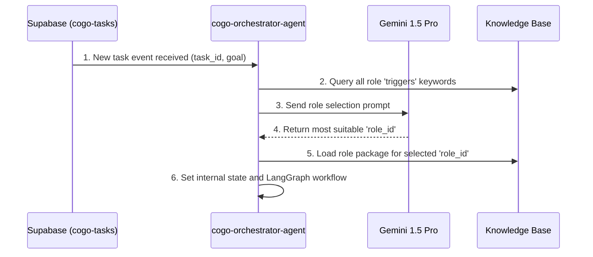

# COGO Role Package Implementation Plan
## Prerequisite Development for cogo-orchestrator-agent

---

## Executive Summary

This document outlines the implementation plan for the Role Package system, which is a critical prerequisite for the cogo-orchestrator-agent. The Role Package system enables the orchestrator to dynamically transform into specialized expert roles based on task requirements, making it a true intelligent "meta-agent."

### Key Objectives
1. **Priority 1**: Define Role Package schema and implement basic packages
2. **Priority 2**: Develop role selection mechanism for cogo-orchestrator-agent
3. **Deliverable**: Fully functional role-based orchestrator agent

---

## Priority 1: Role Package Specification and Basic Implementation

### 1.1 Role Package Standard Schema (JSON Schema)

All role packages follow the standard JSON structure below and are stored in the knowledge base (e.g., JSONB column in RDB).

```json
{
  "$schema": "http://json-schema.org/draft-07/schema#",
  "title": "COGO Role Package",
  "type": "object",
  "properties": {
    "role_id": {
      "type": "string",
      "description": "Unique identifier for the role (e.g., 'CodeGeneration', 'CodeAnalysis')"
    },
    "description": {
      "type": "string",
      "description": "Description of the role's purpose and capabilities"
    },
    "triggers": {
      "type": "array",
      "description": "Keywords or task types that activate this role",
      "items": { "type": "string" }
    },
    "rag_queries": {
      "type": "object",
      "description": "RAG query templates specialized for this role",
      "properties": {
        "pgvector_query": {
          "type": "string",
          "description": "pgvector query template for semantic search. Uses {{goal}} variable."
        },
        "neo4j_cypher": {
          "type": "string",
          "description": "Cypher query template for relationship analysis. Uses {{entities}} variable."
        }
      }
    },
    "expert_prompt_template": {
      "type": "string",
      "description": "Prompt template to make LLM think like an expert in this role"
    },
    "langgraph_workflow": {
      "type": "object",
      "description": "LangGraph workflow definition for this role (JSON/YAML format)"
    }
  },
  "required": ["role_id", "description", "expert_prompt_template", "langgraph_workflow"]
}
```

### 1.2 Basic Role Package Implementation Examples

#### A. CodeGeneration Role Package
**Description**: Specialized role for generating new code or files. Emphasizes "design-first" principle.

```json
{
  "role_id": "CodeGeneration",
  "description": "Generates new code, components, API endpoints, etc. Follows design-implement-validate workflow.",
  "triggers": ["create", "generate", "build", "make", "add new"],
  "rag_queries": {
    "pgvector_query": "Find similar code patterns and templates related to: {{goal}}",
    "neo4j_cypher": "MATCH (f:Function)-[:REFERENCES]->(m:DataModel) WHERE f.name IN {{entities}} RETURN m.name, m.attributes"
  },
  "expert_prompt_template": "You are an expert software architect working within the COGO Agent System. Your task is to design a robust and scalable solution for the following goal. First, define the shared interfaces (Blueprint). Then, create a plan to generate the necessary code files for the cogo-executor-agent.\n\n## Goal:\n{{goal}}\n\n## Relevant Context from Knowledge Base:\n{{rag_context}}",
  "langgraph_workflow": {
    "start": "design_blueprint",
    "nodes": {
      "design_blueprint": {"action": "generate_shared_interface"},
      "generate_code": {"action": "delegate_to_executor_for_codegen"},
      "validate_code": {"action": "delegate_to_executor_for_validation"},
      "integrate": {"action": "delegate_to_executor_for_integration"}
    },
    "edges": [
      {"from": "design_blueprint", "to": "generate_code"},
      {"from": "generate_code", "to": "validate_code"},
      {"from": "validate_code", "to": "integrate", "condition": "validation_passed"},
      {"from": "validate_code", "to": "design_blueprint", "condition": "validation_failed"}
    ]
  }
}
```

#### B. CodeAnalysis Role Package
**Description**: Role for analyzing existing code, evaluating quality, and suggesting improvements.

```json
{
  "role_id": "CodeAnalysis",
  "description": "Analyzes existing code to identify bugs, vulnerabilities, and areas for improvement.",
  "triggers": ["analyze", "review", "find bugs", "refactor", "improve"],
  "rag_queries": {
    "pgvector_query": "Find rules and refactoring strategies related to code smells found in: {{goal}}",
    "neo4j_cypher": "MATCH (f:Function {name: {{entity}}})-[r]->(n) RETURN type(r) as relationship, n.name as target"
  },
  "expert_prompt_template": "You are a senior principal engineer with 20 years of experience. Analyze the following code based on our knowledge base and provide a detailed report on its quality, potential issues, and specific recommendations for improvement. The results will be used by the cogo-orchestrator-agent for further actions.\n\n## Code to Analyze:\n```\n{{code_context}}\n```\n\n## Relevant Rules and Patterns from Knowledge Base:\n{{rag_context}}",
  "langgraph_workflow": {
    "start": "fetch_code",
    "nodes": {
      "fetch_code": {"action": "delegate_to_executor_for_git_read"},
      "analyze_structure": {"action": "query_neo4j_for_relations"},
      "find_smells": {"action": "delegate_to_executor_for_static_analysis"},
      "generate_report": {"action": "call_llm_for_analysis"}
    },
    "edges": [
      {"from": "fetch_code", "to": "analyze_structure"},
      {"from": "analyze_structure", "to": "find_smells"},
      {"from": "find_smells", "to": "generate_report"}
    ]
  }
}
```

---

## Priority 2: Role Selection Mechanism Development

### 2.1 Workflow



### 2.2 Implementation Goals and Approach

#### Goal 1: Task Intent Analysis and Role Selection Logic

**Implementation**: Implement `select_role_for_task(task)` function in **cogo-orchestrator-agent**.

**Process**:
1. Function first retrieves all role packages' `role_id` and `triggers` lists from knowledge base
2. Generate role selection prompt as shown below and call Gemini 1.5 Pro
3. Confirm the `role_id` returned by LLM (e.g., "CodeGeneration") as the final selected role

**Role Selection Prompt Template**:
```
You are an expert system dispatcher for the COGO Agent System. Your task is to select the most appropriate role to handle a user's request.

Here are the available roles and their trigger keywords:
---
{{available_roles_json}}
---

Analyze the following user's goal and respond with ONLY the JSON object for the best matching role.

## User Goal:
"{{user_goal}}"

## Response JSON:
{"selected_role_id": "..."}
```

#### Goal 2: Dynamic Role Package Loading and Application Mechanism

**Implementation**: Implement `load_and_apply_role(role_id)` function in **cogo-orchestrator-agent**.

**Process**:
1. Function uses the selected `role_id` to retrieve the complete role package JSON from knowledge base
2. Use the retrieved `langgraph_workflow` definition to dynamically create or configure LangGraph instance
3. Store `expert_prompt_template` and `rag_queries` in agent's internal state (memory) for use during workflow execution

---

## Implementation Timeline

### Week 1: Role Package Schema and Basic Packages
**Duration**: 5 days  
**Deliverables**:
- Role Package JSON schema definition
- CodeGeneration role package implementation
- CodeAnalysis role package implementation
- Database schema for role package storage

**Key Tasks**:
- [ ] Define and validate JSON schema
- [ ] Implement CodeGeneration role package
- [ ] Implement CodeAnalysis role package
- [ ] Set up database storage for role packages
- [ ] Create role package validation system

### Week 2: Role Selection Mechanism
**Duration**: 5 days  
**Deliverables**:
- Role selection function implementation
- Dynamic role loading mechanism
- Integration with cogo-orchestrator-agent

**Key Tasks**:
- [ ] Implement `select_role_for_task()` function
- [ ] Implement `load_and_apply_role()` function
- [ ] Integrate with Gemini 1.5 Pro API
- [ ] Test role selection accuracy
- [ ] Implement error handling and fallback mechanisms

---

## Technical Requirements

### Database Schema
```sql
-- Role packages table
CREATE TABLE role_packages (
    id UUID PRIMARY KEY DEFAULT gen_random_uuid(),
    role_id TEXT UNIQUE NOT NULL,
    package_data JSONB NOT NULL,
    version TEXT NOT NULL DEFAULT '1.0.0',
    is_active BOOLEAN DEFAULT true,
    created_at TIMESTAMP DEFAULT CURRENT_TIMESTAMP,
    updated_at TIMESTAMP DEFAULT CURRENT_TIMESTAMP
);

-- Index for efficient role lookup
CREATE INDEX idx_role_packages_role_id ON role_packages(role_id);
CREATE INDEX idx_role_packages_active ON role_packages(is_active);
```

### API Endpoints
```typescript
// Get all available roles
GET /api/v2/roles
Response: {
  "roles": [
    {
      "role_id": "CodeGeneration",
      "description": "Generates new code, components, API endpoints...",
      "triggers": ["create", "generate", "build", "make", "add new"]
    }
  ]
}

// Get specific role package
GET /api/v2/roles/{role_id}
Response: {
  "role_id": "CodeGeneration",
  "package_data": { /* complete role package JSON */ }
}

// Create or update role package
POST /api/v2/roles
Request: {
  "role_id": "CodeGeneration",
  "package_data": { /* role package JSON */ }
}
```

---

## Success Criteria

### Functional Requirements
- [ ] Role packages can be stored and retrieved from knowledge base
- [ ] Role selection accurately identifies appropriate role for given task
- [ ] Dynamic role loading successfully configures orchestrator agent
- [ ] LangGraph workflows execute correctly for each role

### Performance Requirements
- [ ] Role selection completes within 2 seconds
- [ ] Role package loading completes within 1 second
- [ ] System can handle 100+ role packages without performance degradation

### Quality Requirements
- [ ] 95% accuracy in role selection for test cases
- [ ] All role packages pass JSON schema validation
- [ ] Comprehensive error handling for edge cases

---

## Risk Mitigation

### Technical Risks
1. **LLM Role Selection Accuracy**: Implement fallback to keyword-based selection
2. **LangGraph Workflow Complexity**: Start with simple workflows and gradually increase complexity
3. **Database Performance**: Implement caching for frequently accessed role packages

### Project Risks
1. **Timeline Delays**: Focus on core functionality first, add advanced features later
2. **Integration Issues**: Implement comprehensive testing before integration

---

## Next Steps

Upon successful completion of this Role Package implementation:

1. **Integration Testing**: Test role selection and execution with real tasks
2. **Performance Optimization**: Optimize role selection and loading performance
3. **Additional Role Packages**: Implement more specialized roles (SecurityAnalysis, PerformanceOptimization, etc.)
4. **Main Development Project**: Proceed with the main COGO system development

---

**Document Version**: 1.0  
**Created**: January 31, 2025  
**Next Review**: February 7, 2025  
**Maintained By**: COGO Development Team 