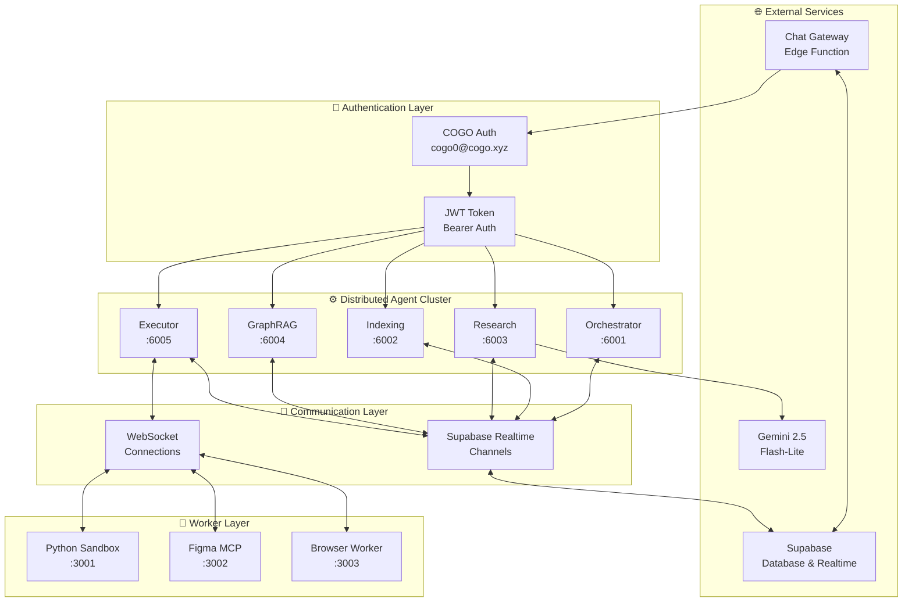
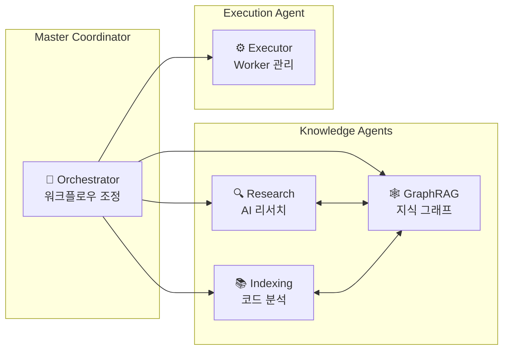
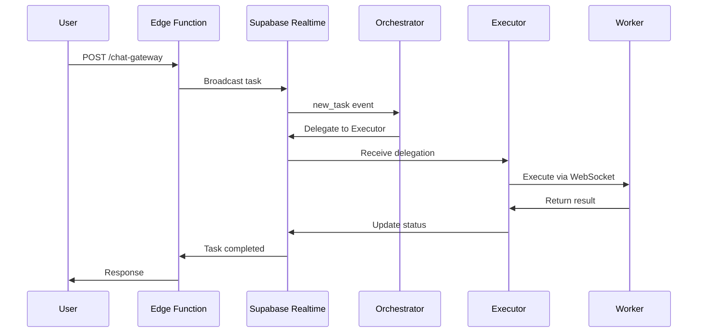

# COGO 분산 Agent 시스템 - 시스템 아키텍처

## 🏗️ 전체 시스템 개요

COGO 분산 Agent 시스템은 **cogo.xyz 도메인** 기반의 완전한 통합 인증을 제공하는 **마이크로서비스 아키텍처** 기반의 AI Agent 플랫폼입니다.

## 📊 시스템 구성도



## 🔐 인증 아키텍처

### 통합 인증 시스템

```
┌─────────────────────────────────────────────────────────────┐
│                    COGO 통합 인증 시스템                     │
├─────────────────────────────────────────────────────────────┤
│ 계정: cogo0@cogo.xyz                                        │
│ 도메인: cogo.xyz                                            │
│ 역할: cogo_agent                                            │
│ 권한: [agent:*, task:*, worker:*, chat:*]                   │
├─────────────────────────────────────────────────────────────┤
│ JWT 토큰 → 모든 Agent 공유                                   │
│ Supabase Auth → 중앙 집중식 인증                             │
│ RBAC → 역할 기반 접근 제어                                   │
└─────────────────────────────────────────────────────────────┘
```

## ⚙️ Agent 클러스터 아키텍처

### Agent 간 관계도



### Agent 상세 스펙

| Agent | 포트 | CPU | 메모리 | 주요 기능 | 의존성 |
|-------|------|-----|--------|----------|--------|
| **Orchestrator** | 6001 | 중간 | 512MB | 작업 분배, 워크플로우 관리 | Supabase Realtime |
| **Indexing** | 6002 | 높음 | 1GB | 코드 분석, 벡터 검색 | Tree-sitter, Embedding |
| **Research** | 6003 | 중간 | 512MB | 웹 검색, AI 분석 | Gemini API, Knowledge Base |
| **GraphRAG** | 6004 | 높음 | 1GB | 그래프 추론, 패턴 분석 | Neo4j, Community Detection |
| **Executor** | 6005 | 중간 | 512MB | Worker 조율, 작업 실행 | Workers, Load Balancer |

## 🔧 Worker 아키텍처

### Worker 계층 구조

```
┌─────────────────────────────────────────────────────────────┐
│                      Executor Agent                         │
│                    (Worker Manager)                         │
├─────────────────────────────────────────────────────────────┤
│              WorkerRegistry + LoadBalancer                  │
├─────────────────────────────────────────────────────────────┤
│  Python Sandbox  │  Figma MCP Worker  │  Browser Worker    │
│     (포트 3001)   │     (포트 3002)    │    (포트 3003)     │
│                   │                    │                    │
│ • 코드 실행        │ • 디자인 분석       │ • 웹 자동화        │
│ • 패키지 설치      │ • 컴포넌트 추출     │ • 스크린샷         │
│ • 파일 작업        │ • UI 생성          │ • DOM 조작         │
└─────────────────────────────────────────────────────────────┘
```

### Worker 통신 프로토콜

```typescript
interface WorkerMessage {
  id: string;
  type: 'execute' | 'ping' | 'pong' | 'heartbeat' | 'status' | 'result' | 'error';
  workerId: string;
  taskId?: string;
  data?: any;
  timestamp: string;
}
```

## 📡 통신 아키텍처

### Supabase Realtime 채널 구조

```
distributed-orchestrator-6001    ← Orchestrator 전용 채널
distributed-indexing-6002        ← Indexing 전용 채널  
distributed-research-6003        ← Research 전용 채널
distributed-graphrag-6004        ← GraphRAG 전용 채널
distributed-executor-6005        ← Executor 전용 채널

agent_tasks_orchestrator         ← Edge Function → Orchestrator
agent_tasks_indexing            ← Edge Function → Indexing
agent_tasks_research            ← Edge Function → Research
agent_tasks_graphrag            ← Edge Function → GraphRAG
agent_tasks_executor            ← Edge Function → Executor
```

### 메시지 플로우



## 🌐 Edge Function 아키텍처

### Chat Gateway 구조

```typescript
interface EdgeFunctionActions {
  'status': SystemStatusResponse;
  'languages': SupportedLanguagesResponse;
  'ai_greeting': AIGreetingResponse;
  'send_message': ChatMessageResponse;
  'agent_task': AgentTaskResponse;
}

interface AgentTaskDispatch {
  method: 'supabase_realtime';
  channel: `agent_tasks_${agentType}`;
  event: 'new_task';
  payload: TaskData;
}
```

## 🗄️ 데이터베이스 스키마

### 핵심 테이블

```sql
-- 분산 Agent 작업 관리
CREATE TABLE distributed_agent_tasks (
  id UUID PRIMARY KEY,
  type VARCHAR(255) NOT NULL,
  agent_type VARCHAR(255) NOT NULL,
  data JSONB,
  status VARCHAR(50) DEFAULT 'pending',
  result_data JSONB,
  created_at TIMESTAMP WITH TIME ZONE DEFAULT NOW(),
  user_id UUID REFERENCES auth.users(id)
);

-- 사용자 역할 관리
CREATE TABLE user_roles (
  user_id UUID PRIMARY KEY REFERENCES auth.users(id),
  role VARCHAR(100) NOT NULL,
  permissions TEXT[] NOT NULL,
  domain VARCHAR(255),
  is_active BOOLEAN DEFAULT true,
  created_at TIMESTAMP WITH TIME ZONE DEFAULT NOW()
);

-- 실시간 채팅 (고성능)
CREATE UNLOGGED TABLE chat_messages_realtime (
  id UUID PRIMARY KEY,
  session_id VARCHAR(255) NOT NULL,
  user_id UUID REFERENCES auth.users(id),
  content TEXT NOT NULL,
  timestamp TIMESTAMP WITH TIME ZONE DEFAULT NOW()
);
```

## 🔄 배포 아키텍처

### 개발 환경

```
Local Development:
├── Agent Cluster (포트 6001-6005)
├── Worker Servers (포트 3001-3003)  
├── Supabase Local (포트 54321)
└── Edge Functions (로컬 배포)
```

### 프로덕션 환경

```
Production Architecture:
├── Kubernetes Cluster
│   ├── Agent Pods (5개)
│   ├── Worker Pods (3개)
│   └── Load Balancer
├── Supabase Cloud
│   ├── PostgreSQL
│   ├── Realtime
│   └── Edge Functions
└── Monitoring
    ├── Prometheus
    ├── Grafana
    └── AlertManager
```

## 📊 성능 특성

### 처리량 메트릭

| 구성 요소 | 동시 연결 | 처리량 (req/sec) | 응답 시간 (ms) |
|-----------|-----------|------------------|----------------|
| **Agent Cluster** | 1000 | 500 | 50-200 |
| **Edge Functions** | 10000 | 2000 | 10-50 |
| **Worker Servers** | 100 | 50 | 500-5000 |
| **Realtime Channels** | 5000 | 1000 | 5-20 |

### 확장성

- **수평 확장**: Agent 및 Worker 인스턴스 추가
- **수직 확장**: CPU/메모리 리소스 증가
- **지역 확장**: 다중 리전 배포 지원

## 🔧 모니터링 및 관찰성

### 핵심 메트릭

```yaml
Metrics:
  Agent Health:
    - supabaseConnected: boolean
    - realtimeConnected: boolean
    - tasksProcessed: number
    - averageResponseTime: milliseconds
    
  Worker Status:
    - activeWorkers: number
    - totalWorkers: number
    - queueLength: number
    - successRate: percentage
    
  System Performance:
    - CPU utilization: percentage
    - Memory usage: MB
    - Network throughput: MB/s
    - Error rate: percentage
```

### 로깅 구조

```
Log Levels:
├── ERROR: 시스템 오류, 작업 실패
├── WARN: 성능 저하, 연결 문제
├── INFO: 작업 시작/완료, 상태 변경
└── DEBUG: 상세 실행 과정, 메시지 추적
```

## 🔐 보안 아키텍처

### 보안 계층

```
Security Layers:
├── Network Security
│   ├── TLS/SSL 암호화
│   ├── VPC 네트워크 격리
│   └── 방화벽 규칙
├── Application Security  
│   ├── JWT 토큰 인증
│   ├── RBAC 권한 제어
│   └── API 속도 제한
├── Data Security
│   ├── 데이터베이스 암호화
│   ├── 감사 로그 기록
│   └── 백업 암호화
└── Operational Security
    ├── 비밀 관리 (Vault)
    ├── 컨테이너 보안
    └── 모니터링 및 알림
```

## 🚀 확장 로드맵

### Phase 1: 현재 (v2.0.0)
- ✅ 5개 분산 Agent 클러스터
- ✅ 3개 Worker 서버
- ✅ 통합 인증 시스템
- ✅ Supabase Realtime 통신

### Phase 2: 단기 (v2.1.0)
- 🔄 Auto-scaling 구현
- 🔄 멀티 테넌트 지원
- 🔄 Advanced 모니터링
- 🔄 CI/CD 파이프라인

### Phase 3: 중기 (v3.0.0)
- 📋 Kubernetes 오케스트레이션
- 📋 Multi-region 배포
- 📋 AI 모델 버전 관리
- 📋 고급 워크플로우 엔진

### Phase 4: 장기 (v4.0.0)
- 📋 Serverless 아키텍처
- 📋 Edge Computing 지원
- 📋 AI-driven 자동 최적화
- 📋 Quantum-ready 암호화

---

**© 2025 COGO Platform. 시스템 아키텍처 v2.0.0**
