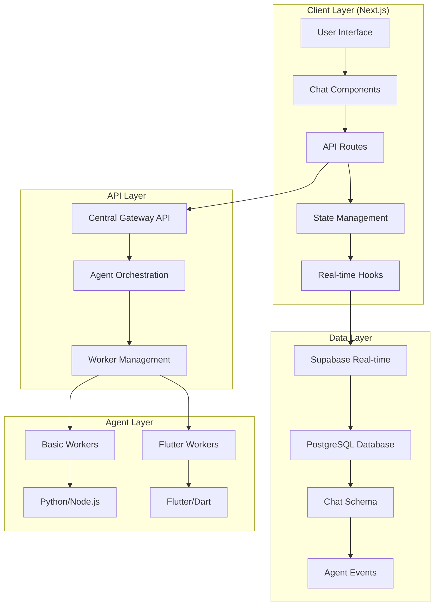

# COGO Client Architecture & Development Plan

## 1. Executive Summary

This document outlines the architecture, design, and development plan for transitioning the existing React-based assistant-ui to a **Next.js (App Router)** foundation while maintaining the core technology stack and integrating with the COGO Agent Core system through the Central Gateway.

## 2. Current State Analysis

### 2.1 Existing Implementation
- ✅ **React 18 + TypeScript** foundation
- ✅ **Tailwind CSS** styling system
- ✅ **React Query** server state management
- ✅ **React Router** routing system
- ✅ **Central Gateway** integration for Flutter operations
- ✅ **Basic monitoring** functionality

### 2.2 Migration Requirements
- 🔄 **Next.js App Router** migration
- 🔄 **Supabase Chat Schema** implementation
- 🔄 **Real-time chat** functionality
- 🔄 **Enhanced Flutter UI** components
- 🔄 **Central Gateway** integration for all agent requests

## 3. Architecture Overview

### 3.1 System Architecture



### 3.2 Technology Stack

| Layer | Technology | Purpose |
|-------|------------|---------|
| **Frontend** | Next.js 14 (App Router) | Modern React framework with SSR/SSG |
| **Styling** | Tailwind CSS | Utility-first CSS framework |
| **State Management** | Zustand + React Query | Client & server state management |
| **Real-time** | Supabase Real-time | Live updates and chat functionality |
| **Database** | Supabase PostgreSQL | Data persistence and real-time subscriptions |
| **API Gateway** | Central Gateway | Unified agent communication |
| **Deployment** | Vercel | Next.js optimized hosting |

## 4. Database Schema Design

### 4.1 Supabase Schema Extensions

```sql
-- Chat Management Schema
CREATE TABLE chat_sessions (
    id UUID PRIMARY KEY DEFAULT gen_random_uuid(),
    user_id UUID REFERENCES auth.users(id),
    title VARCHAR(255) NOT NULL,
    session_type VARCHAR(50) DEFAULT 'general', -- 'general', 'flutter', 'code_generation'
    created_at TIMESTAMP WITH TIME ZONE DEFAULT NOW(),
    updated_at TIMESTAMP WITH TIME ZONE DEFAULT NOW(),
    metadata JSONB DEFAULT '{}'
);

CREATE TABLE chat_messages (
    id UUID PRIMARY KEY DEFAULT gen_random_uuid(),
    session_id UUID REFERENCES chat_sessions(id) ON DELETE CASCADE,
    role VARCHAR(20) NOT NULL CHECK (role IN ('user', 'assistant', 'system', 'agent')),
    content TEXT NOT NULL,
    message_type VARCHAR(50) DEFAULT 'text', -- 'text', 'code', 'file', 'error', 'progress'
    metadata JSONB DEFAULT '{}',
    created_at TIMESTAMP WITH TIME ZONE DEFAULT NOW(),
    parent_message_id UUID REFERENCES chat_messages(id),
    task_id UUID, -- Reference to COGO task if applicable
    agent_id VARCHAR(100) -- Reference to specific agent
);

-- Agent Events for Real-time Updates
CREATE TABLE agent_events (
    id UUID PRIMARY KEY DEFAULT gen_random_uuid(),
    task_id UUID NOT NULL,
    agent_id VARCHAR(100) NOT NULL,
    event_type VARCHAR(50) NOT NULL, -- 'thought', 'action', 'result', 'error', 'progress'
    event_data JSONB NOT NULL,
    created_at TIMESTAMP WITH TIME ZONE DEFAULT NOW(),
    priority INTEGER DEFAULT 0
);

-- Flutter Project Management
CREATE TABLE flutter_projects (
    id UUID PRIMARY KEY DEFAULT gen_random_uuid(),
    session_id UUID REFERENCES chat_sessions(id),
    project_name VARCHAR(255) NOT NULL,
    project_path VARCHAR(500),
    flutter_version VARCHAR(50),
    build_status VARCHAR(50) DEFAULT 'pending',
    build_output JSONB,
    created_at TIMESTAMP WITH TIME ZONE DEFAULT NOW(),
    updated_at TIMESTAMP WITH TIME ZONE DEFAULT NOW()
);

-- Indexes for Performance
CREATE INDEX idx_chat_messages_session_id ON chat_messages(session_id);
CREATE INDEX idx_chat_messages_created_at ON chat_messages(created_at);
CREATE INDEX idx_agent_events_task_id ON agent_events(task_id);
CREATE INDEX idx_agent_events_created_at ON agent_events(created_at);
CREATE INDEX idx_flutter_projects_session_id ON flutter_projects(session_id);

-- Real-time Triggers
ALTER TABLE chat_messages ENABLE ROW LEVEL SECURITY;
ALTER TABLE agent_events ENABLE ROW LEVEL SECURITY;
ALTER TABLE flutter_projects ENABLE ROW LEVEL SECURITY;

-- RLS Policies
CREATE POLICY "Users can view their own chat sessions" ON chat_sessions
    FOR SELECT USING (auth.uid() = user_id);

CREATE POLICY "Users can view their own chat messages" ON chat_messages
    FOR SELECT USING (
        session_id IN (
            SELECT id FROM chat_sessions WHERE user_id = auth.uid()
        )
    );
```

## 5. File Structure

```
cogo-client/
├── app/
│   ├── (auth)/
│   │   ├── login/
│   │   └── register/
│   ├── (dashboard)/
│   │   ├── dashboard/
│   │   │   └── page.tsx
│   │   ├── agents/
│   │   │   └── page.tsx
│   │   ├── flutter/
│   │   │   ├── page.tsx
│   │   │   ├── [projectId]/
│   │   │   │   └── page.tsx
│   │   │   └── components/
│   │   │       ├── FlutterProjectCard.tsx
│   │   │       ├── FlutterBuildForm.tsx
│   │   │       └── FlutterConsole.tsx
│   │   └── settings/
│   │       └── page.tsx
│   ├── chat/
│   │   ├── [sessionId]/
│   │   │   └── page.tsx
│   │   └── components/
│   │       ├── ChatInterface.tsx
│   │       ├── MessageBubble.tsx
│   │       ├── CodeBlock.tsx
│   │       └── AgentStatus.tsx
│   ├── api/
│   │   ├── chat/
│   │   │   └── route.ts
│   │   ├── central-gateway/
│   │   │   ├── route.ts
│   │   │   └── flutter/
│   │   │       └── route.ts
│   │   └── supabase/
│   │       └── webhook/
│   │           └── route.ts
│   ├── globals.css
│   ├── layout.tsx
│   └── page.tsx
├── components/
│   ├── ui/
│   │   ├── Button.tsx
│   │   ├── Card.tsx
│   │   ├── Input.tsx
│   │   └── Badge.tsx
│   ├── layout/
│   │   ├── Sidebar.tsx
│   │   ├── Header.tsx
│   │   └── Navigation.tsx
│   └── shared/
│       ├── LoadingSpinner.tsx
│       ├── ErrorBoundary.tsx
│       └── Toast.tsx
├── hooks/
│   ├── useChat.ts
│   ├── useSupabaseRealtime.ts
│   ├── useFlutterOperations.ts
│   └── useCentralGateway.ts
├── lib/
│   ├── supabase/
│   │   ├── client.ts
│   │   ├── server.ts
│   │   └── types.ts
│   ├── api/
│   │   ├── central-gateway.ts
│   │   ├── chat.ts
│   │   └── flutter.ts
│   ├── utils/
│   │   ├── constants.ts
│   │   ├── helpers.ts
│   │   └── validation.ts
│   └── stores/
│       ├── chatStore.ts
│       ├── agentStore.ts
│       └── flutterStore.ts
├── types/
│   ├── chat.ts
│   ├── agent.ts
│   ├── flutter.ts
│   └── api.ts
└── config/
    ├── next.config.js
    ├── tailwind.config.js
    └── tsconfig.json
```

## 6. Core Components Design

### 6.1 Chat Interface Component

```typescript
// components/chat/ChatInterface.tsx
'use client';

import { useState, useEffect } from 'react';
import { useChat } from '@/hooks/useChat';
import { useSupabaseRealtime } from '@/hooks/useSupabaseRealtime';
import { MessageBubble } from './MessageBubble';
import { CodeBlock } from './CodeBlock';
import { AgentStatus } from './AgentStatus';

interface ChatInterfaceProps {
  sessionId: string;
  initialMessages?: ChatMessage[];
}

export function ChatInterface({ sessionId, initialMessages = [] }: ChatInterfaceProps) {
  const [input, setInput] = useState('');
  const { messages, sendMessage, isLoading } = useChat(sessionId, initialMessages);
  const { agentEvents } = useSupabaseRealtime(sessionId);

  const handleSubmit = async (e: React.FormEvent) => {
    e.preventDefault();
    if (!input.trim() || isLoading) return;

    await sendMessage(input);
    setInput('');
  };

  return (
    <div className="flex flex-col h-full">
      {/* Messages Area */}
      <div className="flex-1 overflow-y-auto p-4 space-y-4">
        {messages.map((message) => (
          <MessageBubble key={message.id} message={message} />
        ))}
        
        {/* Agent Events */}
        {agentEvents.map((event) => (
          <AgentStatus key={event.id} event={event} />
        ))}
      </div>

      {/* Input Area */}
      <form onSubmit={handleSubmit} className="p-4 border-t">
        <div className="flex space-x-2">
          <input
            type="text"
            value={input}
            onChange={(e) => setInput(e.target.value)}
            placeholder="Type your message..."
            className="flex-1 px-3 py-2 border rounded-lg focus:outline-none focus:ring-2 focus:ring-cogo-500"
            disabled={isLoading}
          />
          <button
            type="submit"
            disabled={isLoading || !input.trim()}
            className="px-4 py-2 bg-cogo-600 text-white rounded-lg hover:bg-cogo-700 disabled:opacity-50"
          >
            {isLoading ? 'Sending...' : 'Send'}
          </button>
        </div>
      </form>
    </div>
  );
}
```

### 6.2 Flutter Operations Component

```typescript
// components/flutter/FlutterBuildForm.tsx
'use client';

import { useState } from 'react';
import { useFlutterOperations } from '@/hooks/useFlutterOperations';

export function FlutterBuildForm() {
  const [projectName, setProjectName] = useState('');
  const [buildTarget, setBuildTarget] = useState('apk');
  const [buildMode, setBuildMode] = useState('debug');
  const { createProject, buildProject, isLoading } = useFlutterOperations();

  const handleCreateProject = async () => {
    if (!projectName.trim()) return;
    
    await createProject({
      projectName: projectName.trim(),
      template: 'app'
    });
  };

  const handleBuildProject = async () => {
    await buildProject({
      projectPath: `/workspace/${projectName}`,
      target: buildTarget,
      mode: buildMode
    });
  };

  return (
    <div className="space-y-6">
      <div className="card">
        <h3 className="text-lg font-semibold mb-4">Create Flutter Project</h3>
        <div className="space-y-4">
          <input
            type="text"
            value={projectName}
            onChange={(e) => setProjectName(e.target.value)}
            placeholder="Project name"
            className="w-full px-3 py-2 border rounded-lg"
          />
          <button
            onClick={handleCreateProject}
            disabled={isLoading || !projectName.trim()}
            className="w-full px-4 py-2 bg-green-600 text-white rounded-lg hover:bg-green-700 disabled:opacity-50"
          >
            Create Project
          </button>
        </div>
      </div>

      <div className="card">
        <h3 className="text-lg font-semibold mb-4">Build Flutter Project</h3>
        <div className="space-y-4">
          <select
            value={buildTarget}
            onChange={(e) => setBuildTarget(e.target.value)}
            className="w-full px-3 py-2 border rounded-lg"
          >
            <option value="apk">APK</option>
            <option value="appbundle">App Bundle</option>
            <option value="ios">iOS</option>
            <option value="web">Web</option>
          </select>
          
          <select
            value={buildMode}
            onChange={(e) => setBuildMode(e.target.value)}
            className="w-full px-3 py-2 border rounded-lg"
          >
            <option value="debug">Debug</option>
            <option value="release">Release</option>
            <option value="profile">Profile</option>
          </select>
          
          <button
            onClick={handleBuildProject}
            disabled={isLoading || !projectName.trim()}
            className="w-full px-4 py-2 bg-blue-600 text-white rounded-lg hover:bg-blue-700 disabled:opacity-50"
          >
            Build Project
          </button>
        </div>
      </div>
    </div>
  );
}
```

## 7. API Integration Design

### 7.1 Central Gateway API Client

```typescript
// lib/api/central-gateway.ts
import { CentralRequest, CentralResponse } from '@/types/api';

const CENTRAL_GATEWAY_URL = process.env.NEXT_PUBLIC_CENTRAL_GATEWAY_URL || 'http://localhost:3000/api/central';

export class CentralGatewayClient {
  private baseURL: string;

  constructor(baseURL: string = CENTRAL_GATEWAY_URL) {
    this.baseURL = baseURL;
  }

  async sendRequest(request: CentralRequest): Promise<CentralResponse> {
    const response = await fetch(`${this.baseURL}/request`, {
      method: 'POST',
      headers: {
        'Content-Type': 'application/json',
      },
      body: JSON.stringify(request),
    });

    if (!response.ok) {
      throw new Error(`Central Gateway error: ${response.statusText}`);
    }

    return response.json();
  }

  // Flutter-specific methods
  async flutterBuild(params: FlutterBuildParams): Promise<CentralResponse> {
    return this.sendRequest({
      id: `flutter-build-${Date.now()}`,
      type: 'flutter_build',
      priority: 'medium',
      payload: params,
      metadata: {
        timestamp: new Date(),
        source: 'cogo-client'
      }
    });
  }

  async flutterProject(params: FlutterProjectParams): Promise<CentralResponse> {
    return this.sendRequest({
      id: `flutter-project-${Date.now()}`,
      type: 'flutter_project',
      priority: 'medium',
      payload: params,
      metadata: {
        timestamp: new Date(),
        source: 'cogo-client'
      }
    });
  }

  async flutterAnalysis(params: FlutterAnalysisParams): Promise<CentralResponse> {
    return this.sendRequest({
      id: `flutter-analysis-${Date.now()}`,
      type: 'flutter_analysis',
      priority: 'low',
      payload: params,
      metadata: {
        timestamp: new Date(),
        source: 'cogo-client'
      }
    });
  }

  // General agent requests
  async codeGeneration(params: CodeGenerationParams): Promise<CentralResponse> {
    return this.sendRequest({
      id: `code-gen-${Date.now()}`,
      type: 'code_generation',
      priority: 'medium',
      payload: params,
      metadata: {
        timestamp: new Date(),
        source: 'cogo-client'
      }
    });
  }

  async researchQuery(params: ResearchParams): Promise<CentralResponse> {
    return this.sendRequest({
      id: `research-${Date.now()}`,
      type: 'research',
      priority: 'medium',
      payload: params,
      metadata: {
        timestamp: new Date(),
        source: 'cogo-client'
      }
    });
  }
}

export const centralGateway = new CentralGatewayClient();
```

### 7.2 Chat API Route

```typescript
// app/api/chat/route.ts
import { NextRequest, NextResponse } from 'next/server';
import { createClient } from '@/lib/supabase/server';
import { centralGateway } from '@/lib/api/central-gateway';

export async function POST(request: NextRequest) {
  try {
    const { message, sessionId, userId } = await request.json();

    // Create Supabase client
    const supabase = createClient();

    // Save user message to database
    const { data: savedMessage, error: saveError } = await supabase
      .from('chat_messages')
      .insert({
        session_id: sessionId,
        role: 'user',
        content: message,
        metadata: { userId }
      })
      .select()
      .single();

    if (saveError) {
      throw new Error(`Failed to save message: ${saveError.message}`);
    }

    // Determine if this is a task request or general conversation
    const isTaskRequest = await analyzeIntent(message);

    if (isTaskRequest) {
      // Send to Central Gateway for agent processing
      const response = await centralGateway.sendRequest({
        id: `chat-task-${Date.now()}`,
        type: 'development',
        priority: 'medium',
        payload: {
          description: message,
          sessionId,
          userId
        },
        metadata: {
          timestamp: new Date(),
          source: 'chat-api'
        }
      });

      // Save assistant response
      await supabase
        .from('chat_messages')
        .insert({
          session_id: sessionId,
          role: 'assistant',
          content: 'I\'ve started processing your request. You\'ll receive updates in real-time.',
          metadata: { 
            taskId: response.id,
            type: 'task_started'
          }
        });

      return NextResponse.json({
        success: true,
        message: 'Task started successfully',
        taskId: response.id
      });

    } else {
      // Handle general conversation (could integrate with a conversation LLM)
      const assistantResponse = 'This is a general conversation response.';
      
      await supabase
        .from('chat_messages')
        .insert({
          session_id: sessionId,
          role: 'assistant',
          content: assistantResponse
        });

      return NextResponse.json({
        success: true,
        message: assistantResponse
      });
    }

  } catch (error) {
    console.error('Chat API error:', error);
    return NextResponse.json(
      { error: 'Failed to process message' },
      { status: 500 }
    );
  }
}

async function analyzeIntent(message: string): Promise<boolean> {
  // Simple keyword-based intent analysis
  const taskKeywords = [
    'create', 'build', 'generate', 'analyze', 'refactor', 'test',
    'flutter', 'dart', 'code', 'project', 'app', 'mobile'
  ];
  
  const lowerMessage = message.toLowerCase();
  return taskKeywords.some(keyword => lowerMessage.includes(keyword));
}
```

## 8. Development Phases

### Phase 1: Foundation Setup (Week 1-2)
- [ ] **Next.js 14** project initialization with App Router
- [ ] **Tailwind CSS** configuration and design system setup
- [ ] **Supabase** integration and schema implementation
- [ ] **TypeScript** configuration and type definitions
- [ ] **Basic routing** and layout components

### Phase 2: Core Infrastructure (Week 3-4)
- [ ] **Central Gateway** API client implementation
- [ ] **Supabase Real-time** hooks and subscriptions
- [ ] **State management** with Zustand stores
- [ ] **Authentication** system (if required)
- [ ] **Error handling** and loading states

### Phase 3: Chat System (Week 5-6)
- [ ] **Chat interface** components
- [ ] **Message handling** and persistence
- [ ] **Real-time updates** for agent events
- [ ] **Code highlighting** and file display
- [ ] **Chat session** management

### Phase 4: Flutter Integration (Week 7-8)
- [ ] **Flutter project** management UI
- [ ] **Build forms** and configuration
- [ ] **Real-time build** progress tracking
- [ ] **Console output** display
- [ ] **Project file** browser

### Phase 5: Advanced Features (Week 9-10)
- [ ] **Agent monitoring** dashboard
- [ ] **Performance metrics** visualization
- [ ] **Settings** and configuration
- [ ] **Export/import** functionality
- [ ] **Advanced search** and filtering

### Phase 6: Testing & Deployment (Week 11-12)
- [ ] **Unit and integration** testing
- [ ] **Performance optimization**
- [ ] **Security audit** and hardening
- [ ] **Vercel deployment** configuration
- [ ] **Documentation** and user guides

## 9. Technical Specifications

### 9.1 Performance Requirements
- **Initial Load Time**: < 2 seconds
- **Real-time Updates**: < 100ms latency
- **Chat Response Time**: < 500ms
- **Flutter Build Status**: Real-time updates
- **Concurrent Users**: Support for 100+ simultaneous users

### 9.2 Security Requirements
- **Authentication**: Supabase Auth integration
- **Authorization**: Row Level Security (RLS) policies
- **API Security**: Rate limiting and input validation
- **Data Encryption**: TLS 1.3 for all communications
- **Session Management**: Secure session handling

### 9.3 Scalability Considerations
- **Database**: Supabase auto-scaling
- **CDN**: Vercel Edge Network
- **Caching**: React Query for client-side caching
- **Real-time**: Supabase Real-time subscriptions
- **Monitoring**: Vercel Analytics and error tracking

## 10. Success Metrics

### 10.1 Technical Metrics
- **Uptime**: 99.9% availability
- **Error Rate**: < 0.1% API errors
- **Response Time**: < 200ms average
- **Real-time Latency**: < 50ms

### 10.2 User Experience Metrics
- **User Engagement**: Average session duration > 10 minutes
- **Task Completion**: > 90% successful Flutter operations
- **User Satisfaction**: > 4.5/5 rating
- **Feature Adoption**: > 80% of users use chat functionality

## 11. Implementation Timeline

| Week | Phase | Key Deliverables |
|------|-------|------------------|
| 1-2 | Foundation | Next.js setup, Supabase schema, basic routing |
| 3-4 | Infrastructure | API clients, real-time hooks, state management |
| 5-6 | Chat System | Chat interface, message handling, real-time updates |
| 7-8 | Flutter UI | Flutter project management, build forms, progress tracking |
| 9-10 | Advanced Features | Monitoring dashboard, metrics, settings |
| 11-12 | Testing & Deploy | Testing, optimization, deployment, documentation |

This comprehensive plan provides a clear roadmap for transitioning to Next.js while maintaining the existing functionality and adding powerful new features for Flutter development and real-time collaboration. 