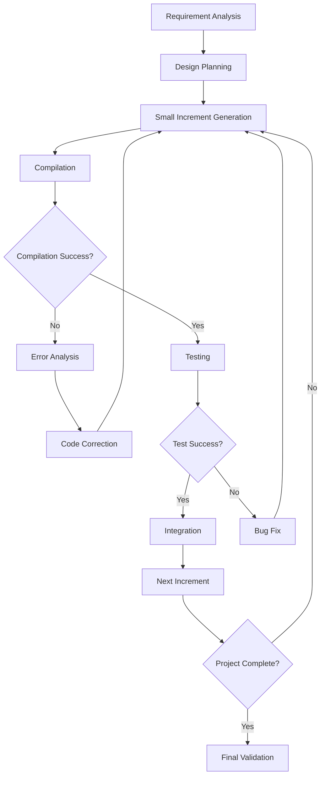

# COGO Development Methodology and Architecture

## Overview

This document provides a comprehensive guide to COGO's development methodology, including source code generation procedures, documentation and Knowledge Graph (KG) structure, validation methods, and the roles and characteristics of each agent in the system.

## 🏗️ **COGO System Architecture**

### Core Components

```
COGO Agent Core
├── 🤖 Agent Layer
│   ├── cogo-orchestrator-agent (CIO)
│   ├── cogo-executor-agent
│   ├── cogo-sandbox-worker
│   ├── cogo-codegen-service (CCGA)
│   ├── cogo-arch-gateway
│   ├── cogo-indexing-worker
│   └── cogo-research-worker
├── 🧠 Knowledge Layer
│   ├── Documentation System
│   ├── Knowledge Graph (Neo4j)
│   ├── Vector Database (Supabase pgvector)
│   └── Real-time Collaboration
├── 🔧 Execution Layer
│   ├── MCP Servers
│   ├── Docker Containers
│   ├── OpenHands CLI
│   └── Code Execution Environment
└── 📊 Monitoring Layer
    ├── Performance Tracking
    ├── Real-time Monitoring
    ├── Health Checks
    └── Analytics Dashboard
```

## 📚 **Documentation + KG Structure**

### 1. **Documentation Hierarchy**

```
docs/
├── 📋 System Documentation
│   ├── COGO_DEVELOPMENT_METHODOLOGY_AND_ARCHITECTURE.md
│   ├── AGENT_ARCHITECTURE_OVERVIEW.md
│   ├── AGENT_DETAILED_SPECIFICATIONS.md
│   └── SYSTEM_INTEGRATION_GUIDE.md
├── 🔧 Technical Documentation
│   ├── LLM_INTEGRATION_COMPLETE_GUIDE.md
│   ├── MCP_SERVER_INTEGRATION_GUIDE.md
│   ├── API_DOCUMENTATION.md
│   └── DEPLOYMENT_GUIDE.md
├── 📊 Development Reports
│   ├── LLM_INTEGRATION_DEVELOPMENT_SUMMARY.md
│   ├── PERFORMANCE_ANALYSIS_REPORTS.md
│   └── QUALITY_ASSESSMENT_REPORTS.md
└── 🎯 Project Plans
    ├── FIREWORKS_AI_MODEL_INTEGRATION_PLAN.md
    ├── MODEL_SELECTION_STRATEGY_ANALYSIS.md
    └── FUTURE_ENHANCEMENT_PLANS.md
```

### 2. **Knowledge Graph Structure**

#### Node Types
```cypher
// Agent Nodes
(:Agent {
  id: String,
  name: String,
  type: String,
  capabilities: [String],
  status: String,
  performance_metrics: Object
})

// Document Nodes
(:Document {
  id: String,
  title: String,
  type: String,
  content: String,
  created_at: DateTime,
  updated_at: DateTime,
  version: String
})

// Concept Nodes
(:Concept {
  id: String,
  name: String,
  description: String,
  category: String,
  complexity: Integer
})

// Technology Nodes
(:Technology {
  id: String,
  name: String,
  version: String,
  category: String,
  documentation_url: String
})

// Project Nodes
(:Project {
  id: String,
  name: String,
  status: String,
  description: String,
  created_at: DateTime
})
```

#### Relationship Types
```cypher
// Agent Relationships
(agent1)-[:COLLABORATES_WITH]->(agent2)
(agent)-[:HAS_CAPABILITY]->(capability)
(agent)-[:WORKS_ON]->(project)

// Document Relationships
(document)-[:DESCRIBES]->(concept)
(document)-[:REFERENCES]->(technology)
(document)-[:PART_OF]->(project)

// Knowledge Relationships
(concept)-[:RELATED_TO]->(concept)
(technology)-[:DEPENDS_ON]->(technology)
(project)-[:USES]->(technology)
```

### 3. **Documentation Generation Process**

#### Step 1: Content Analysis
```typescript
interface ContentAnalysis {
  documentType: 'system' | 'technical' | 'report' | 'plan';
  targetAudience: 'developers' | 'architects' | 'managers' | 'users';
  complexity: 'basic' | 'intermediate' | 'advanced';
  requiredSections: string[];
  kgRelationships: KGRelationship[];
}
```

#### Step 2: Template Selection
```typescript
const documentTemplates = {
  system: {
    structure: ['overview', 'architecture', 'components', 'workflows'],
    style: 'comprehensive',
    detailLevel: 'high'
  },
  technical: {
    structure: ['api', 'implementation', 'examples', 'troubleshooting'],
    style: 'practical',
    detailLevel: 'medium'
  },
  report: {
    structure: ['summary', 'findings', 'analysis', 'recommendations'],
    style: 'analytical',
    detailLevel: 'variable'
  }
};
```

#### Step 3: KG Integration
```typescript
interface KGIntegration {
  createNodes: (content: string) => Node[];
  createRelationships: (nodes: Node[]) => Relationship[];
  updateExistingNodes: (changes: Change[]) => void;
  validateConsistency: () => ValidationResult;
}
```

## 🔄 **Source Generation Procedures**

### 1. **Incremental Development Methodology**

#### Phase 1: Planning & Analysis
```typescript
interface DevelopmentPhase {
  phase: 'planning' | 'design' | 'implementation' | 'testing' | 'deployment';
  tasks: Task[];
  dependencies: string[];
  estimatedDuration: number;
  successCriteria: string[];
}
```

#### Phase 2: Small Increment Generation
```typescript
interface CodeIncrement {
  size: 'small' | 'medium' | 'large';
  maxLines: number;
  focus: 'single_feature' | 'bug_fix' | 'refactoring';
  validationRequired: boolean;
}
```

#### Phase 3: Compilation & Testing
```typescript
interface ValidationStep {
  compile: () => CompilationResult;
  test: () => TestResult;
  analyze: () => AnalysisResult;
  feedback: () => Feedback[];
}
```

### 2. **Code Generation Workflow**



### 3. **Parallel Agent Collaboration**

#### Agent Parallelization Strategy
```typescript
interface ParallelStrategy {
  maxConcurrentAgents: number;
  taskDistribution: 'round_robin' | 'capability_based' | 'load_balanced';
  coordinationMechanism: 'real_time' | 'batch' | 'event_driven';
  conflictResolution: 'priority_based' | 'consensus' | 'arbitration';
}
```

#### Sequential Compilation
```typescript
interface CompilationStrategy {
  sequentialCompilation: true;
  dependencyOrder: string[];
  memoryManagement: 'cleanup_after_each' | 'batch_cleanup';
  errorHandling: 'stop_on_error' | 'continue_with_warnings';
}
```

## 🤖 **Agent Roles and Characteristics**

### 1. **cogo-orchestrator-agent (CIO)**

#### Role: Chief Intelligence Officer
```typescript
interface CIOAgent {
  role: 'system_orchestrator';
  responsibilities: [
    'project_planning',
    'resource_allocation',
    'quality_assurance',
    'performance_monitoring',
    'strategic_decision_making'
  ];
  capabilities: [
    'llm_model_selection',
    'task_decomposition',
    'progress_tracking',
    'risk_assessment',
    'optimization_analysis'
  ];
  characteristics: {
    decisionMaking: 'strategic',
    communicationStyle: 'directive',
    focus: 'big_picture',
    collaboration: 'coordinator'
  };
}
```

#### Key Features
- **Strategic Planning**: Long-term project planning and goal setting
- **Model Selection**: Intelligent LLM model selection based on task requirements
- **Resource Management**: Optimal allocation of computational resources
- **Quality Control**: Ensuring code quality and adherence to standards
- **Performance Optimization**: Continuous monitoring and optimization

### 2. **cogo-executor-agent**

#### Role: Task Execution Specialist
```typescript
interface ExecutorAgent {
  role: 'task_executor';
  responsibilities: [
    'code_generation',
    'task_implementation',
    'error_handling',
    'progress_reporting',
    'integration_management'
  ];
  capabilities: [
    'mcp_server_communication',
    'real_time_processing',
    'error_recovery',
    'performance_tracking',
    'code_optimization'
  ];
  characteristics: {
    executionStyle: 'efficient',
    errorHandling: 'robust',
    communication: 'detailed',
    focus: 'implementation'
  };
}
```

#### Key Features
- **MCP Integration**: Direct communication with MCP servers
- **Real-time Processing**: Immediate task execution and response
- **Error Recovery**: Automatic error detection and recovery mechanisms
- **Performance Tracking**: Real-time performance monitoring
- **Code Optimization**: Continuous code improvement and optimization

### 3. **cogo-sandbox-worker**

#### Role: Safe Execution Environment
```typescript
interface SandboxWorker {
  role: 'safe_execution';
  responsibilities: [
    'code_execution',
    'environment_isolation',
    'security_monitoring',
    'resource_management',
    'cleanup_operations'
  ];
  capabilities: [
    'docker_containerization',
    'security_sandboxing',
    'resource_limiting',
    'process_monitoring',
    'cleanup_automation'
  ];
  characteristics: {
    securityLevel: 'high',
    isolation: 'complete',
    resourceManagement: 'efficient',
    cleanup: 'automatic'
  };
}
```

#### Key Features
- **Docker Containerization**: Isolated execution environments
- **Security Sandboxing**: Complete isolation from host system
- **Resource Limiting**: Controlled resource allocation
- **Process Monitoring**: Real-time process monitoring
- **Automatic Cleanup**: Automatic resource cleanup after execution

### 4. **cogo-codegen-service (CCGA)**

#### Role: Code Generation Specialist
```typescript
interface CCGAAgent {
  role: 'code_generation';
  responsibilities: [
    'source_code_generation',
    'code_analysis',
    'quality_assessment',
    'optimization_suggestions',
    'documentation_generation'
  ];
  capabilities: [
    'multi_language_support',
    'code_analysis',
    'quality_scoring',
    'optimization_recommendations',
    'documentation_creation'
  ];
  characteristics: {
    codeQuality: 'enterprise_grade',
    languageSupport: 'multi_language',
    analysisDepth: 'comprehensive',
    optimization: 'intelligent'
  };
}
```

#### Key Features
- **Multi-language Support**: Support for multiple programming languages
- **Code Analysis**: Comprehensive code quality analysis
- **Quality Scoring**: Automated code quality assessment
- **Optimization Recommendations**: Intelligent optimization suggestions
- **Documentation Generation**: Automatic documentation creation

### 5. **cogo-arch-gateway**

#### Role: Architecture Gateway
```typescript
interface ArchGateway {
  role: 'architecture_gateway';
  responsibilities: [
    'system_architecture_management',
    'component_coordination',
    'interface_management',
    'scalability_planning',
    'performance_optimization'
  ];
  capabilities: [
    'architecture_analysis',
    'component_orchestration',
    'interface_design',
    'scalability_assessment',
    'performance_monitoring'
  ];
  characteristics: {
    architecturalFocus: 'system_level',
    coordination: 'centralized',
    scalability: 'forward_thinking',
    performance: 'optimized'
  };
}
```

#### Key Features
- **Architecture Analysis**: System-level architecture analysis
- **Component Orchestration**: Coordination of system components
- **Interface Design**: Design and management of system interfaces
- **Scalability Assessment**: Assessment of system scalability
- **Performance Monitoring**: System-wide performance monitoring

### 6. **cogo-indexing-worker**

#### Role: Knowledge Indexing Specialist
```typescript
interface IndexingWorker {
  role: 'knowledge_indexing';
  responsibilities: [
    'document_indexing',
    'knowledge_extraction',
    'vector_embedding',
    'search_optimization',
    'knowledge_maintenance'
  ];
  capabilities: [
    'text_processing',
    'vector_embedding',
    'semantic_search',
    'knowledge_extraction',
    'index_optimization'
  ];
  characteristics: {
    processingSpeed: 'high',
    accuracy: 'precise',
    scalability: 'massive',
    maintenance: 'automated'
  };
}
```

#### Key Features
- **Text Processing**: Advanced text processing and analysis
- **Vector Embedding**: Creation of semantic vector embeddings
- **Semantic Search**: Intelligent semantic search capabilities
- **Knowledge Extraction**: Automated knowledge extraction
- **Index Optimization**: Continuous index optimization

### 7. **cogo-research-worker**

#### Role: Research and Analysis Specialist
```typescript
interface ResearchWorker {
  role: 'research_analysis';
  responsibilities: [
    'information_gathering',
    'data_analysis',
    'trend_identification',
    'insight_generation',
    'recommendation_creation'
  ];
  capabilities: [
    'web_research',
    'data_analysis',
    'trend_analysis',
    'insight_generation',
    'recommendation_creation'
  ];
  characteristics: {
    researchDepth: 'comprehensive',
    analysisQuality: 'high',
    insightGeneration: 'intelligent',
    recommendationQuality: 'actionable'
  };
}
```

#### Key Features
- **Web Research**: Comprehensive web-based research
- **Data Analysis**: Advanced data analysis capabilities
- **Trend Analysis**: Identification of trends and patterns
- **Insight Generation**: Intelligent insight generation
- **Recommendation Creation**: Actionable recommendation creation

## 🔍 **Validation Methods**

### 1. **Code Quality Validation**

#### Automated Quality Checks
```typescript
interface QualityValidation {
  staticAnalysis: {
    linting: boolean;
    typeChecking: boolean;
    complexityAnalysis: boolean;
    securityScanning: boolean;
  };
  dynamicAnalysis: {
    unitTesting: boolean;
    integrationTesting: boolean;
    performanceTesting: boolean;
    securityTesting: boolean;
  };
  manualReview: {
    codeReview: boolean;
    architectureReview: boolean;
    securityReview: boolean;
  };
}
```

#### Quality Metrics
```typescript
interface QualityMetrics {
  codeCoverage: number; // Target: >90%
  cyclomaticComplexity: number; // Target: <10
  maintainabilityIndex: number; // Target: >70
  technicalDebt: number; // Target: <5%
  securityScore: number; // Target: >95%
}
```

### 2. **Performance Validation**

#### Performance Benchmarks
```typescript
interface PerformanceValidation {
  responseTime: {
    target: number; // milliseconds
    acceptable: number;
    critical: number;
  };
  throughput: {
    requestsPerSecond: number;
    concurrentUsers: number;
  };
  resourceUsage: {
    cpu: number; // percentage
    memory: number; // percentage
    disk: number; // percentage
  };
}
```

### 3. **Integration Validation**

#### System Integration Tests
```typescript
interface IntegrationValidation {
  apiTesting: {
    endpointValidation: boolean;
    responseValidation: boolean;
    errorHandling: boolean;
  };
  databaseTesting: {
    connectionValidation: boolean;
    queryPerformance: boolean;
    dataIntegrity: boolean;
  };
  realTimeTesting: {
    messageDelivery: boolean;
    latencyValidation: boolean;
    scalabilityTesting: boolean;
  };
}
```

## 📊 **Development Metrics and KPIs**

### 1. **Productivity Metrics**
- **Code Generation Speed**: Lines of code per hour
- **Bug Rate**: Bugs per 1000 lines of code
- **Development Velocity**: Features completed per sprint
- **Code Quality Score**: Automated quality assessment score

### 2. **Quality Metrics**
- **Test Coverage**: Percentage of code covered by tests
- **Code Review Score**: Average code review rating
- **Technical Debt**: Amount of technical debt in codebase
- **Security Score**: Security assessment score

### 3. **Performance Metrics**
- **Response Time**: Average API response time
- **Throughput**: Requests processed per second
- **Uptime**: System availability percentage
- **Resource Efficiency**: Resource utilization optimization

## 🔮 **Future Enhancements**

### 1. **Advanced AI Integration**
- **Context-Aware Model Selection**: Intelligent model selection based on context
- **Automated Code Review**: AI-powered code review and suggestions
- **Predictive Analytics**: Predictive analysis for project success
- **Intelligent Testing**: AI-generated test cases

### 2. **Enhanced Collaboration**
- **Real-time Collaboration**: Enhanced real-time collaboration features
- **Multi-agent Coordination**: Improved multi-agent coordination
- **Knowledge Sharing**: Advanced knowledge sharing mechanisms
- **Team Learning**: Collective learning and improvement

### 3. **Scalability Improvements**
- **Microservices Architecture**: Migration to microservices
- **Cloud-Native Deployment**: Cloud-native deployment strategies
- **Auto-scaling**: Automatic scaling based on demand
- **Global Distribution**: Global distribution and edge computing

## 🎯 **Conclusion**

COGO's development methodology represents a comprehensive, enterprise-grade approach to AI-powered software development. The system combines:

- **Incremental Development**: Small, manageable code increments
- **Parallel Agent Collaboration**: Efficient multi-agent coordination
- **Comprehensive Validation**: Multiple layers of quality assurance
- **Knowledge Integration**: Seamless documentation and KG integration
- **Performance Optimization**: Continuous performance monitoring and optimization

This methodology ensures high-quality, maintainable, and scalable software development while leveraging the full potential of AI and automation.

---

**Last Updated**: 2025-08-02  
**Version**: 1.0.0  
**Status**: Production Ready ✅ 