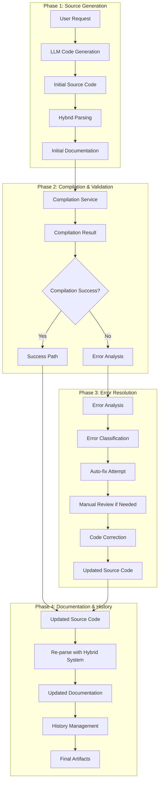

# 소스 생성-컴파일-수정 워크플로우 및 히스토리 관리

## Overview

COGO Agent Core의 완전한 소스 생성 워크플로우는 소스 생성, 컴파일, 오류 수정, 구조화 문서 생성을 통합적으로 관리합니다. 이 문서는 각 단계별 프로세스와 히스토리 관리 방안을 상세히 제시합니다.

## 1. 전체 워크플로우 아키텍처

### 1.1 워크플로우 다이어그램



### 1.2 단계별 상세 프로세스

## 2. Phase 1: 소스 생성 및 초기 파싱

### 2.1 소스 생성 프로세스

```typescript
// src/workflows/SourceGenerationWorkflow.ts
export class SourceGenerationWorkflow {
  async generateSource(request: GenerationRequest): Promise<GenerationResult> {
    const startTime = Date.now();
    
    // 1. LLM을 통한 초기 코드 생성
    const generatedCode = await this.llmService.generateCode(request);
    
    // 2. 하이브리드 파싱으로 초기 구조화 문서 생성
    const initialParsing = await this.hybridParser.parseSourceCode(
      generatedCode, 
      request.language
    );
    
    // 3. 초기 품질 평가
    const qualityAssessment = await this.qualityAssessor.assess(generatedCode);
    
    // 4. 워크플로우 상태 생성
    const workflowState = await this.createWorkflowState({
      phase: 'generation',
      sourceCode: generatedCode,
      parsingResult: initialParsing,
      qualityAssessment,
      timestamp: new Date(),
      request
    });
    
    return {
      success: true,
      sourceCode: generatedCode,
      documentation: initialParsing.mergedData,
      quality: qualityAssessment,
      workflowId: workflowState.id,
      metadata: {
        generationTime: Date.now() - startTime,
        language: request.language,
        framework: request.framework
      }
    };
  }
}
```

### 2.2 초기 구조화 문서 생성

```typescript
// src/services/InitialDocumentationService.ts
export class InitialDocumentationService {
  async createInitialDocumentation(
    sourceCode: string, 
    language: string
  ): Promise<StructuredDocumentation> {
    // 하이브리드 파싱으로 주석과 코드 구조 분석
    const parsingResult = await this.hybridParser.parseSourceCode(sourceCode, language);
    
    // 구조화된 문서 생성
    const documentation: StructuredDocumentation = {
      id: generateUUID(),
      version: '1.0.0',
      createdAt: new Date(),
      sourceCode: sourceCode,
      language: language,
      
      // 주석에서 추출한 메타데이터
      title: parsingResult.commentData.title,
      description: parsingResult.commentData.description,
      features: parsingResult.commentData.features,
      api: parsingResult.commentData.api,
      dependencies: parsingResult.commentData.dependencies,
      
      // Tree-sitter에서 추출한 구조 정보
      functions: parsingResult.codeData.functions,
      classes: parsingResult.codeData.classes,
      imports: parsingResult.codeData.imports,
      exports: parsingResult.codeData.exports,
      
      // 통합된 정보
      complexity: parsingResult.mergedData.complexity,
      type: parsingResult.mergedData.type,
      framework: parsingResult.mergedData.framework,
      
      // 품질 정보
      quality: parsingResult.quality,
      metrics: parsingResult.mergedData.metrics,
      
      // 워크플로우 상태
      workflowPhase: 'generation',
      status: 'initial'
    };
    
    return documentation;
  }
}
```

## 3. Phase 2: 컴파일 및 검증

### 3.1 컴파일 서비스

```typescript
// src/services/CompilationService.ts
export class CompilationService {
  async compileSource(
    sourceCode: string, 
    language: string, 
    workflowId: string
  ): Promise<CompilationResult> {
    const startTime = Date.now();
    
    // 1. 컴파일 실행
    const compilationResult = await this.executeCompilation(sourceCode, language);
    
    // 2. 컴파일 결과 분석
    const analysis = await this.analyzeCompilationResult(compilationResult);
    
    // 3. 워크플로우 상태 업데이트
    await this.updateWorkflowState(workflowId, {
      phase: 'compilation',
      compilationResult: analysis,
      timestamp: new Date()
    });
    
    return {
      success: compilationResult.success,
      errors: compilationResult.errors,
      warnings: compilationResult.warnings,
      output: compilationResult.output,
      analysis: analysis,
      metadata: {
        compilationTime: Date.now() - startTime,
        language: language,
        errorCount: compilationResult.errors.length,
        warningCount: compilationResult.warnings.length
      }
    };
  }
  
  private async executeCompilation(sourceCode: string, language: string): Promise<RawCompilationResult> {
    switch (language) {
      case 'typescript':
        return await this.compileTypeScript(sourceCode);
      case 'javascript':
        return await this.compileJavaScript(sourceCode);
      case 'python':
        return await this.compilePython(sourceCode);
      case 'java':
        return await this.compileJava(sourceCode);
      default:
        throw new Error(`Unsupported language: ${language}`);
    }
  }
  
  private async analyzeCompilationResult(result: RawCompilationResult): Promise<CompilationAnalysis> {
    return {
      success: result.success,
      errorTypes: this.categorizeErrors(result.errors),
      severityLevel: this.calculateSeverity(result.errors, result.warnings),
      autoFixable: this.identifyAutoFixableErrors(result.errors),
      suggestions: this.generateSuggestions(result.errors),
      estimatedFixTime: this.estimateFixTime(result.errors)
    };
  }
}
```

### 3.2 오류 분석 및 분류

```typescript
// src/services/ErrorAnalysisService.ts
export class ErrorAnalysisService {
  categorizeErrors(errors: CompilationError[]): ErrorCategory[] {
    const categories: ErrorCategory[] = [];
    
    for (const error of errors) {
      const category = this.classifyError(error);
      categories.push({
        type: category.type,
        severity: category.severity,
        autoFixable: category.autoFixable,
        errors: [error],
        suggestedFixes: category.suggestedFixes
      });
    }
    
    return this.mergeSimilarCategories(categories);
  }
  
  private classifyError(error: CompilationError): ErrorClassification {
    // 구문 오류
    if (error.type === 'syntax') {
      return {
        type: 'syntax',
        severity: 'high',
        autoFixable: this.isSyntaxErrorAutoFixable(error),
        suggestedFixes: this.generateSyntaxFixes(error)
      };
    }
    
    // 타입 오류
    if (error.type === 'type') {
      return {
        type: 'type',
        severity: 'medium',
        autoFixable: this.isTypeErrorAutoFixable(error),
        suggestedFixes: this.generateTypeFixes(error)
      };
    }
    
    // 링크 오류
    if (error.type === 'link') {
      return {
        type: 'link',
        severity: 'high',
        autoFixable: false,
        suggestedFixes: this.generateLinkFixes(error)
      };
    }
    
    // 기타 오류
    return {
      type: 'other',
      severity: 'medium',
      autoFixable: false,
      suggestedFixes: []
    };
  }
}
```

## 4. Phase 3: 오류 해결 및 코드 수정

### 4.1 자동 수정 시도

```typescript
// src/services/AutoFixService.ts
export class AutoFixService {
  async attemptAutoFix(
    sourceCode: string,
    errors: CompilationError[],
    language: string
  ): Promise<AutoFixResult> {
    const fixableErrors = errors.filter(error => error.autoFixable);
    const appliedFixes: AppliedFix[] = [];
    
    for (const error of fixableErrors) {
      const fix = await this.generateFix(sourceCode, error, language);
      
      if (fix.confidence > 0.8) { // 80% 이상의 신뢰도
        sourceCode = this.applyFix(sourceCode, fix);
        appliedFixes.push({
          error: error,
          fix: fix,
          appliedAt: new Date()
        });
      }
    }
    
    return {
      success: appliedFixes.length > 0,
      fixedSourceCode: sourceCode,
      appliedFixes: appliedFixes,
      remainingErrors: errors.filter(error => !error.autoFixable),
      metadata: {
        totalErrors: errors.length,
        fixedErrors: appliedFixes.length,
        fixRate: appliedFixes.length / errors.length
      }
    };
  }
  
  private async generateFix(
    sourceCode: string, 
    error: CompilationError, 
    language: string
  ): Promise<CodeFix> {
    // Tree-sitter를 사용한 정확한 오류 위치 파악
    const ast = await this.treeSitterParser.parseCode(sourceCode, language);
    const errorLocation = this.locateErrorInAST(ast, error);
    
    // LLM을 사용한 수정 제안 생성
    const fixPrompt = this.createFixPrompt(sourceCode, error, errorLocation);
    const fixSuggestion = await this.llmService.generateFix(fixPrompt);
    
    return {
      type: error.type,
      location: errorLocation,
      originalCode: this.extractCodeAtLocation(sourceCode, errorLocation),
      suggestedCode: fixSuggestion,
      confidence: this.calculateFixConfidence(fixSuggestion, error),
      explanation: fixSuggestion.explanation
    };
  }
}
```

### 4.2 수동 검토 및 수정

```typescript
// src/services/ManualReviewService.ts
export class ManualReviewService {
  async createReviewSession(
    workflowId: string,
    sourceCode: string,
    errors: CompilationError[],
    autoFixResult: AutoFixResult
  ): Promise<ReviewSession> {
    const session: ReviewSession = {
      id: generateUUID(),
      workflowId: workflowId,
      createdAt: new Date(),
      status: 'pending',
      
      // 검토할 내용
      sourceCode: autoFixResult.fixedSourceCode,
      remainingErrors: autoFixResult.remainingErrors,
      appliedFixes: autoFixResult.appliedFixes,
      
      // 검토 도구
      suggestions: this.generateReviewSuggestions(autoFixResult),
      diffView: this.createDiffView(sourceCode, autoFixResult.fixedSourceCode),
      
      // 검토 히스토리
      reviewHistory: []
    };
    
    await this.saveReviewSession(session);
    return session;
  }
  
  async applyManualFix(
    sessionId: string,
    fix: ManualFix
  ): Promise<ReviewSession> {
    const session = await this.getReviewSession(sessionId);
    
    // 수정 적용
    session.sourceCode = this.applyManualFix(session.sourceCode, fix);
    
    // 검토 히스토리 업데이트
    session.reviewHistory.push({
      timestamp: new Date(),
      type: 'manual_fix',
      fix: fix,
      reviewer: fix.reviewer
    });
    
    await this.updateReviewSession(session);
    return session;
  }
}
```

## 5. Phase 4: 문서 업데이트 및 히스토리 관리

### 5.1 구조화 문서 업데이트

```typescript
// src/services/DocumentationUpdateService.ts
export class DocumentationUpdateService {
  async updateDocumentation(
    workflowId: string,
    updatedSourceCode: string,
    language: string
  ): Promise<UpdatedDocumentation> {
    // 1. 업데이트된 소스 코드로 재파싱
    const updatedParsing = await this.hybridParser.parseSourceCode(
      updatedSourceCode, 
      language
    );
    
    // 2. 이전 문서와 비교하여 변경사항 식별
    const previousDoc = await this.getPreviousDocumentation(workflowId);
    const changes = this.identifyChanges(previousDoc, updatedParsing.mergedData);
    
    // 3. 업데이트된 문서 생성
    const updatedDocumentation: UpdatedDocumentation = {
      ...previousDoc,
      version: this.incrementVersion(previousDoc.version),
      updatedAt: new Date(),
      sourceCode: updatedSourceCode,
      
      // 업데이트된 정보
      functions: updatedParsing.codeData.functions,
      classes: updatedParsing.codeData.classes,
      imports: updatedParsing.codeData.imports,
      exports: updatedParsing.codeData.exports,
      
      // 변경사항 추적
      changes: changes,
      changeSummary: this.generateChangeSummary(changes),
      
      // 워크플로우 상태
      workflowPhase: 'completed',
      status: 'final'
    };
    
    // 4. 문서 저장
    await this.saveDocumentation(updatedDocumentation);
    
    return updatedDocumentation;
  }
  
  private identifyChanges(
    previous: StructuredDocumentation, 
    current: MergedParsingResult
  ): DocumentationChange[] {
    const changes: DocumentationChange[] = [];
    
    // 함수 변경사항
    const functionChanges = this.compareFunctions(previous.functions, current.functions);
    changes.push(...functionChanges);
    
    // 클래스 변경사항
    const classChanges = this.compareClasses(previous.classes, current.classes);
    changes.push(...classChanges);
    
    // 의존성 변경사항
    const dependencyChanges = this.compareDependencies(
      previous.dependencies, 
      current.dependencies
    );
    changes.push(...dependencyChanges);
    
    return changes;
  }
}
```

### 5.2 히스토리 관리 시스템

```typescript
// src/services/HistoryManagementService.ts
export class HistoryManagementService {
  async createWorkflowHistory(workflowId: string): Promise<WorkflowHistory> {
    const history: WorkflowHistory = {
      id: workflowId,
      createdAt: new Date(),
      phases: [],
      artifacts: [],
      metrics: {
        totalTime: 0,
        generationTime: 0,
        compilationTime: 0,
        fixTime: 0,
        documentationTime: 0
      }
    };
    
    await this.saveWorkflowHistory(history);
    return history;
  }
  
  async addPhaseToHistory(
    workflowId: string, 
    phase: WorkflowPhase
  ): Promise<void> {
    const history = await this.getWorkflowHistory(workflowId);
    
    history.phases.push({
      phase: phase.name,
      startTime: phase.startTime,
      endTime: phase.endTime,
      duration: phase.endTime.getTime() - phase.startTime.getTime(),
      status: phase.status,
      metadata: phase.metadata
    });
    
    // 메트릭 업데이트
    this.updateMetrics(history, phase);
    
    await this.updateWorkflowHistory(history);
  }
  
  async addArtifactToHistory(
    workflowId: string, 
    artifact: WorkflowArtifact
  ): Promise<void> {
    const history = await this.getWorkflowHistory(workflowId);
    
    history.artifacts.push({
      type: artifact.type,
      name: artifact.name,
      content: artifact.content,
      createdAt: new Date(),
      phase: artifact.phase,
      metadata: artifact.metadata
    });
    
    await this.updateWorkflowHistory(history);
  }
  
  async generateHistoryReport(workflowId: string): Promise<HistoryReport> {
    const history = await this.getWorkflowHistory(workflowId);
    
    return {
      workflowId: workflowId,
      summary: this.generateSummary(history),
      timeline: this.generateTimeline(history),
      artifacts: this.categorizeArtifacts(history.artifacts),
      metrics: history.metrics,
      insights: this.generateInsights(history)
    };
  }
}
```

## 6. 통합 워크플로우 관리

### 6.1 메인 워크플로우 컨트롤러

```typescript
// src/controllers/WorkflowController.ts
export class WorkflowController {
  async executeCompleteWorkflow(request: GenerationRequest): Promise<WorkflowResult> {
    const workflowId = generateUUID();
    const startTime = new Date();
    
    try {
      // Phase 1: 소스 생성
      const generationResult = await this.sourceGenerationWorkflow.generateSource(request);
      await this.historyService.addPhaseToHistory(workflowId, {
        name: 'generation',
        startTime: startTime,
        endTime: new Date(),
        status: 'completed',
        metadata: generationResult.metadata
      });
      
      // Phase 2: 컴파일
      const compilationResult = await this.compilationService.compileSource(
        generationResult.sourceCode,
        request.language,
        workflowId
      );
      
      if (compilationResult.success) {
        // 성공 경로
        const finalDocumentation = await this.documentationService.updateDocumentation(
          workflowId,
          generationResult.sourceCode,
          request.language
        );
        
        return {
          success: true,
          workflowId: workflowId,
          sourceCode: generationResult.sourceCode,
          documentation: finalDocumentation,
          compilationResult: compilationResult,
          history: await this.historyService.generateHistoryReport(workflowId)
        };
      } else {
        // 오류 해결 경로
        return await this.handleCompilationErrors(
          workflowId,
          generationResult.sourceCode,
          compilationResult,
          request.language
        );
      }
    } catch (error) {
      await this.historyService.addPhaseToHistory(workflowId, {
        name: 'error',
        startTime: startTime,
        endTime: new Date(),
        status: 'failed',
        metadata: { error: error.message }
      });
      
      throw error;
    }
  }
  
  private async handleCompilationErrors(
    workflowId: string,
    sourceCode: string,
    compilationResult: CompilationResult,
    language: string
  ): Promise<WorkflowResult> {
    // 자동 수정 시도
    const autoFixResult = await this.autoFixService.attemptAutoFix(
      sourceCode,
      compilationResult.errors,
      language
    );
    
    if (autoFixResult.success) {
      // 자동 수정 성공
      const recompilationResult = await this.compilationService.compileSource(
        autoFixResult.fixedSourceCode,
        language,
        workflowId
      );
      
      if (recompilationResult.success) {
        const finalDocumentation = await this.documentationService.updateDocumentation(
          workflowId,
          autoFixResult.fixedSourceCode,
          language
        );
        
        return {
          success: true,
          workflowId: workflowId,
          sourceCode: autoFixResult.fixedSourceCode,
          documentation: finalDocumentation,
          compilationResult: recompilationResult,
          autoFixes: autoFixResult.appliedFixes,
          history: await this.historyService.generateHistoryReport(workflowId)
        };
      }
    }
    
    // 수동 검토 필요
    const reviewSession = await this.manualReviewService.createReviewSession(
      workflowId,
      sourceCode,
      compilationResult.errors,
      autoFixResult
    );
    
    return {
      success: false,
      workflowId: workflowId,
      sourceCode: sourceCode,
      reviewSession: reviewSession,
      compilationResult: compilationResult,
      autoFixResult: autoFixResult,
      history: await this.historyService.generateHistoryReport(workflowId)
    };
  }
}
```

## 7. 데이터베이스 스키마

### 7.1 워크플로우 상태 테이블

```sql
-- 워크플로우 상태 관리
CREATE TABLE workflow_states (
  id UUID PRIMARY KEY DEFAULT gen_random_uuid(),
  workflow_id UUID NOT NULL,
  phase VARCHAR(50) NOT NULL, -- 'generation', 'compilation', 'fix', 'documentation'
  status VARCHAR(50) NOT NULL, -- 'pending', 'in_progress', 'completed', 'failed'
  source_code TEXT,
  compilation_result JSONB,
  auto_fix_result JSONB,
  documentation JSONB,
  metadata JSONB,
  created_at TIMESTAMP WITH TIME ZONE DEFAULT NOW(),
  updated_at TIMESTAMP WITH TIME ZONE DEFAULT NOW()
);

-- 워크플로우 히스토리
CREATE TABLE workflow_history (
  id UUID PRIMARY KEY DEFAULT gen_random_uuid(),
  workflow_id UUID NOT NULL,
  phase VARCHAR(50) NOT NULL,
  start_time TIMESTAMP WITH TIME ZONE NOT NULL,
  end_time TIMESTAMP WITH TIME ZONE,
  duration_ms INTEGER,
  status VARCHAR(50) NOT NULL,
  metadata JSONB,
  created_at TIMESTAMP WITH TIME ZONE DEFAULT NOW()
);

-- 워크플로우 아티팩트
CREATE TABLE workflow_artifacts (
  id UUID PRIMARY KEY DEFAULT gen_random_uuid(),
  workflow_id UUID NOT NULL,
  type VARCHAR(50) NOT NULL, -- 'source_code', 'documentation', 'compilation_result', 'fix'
  name VARCHAR(255) NOT NULL,
  content TEXT,
  phase VARCHAR(50) NOT NULL,
  metadata JSONB,
  created_at TIMESTAMP WITH TIME ZONE DEFAULT NOW()
);

-- 문서 변경사항 추적
CREATE TABLE documentation_changes (
  id UUID PRIMARY KEY DEFAULT gen_random_uuid(),
  workflow_id UUID NOT NULL,
  version VARCHAR(20) NOT NULL,
  change_type VARCHAR(50) NOT NULL, -- 'function_added', 'function_modified', 'class_added', etc.
  target_name VARCHAR(255),
  old_content TEXT,
  new_content TEXT,
  diff_content TEXT,
  created_at TIMESTAMP WITH TIME ZONE DEFAULT NOW()
);
```

## 8. 성과 지표 및 모니터링

### 8.1 워크플로우 성과 지표

| 지표 | 목표 | 측정 방법 |
|------|------|-----------|
| **워크플로우 성공률** | 95% | 성공한 워크플로우 / 전체 워크플로우 |
| **평균 완료 시간** | 30초 | 워크플로우 시작부터 완료까지 |
| **자동 수정 성공률** | 80% | 자동 수정된 오류 / 전체 오류 |
| **수동 검토 필요율** | 20% | 수동 검토 필요한 워크플로우 / 전체 워크플로우 |
| **문서 정확도** | 99% | 최종 문서 품질 점수 |

### 8.2 모니터링 대시보드

```typescript
// src/monitoring/WorkflowMonitoringService.ts
export class WorkflowMonitoringService {
  async generateDashboard(): Promise<WorkflowDashboard> {
    const today = new Date();
    const startOfDay = new Date(today.getFullYear(), today.getMonth(), today.getDate());
    
    const workflows = await this.getWorkflowsByDateRange(startOfDay, today);
    
    return {
      summary: {
        totalWorkflows: workflows.length,
        successfulWorkflows: workflows.filter(w => w.success).length,
        failedWorkflows: workflows.filter(w => !w.success).length,
        averageCompletionTime: this.calculateAverageCompletionTime(workflows)
      },
      metrics: {
        successRate: this.calculateSuccessRate(workflows),
        autoFixRate: this.calculateAutoFixRate(workflows),
        manualReviewRate: this.calculateManualReviewRate(workflows),
        averageDocumentationQuality: this.calculateAverageDocumentationQuality(workflows)
      },
      trends: await this.generateTrends(workflows),
      alerts: await this.generateAlerts(workflows)
    };
  }
}
```

## 9. 결론

이 워크플로우는 소스 생성부터 컴파일, 오류 수정, 문서 업데이트까지의 전체 프로세스를 통합적으로 관리합니다. 각 단계에서 생성되는 구조화 문서와 히스토리는 완전히 추적되며, 자동화와 수동 검토의 균형을 통해 높은 품질의 결과물을 보장합니다.

**주요 특징**:
- ✅ **완전한 추적성**: 모든 단계와 변경사항 추적
- ✅ **자동화 최적화**: 가능한 한 자동화하고 수동 검토는 최소화
- ✅ **품질 보장**: 각 단계별 품질 검증
- ✅ **히스토리 관리**: 완전한 변경 이력 및 아티팩트 보존
- ✅ **성과 모니터링**: 실시간 성과 지표 및 알림 