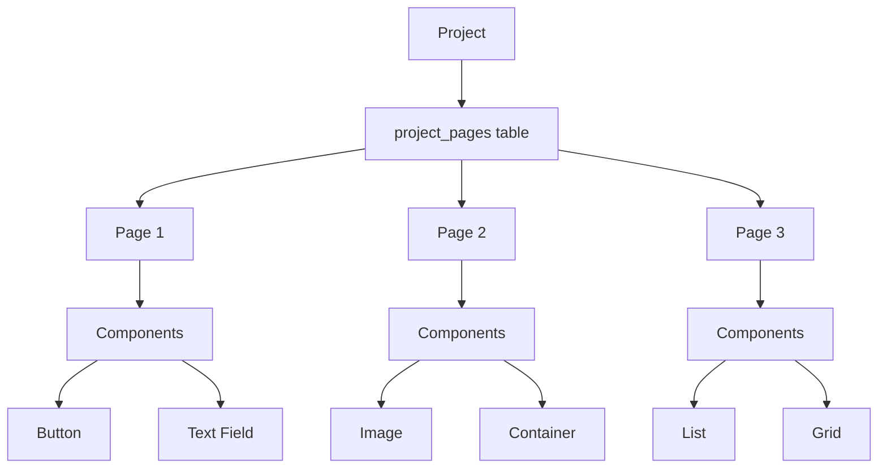
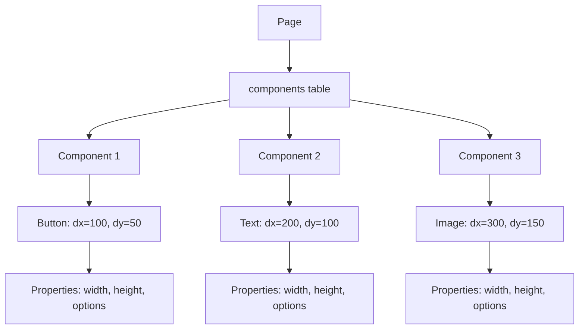
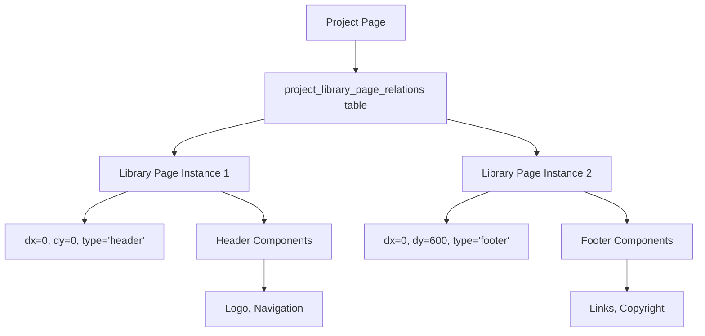
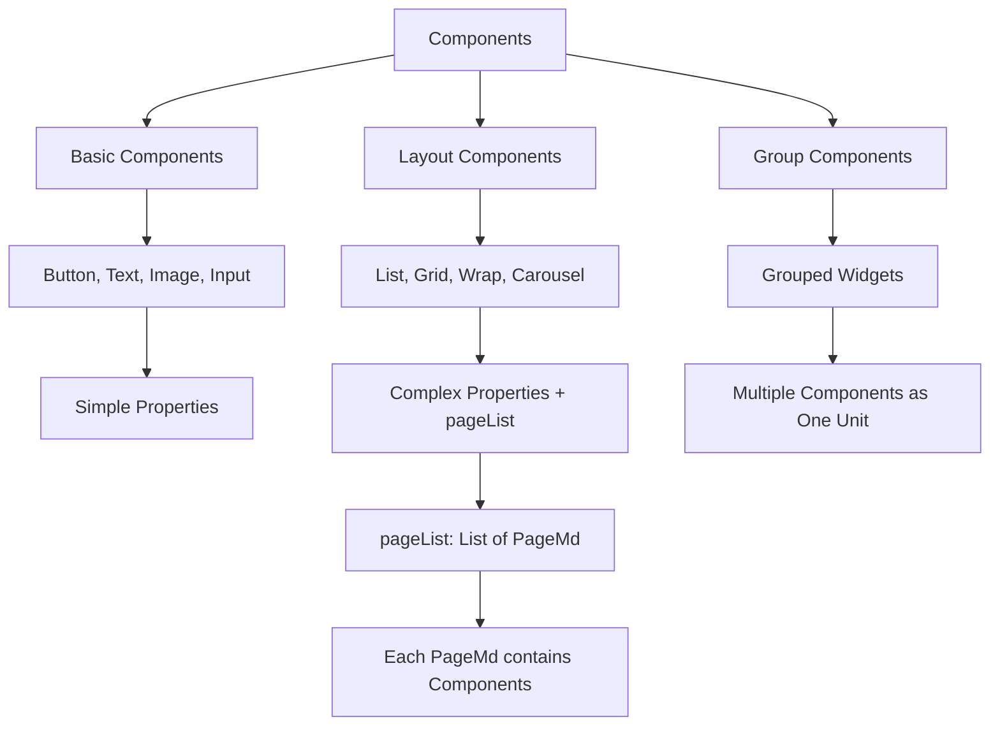

# CreateGo Page Architecture Documentation

## Overview

CreateGo is a visual development platform that allows users to create applications using a drag-and-drop interface. This document explains the core architecture of how pages, components, libraries, and projects are structured and related to each other.

## Core Concepts

### 1. Projects
- **Definition**: A project is a container that holds multiple pages and defines the overall application
- **Types**: 
  - Regular projects (for applications)
  - Library projects (reusable component collections)
  - Layout projects (for design systems)

### 2. Pages
- **Definition**: A page represents a single screen or view in the application
- **Properties**: Width, height, background color, components, layout elements
- **Types**:
  - Project pages (belong to a specific project)
  - Library pages (reusable page templates)
  - Layout pages (header, footer, drawer templates)

### 3. Components
- **Definition**: Individual UI elements that make up a page
- **Properties**: Position (dx, dy), size (width, height), type, options
- **Examples**: Buttons, text fields, images, containers, lists

### 4. Libraries
- **Definition**: Collections of reusable components and pages
- **Usage**: Can be imported into projects to avoid recreating common elements

## Database Schema

### Core Tables

```sql
-- Projects table
projects (
  id, name, description, version, owner_id, 
  is_library, for_layout, is_public, initial_page_id
)

-- Pages table  
pages (
  id, name, width, height, image_url, 
  header_id, footer_id, drawer_id, bg_clr, on_load
)

-- Components table
components (
  id, name, type, dx, dy, width, height, 
  page_id, group_id, index_in_page, options
)

-- Project-Page relationships
project_pages (project_id, page_id)

-- Library-Page relationships  
library_pages (library_id, page_id)

-- Project-Library page relations
project_library_page_relations (
  id, project_page_id, library_page_id, 
  dx, dy, is_editable, type, index_in_page
)
```

## Architecture Diagram

```
┌─────────────────────────────────────────────────────────────────┐
│                        PROJECT                                 │
│  ┌─────────────────┐  ┌─────────────────┐  ┌─────────────────┐ │
│  │   PROJECT PAGE  │  │   PROJECT PAGE  │  │   PROJECT PAGE  │ │
│  │                 │  │                 │  │                 │ │
│  │ ┌─────────────┐ │  │ ┌─────────────┐ │  │ ┌─────────────┐ │ │
│  │ │ COMPONENT   │ │  │ │ COMPONENT   │ │  │ │ COMPONENT   │ │ │
│  │ │ (Button)    │ │  │ │ (Text)      │ │  │ │ (Image)     │ │ │
│  │ └─────────────┘ │  │ └─────────────┘ │  │ └─────────────┘ │ │
│  │                 │  │                 │  │                 │ │
│  │ ┌─────────────┐ │  │ ┌─────────────┐ │  │ ┌─────────────┐ │ │
│  │ │ LIBRARY     │ │  │ │ LIBRARY     │ │  │ │ LIBRARY     │ │ │
│  │ │ PAGE        │ │  │ │ PAGE        │ │  │ │ PAGE        │ │ │
│  │ │ (Header)    │ │  │ │ (Footer)    │ │  │ │ (Drawer)    │ │ │
│  │ │             │ │  │ │             │ │  │ │             │ │ │
│  │ │ ┌─────────┐ │ │  │ │ ┌─────────┐ │ │  │ │ ┌─────────┐ │ │ │
│  │ │ │COMPONENT│ │ │  │ │ │COMPONENT│ │ │  │ │ │COMPONENT│ │ │ │
│  │ │ │(Logo)   │ │ │  │ │ │(Links)  │ │ │  │ │ │(Menu)   │ │ │ │
│  │ │ └─────────┘ │ │  │ │ └─────────┘ │ │  │ │ └─────────┘ │ │ │
│  │ └─────────────┘ │  │ └─────────────┘ │  │ └─────────────┘ │ │
│  └─────────────────┘  └─────────────────┘  └─────────────────┘ │
└─────────────────────────────────────────────────────────────────┘
                                │
                                ▼
┌─────────────────────────────────────────────────────────────────┐
│                        LIBRARY                                 │
│  ┌─────────────────┐  ┌─────────────────┐  ┌─────────────────┐ │
│  │   LIBRARY PAGE  │  │   LIBRARY PAGE  │  │   LIBRARY PAGE  │ │
│  │                 │  │                 │  │                 │ │
│  │ ┌─────────────┐ │  │ ┌─────────────┐ │  │ ┌─────────────┐ │ │
│  │ │ COMPONENT   │ │  │ │ COMPONENT   │ │  │ │ COMPONENT   │ │ │
│  │ │ (Card)      │ │  │ │ (Form)      │ │  │ │ (Table)     │ │ │
│  │ └─────────────┘ │  │ └─────────────┘ │  │ └─────────────┘ │ │
│  └─────────────────┘  └─────────────────┘  └─────────────────┘ │
└─────────────────────────────────────────────────────────────────┘
```

## Detailed Relationships

### 1. Project → Pages Relationship



**Code Implementation:**
```dart
// In project_logic.dart
TaskEither<Object, List<PageMd>> fetchProjectPages({
  required int projectId,
  required bool isLibrary,
  bool? forLayout,
}) {
  // Fetches pages associated with a project
  // Uses project_pages table for regular projects
  // Uses library_pages table for library projects
  // Uses layout_pages table for layout projects
}
```

### 2. Page → Components Relationship



**Code Implementation:**
```dart
// In grid_logic.dart
List<ComponentMd> _components = [];

Future<bool> fetchPageDetails(int pageId) async {
  // Fetches all components for a specific page
  // Components are ordered by index_in_page
  // Each component has position (dx, dy) and size (width, height)
}
```

### 3. Library Pages Inside Project Pages



**Code Implementation:**
```dart
// In grid_logic.dart
List<LibPageInProjPage> currLibPages = [];

// Library pages can be:
// - Header (sticky at top)
// - Footer (sticky at bottom) 
// - Drawer (side navigation)
// - Regular content blocks
// - Grouped components
```

### 4. Component Types and Hierarchy



**Code Implementation:**
```dart
// In component_md.dart
class ComponentMd {
  final String type;           // 'button', 'list', 'grid', etc.
  final Map<String, dynamic> options;  // Component-specific properties
  
  // For layout components like list, grid, wrap, carousel
  // options['pageList'] contains List<PageMd>
  // Each PageMd represents a template for list items
}
```

## Key Features

### 1. Multi-Page Support
- Projects can contain multiple pages
- Each page has its own set of components
- Pages can reference other pages (parent-child relationships)

### 2. Component Positioning System
- **Absolute Positioning**: Each component has dx, dy coordinates
- **Z-Index**: Components are rendered in order of index_in_page
- **Responsive**: Components can be resized and repositioned

### 3. Library System
- **Reusable Components**: Common UI elements stored in libraries
- **Page Templates**: Complete page layouts that can be reused
- **Import/Export**: Libraries can be shared between projects

### 4. Grouping System
- **Component Groups**: Multiple components can be grouped together
- **Library Pages**: Groups can be saved as library pages
- **Shared Components**: Groups can be shared across projects

## Data Flow

### 1. Page Loading
```
1. User navigates to a page
2. GridLogic.fetchPageDetails() is called
3. Components are fetched from components table
4. Library pages are fetched from project_library_page_relations
5. UI is rendered with all elements positioned correctly
```

### 2. Component Updates
```
1. User modifies a component (position, size, properties)
2. Component is marked for update (added to componentsToUpdate list)
3. Changes are saved to database when project is saved
4. Real-time updates are sent to other users via Supabase realtime
```

### 3. Library Page Integration
```
1. User adds a library page to a project page
2. Library page is copied to project_library_page_relations
3. Components from library page are positioned relative to project page
4. Changes to library page can be synced back to original library
```

## Advanced Features

### 1. Page Locking System
- **Collaborative Editing**: Only one user can edit a page at a time
- **Real-time Locks**: Page locks are managed via Supabase realtime
- **Auto-release**: Locks are automatically released when users leave

### 2. Undo/Redo System
- **Action History**: All changes are tracked for undo/redo
- **State Management**: Component states are preserved across operations
- **Batch Operations**: Multiple changes can be undone/redone together

### 3. Clipboard System
- **Copy/Paste**: Components and library pages can be copied between pages
- **Session Storage**: Clipboard data persists across page navigation
- **Multi-selection**: Multiple components can be copied at once

### 4. Search and Filtering
- **Component Search**: Find components by name or type
- **Page Filtering**: Filter pages by various criteria
- **Real-time Search**: Search updates as user types

## Best Practices

### 1. Component Organization
- Use meaningful names for components
- Group related components together
- Maintain consistent positioning and sizing

### 2. Library Usage
- Create reusable components in libraries
- Use consistent naming conventions
- Document component purposes and usage

### 3. Performance Considerations
- Limit the number of components per page
- Use efficient positioning algorithms
- Implement proper cleanup in dispose methods

### 4. Collaboration
- Communicate with team members about page locks
- Use descriptive commit messages
- Test changes in isolation before sharing

## Troubleshooting

### Common Issues

1. **Components Not Rendering**
   - Check if page is properly loaded
   - Verify component coordinates are valid
   - Ensure components table has correct data

2. **Library Pages Not Loading**
   - Verify project_library_page_relations entries
   - Check if library project is accessible
   - Ensure proper permissions

3. **Positioning Problems**
   - Check dx, dy values in database
   - Verify index_in_page ordering
   - Check for conflicting coordinates

4. **Real-time Updates Not Working**
   - Verify Supabase realtime connection
   - Check channel subscriptions
   - Ensure proper error handling

## Conclusion

The CreateGo page architecture provides a flexible and powerful system for building visual applications. Understanding the relationships between projects, pages, components, and libraries is essential for effective development. The system supports both simple and complex use cases, from basic UI components to sophisticated multi-page applications with reusable libraries.

Key takeaways:
- **Hierarchical Structure**: Projects contain pages, pages contain components
- **Flexible Positioning**: Components use absolute positioning with z-index ordering
- **Reusable Libraries**: Common elements can be shared across projects
- **Real-time Collaboration**: Multiple users can work together with proper locking
- **Extensible System**: New component types and features can be easily added
