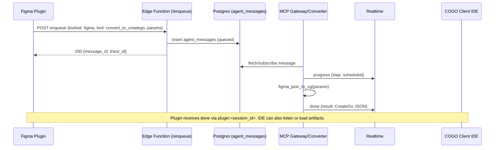
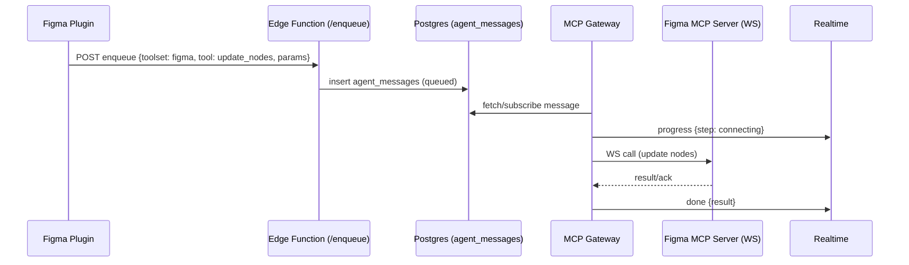

## Supabase Realtime Protocol for Distributed Agents (Figma Plugin Compatible)

This document specifies a transport-agnostic protocol tailored for the COGO distributed agent system using Supabase (Postgres + Realtime + Edge Functions). It is designed to be compatible with constrained clients such as Figma plugins (no npm packages), while supporting scalable, multi-tenant agent workflows.

The document also provides a compatibility mapping from existing CreateGo-Agents protocols to the new protocol to enable incremental adoption by developers.

### Goals
- Minimal client footprint: Figma plugin can use only `fetch` and basic WebSocket.
- Real-time UX: progress streaming and human-in-the-loop prompts via Supabase Realtime broadcast.
- Multi-tenancy: strict scoping by `project_id`, optional `session_id`.
- Server-side mediation: all DB writes via service role; end-user auth optional at first (no-auth mode), future-ready for RLS.
- Backpressure and observability: queue via `agent_messages`, audit via `bus_events`, per-project metrics.

### Non-Goals
- Direct DB writes from Figma plugin.
- Client-specific SDK requirements.

---

## 1) Transport Matrix

- HTTP (Supabase Edge Function)
  - Submit new work (enqueue), poll results (fallback), send human responses.
  - Publicly callable with `Authorization: Bearer <ANON>`; DB operations executed with service role on server-side.

- Realtime (Supabase Realtime broadcast)
  - Streaming progress/events from agents to the plugin.
  - Channel naming scoped by `session_id` (UI scope) and filtered by `project_id`.

---

## 2) Identity & Routing

Canonical identifiers:
- `project_id: uuid` — multi-tenancy boundary; all bus rows tagged with this.
- `cogo_project_id?: uuid` — internal COGO scope identifier; optional and independent from `project_id` (no mapping required). If provided by caller, it is propagated to bus/realtime payloads and can be used for internal filtering and observability. Not used for authorization decisions.
- `session_id: string` — UI session scope (e.g., a single Figma plugin session or tab).
- `trace_id: string` — end-to-end tracing across enqueue → worker → external MCP → response.
- `message_id: uuid` — primary key of `agent_messages` row produced by enqueue.
- `agent_id: string` — logical identifier of the worker handling the message.

Routing primitives:
- Bus table: `public.agent_messages(project_id, status, payload, ...)`
- Event table: `public.bus_events(project_id, event_type, payload, ...)`
- Realtime channels (broadcast): `plugin:<session_id>`

---

## 3) Message Envelope

All protocol payloads share a common envelope to simplify logging, metrics, and evolution.

```ts
type ProtocolVersion = '1.0';

interface Envelope<T = unknown> {
  v: ProtocolVersion;        // protocol version
  type: string;              // semantic event type (see sections below)
  ts: string;                // ISO timestamp (server-populated when emitted by agents)
  trace_id?: string;         // for e2e tracing
  project_id: string;        // uuid (required on server-emitted events)
  session_id?: string;       // UI scoping
  message_id?: string;       // agent_messages.id
  service?: string;          // e.g., 'mcp'
  role?: string;             // e.g., 'gateway'
  shard?: number;            // worker shard id
  agent_id?: string;         // logical worker id
  data?: T;                  // event-specific body
}
```

Notes:
- Clients may omit `ts` on requests; server populates when publishing events.
- `project_id` is required on server-side publications and bus writes.
- `cogo_project_id` is optional; when absent, server records `null` without attempting any auto-mapping to `project_id`.

---

## 4) HTTP API (Edge Functions)

All endpoints live under an Edge Function (example path `/figma-plugin/*`), and accept CORS with anonymous access in no-auth mode. In auth mode, require Supabase Auth JWT (Anon for read, Service for privileged server-side only).

### 4.1 Enqueue
`POST /figma-plugin/enqueue`

Request body:
```ts
interface EnqueueRequest {
  // Routing
  project_id: string;            // uuid, required
  session_id?: string;
  shard?: number;                // optional routing hint

  // Work description
  toolset: 'figma' | string;     // e.g., 'figma'
  tool: string;                  // e.g., 'get_document_info' | 'convert_to_creatego'
  params: Record<string, unknown>;
}
```

Response body (200):
```ts
interface EnqueueResponse {
  ok: true;
  message_id: string;            // uuid
  trace_id: string;
}
```

Response body (4xx/5xx):
```ts
interface ErrorResponse {
  ok: false;
  code: string;                  // e.g., 'invalid_project', 'enqueue_failed'
  message?: string;
}
```

Semantics:
- Inserts one row into `agent_messages` with `service='mcp'`, `role='gateway'`, `status='queued'`, `project_id`, payload `{ toolset, tool, params, session_id, project_id }`.
- Returns `message_id` (uuid generated by DB) and `trace_id` (server-generated or derived).

Compatibility helper: see Section 8 for mapping CreateGo Figma JSON conversion request to `tool='convert_to_creatego'` params.

### 4.2 Result (Polling Fallback)
`GET /figma-plugin/result?messageId=<uuid>`

Response (200):
```ts
type ResultStatus = 'queued' | 'in_progress' | 'succeeded' | 'failed';

interface ResultResponse {
  ok: true;
  message_id: string;
  status: ResultStatus;
  result?: unknown;
  error?: {
    code: string;
    message?: string;
  };
}
```

### 4.3 Respond (Human-in-the-Loop)
`POST /figma-plugin/respond`

Used by the plugin to respond to `input_required` events when client cannot publish via Realtime (or as a canonical write path).

```ts
interface HumanResponse {
  project_id: string;
  session_id?: string;
  message_id: string;             // correlates to original work item
  prompt_type: 'dynamic_style' | 'suggested_events' | 'mapped_dynamic_ui_state' | 'mapped_app_data' | 'flow_completion' | string;
  payload: Record<string, unknown>; // exact structure per prompt type (see 6.3)
}
```

Semantics:
- Server converts this to a response bus message or directly injects into the worker context.
- Emits `bus_events` with `event_type='human_response_received'`.

---

## 5) Realtime (Broadcast) Events

Channel name: `plugin:<session_id>`

Event names and bodies are published using the `Envelope` structure. Clients subscribe to the channel and handle the following `type` values in the envelope:

### 5.1 Heartbeat
```ts
type = 'heartbeat'
data = { alive: true }
```

### 5.2 Progress
```ts
type = 'progress'
data = {
  step: 'scheduled' | 'connecting' | 'calling' | 'parsing_result' | 'persisting' | string;
  toolset: string;
  tool: string;
  percent?: number;               // optional heuristic
}
```

### 5.3 Stream (Incremental Output)
```ts
type = 'stream'
data = {
  chunk: unknown;                 // tool-specific chunk
  sequence?: number;
}
```

### 5.4 Input Required (HITL)
```ts
type = 'input_required'
data = {
  prompt_type: 'dynamic_style' | 'suggested_events' | 'mapped_dynamic_ui_state' | 'mapped_app_data' | 'flow_completion' | string;
  prefix?: string;
  fields: Record<string, unknown>; // concrete field contract per prompt_type (see 6.3)
}
```

Client responses:
- Preferred: `POST /figma-plugin/respond` with `HumanResponse`.
- Optional (advanced): publish to a request-scoped channel (out of scope for no-auth mode).

### 5.5 Done
```ts
type = 'done'
data = {
  toolset: string;
  tool: string;
  latency_ms?: number;
  result: unknown;
}
```

### 5.6 Error
```ts
type = 'error'
data = {
  code: string;                    // e.g., 'mcp_call_failed', 'invalid_params'
  message?: string;
  details?: unknown;
}
```

---

## 6) Payload Contracts (Selected Tools)

### 6.1 Figma: get_document_info

Enqueue params:
```ts
interface GetDocumentInfoParams {
  file_key: string;                 // Figma file key (if applicable)
  node_ids?: string[];              // optional subset
}
```

Done result sample:
```ts
interface GetDocumentInfoResult {
  nodes: unknown[];                 // normalized nodes
  stats?: Record<string, unknown>;
}
```

### 6.2 Figma: convert_to_creatego (Compatibility with CreateGo JSON)

Enqueue params (maps from `JSONConversionRequest`):
```ts
interface ConvertToCreateGoParams {
  user_id?: string;                 // forwarded (optional)
  project_id: number | string;      // required by converter
  page_id: number | string;         // required by converter
  is_whole_page_selected?: boolean;
  figma_json?: unknown;             // array or object
  input_image?: string | null;      // url or base64
  image_type?: 'url' | 'image/png' | 'image/jpeg' | 'image/svg+xml';
  feedback_json?: unknown;
  use_vision_corrections?: boolean;
}
``;

Done result:
```ts
type ConvertToCreateGoResult = unknown[]; // CreateGo components array
```

### 6.3 HITL Prompt/Response Contracts

Prompt → `input_required` data.fields
Response → `POST /figma-plugin/respond` payload

- dynamic_style
  - fields: `{ items: Array<unknown> }`
  - response.payload: `{ revised_style_json: Array<unknown>, response?: string }`

- suggested_events
  - fields: `{ items: Array<unknown> }`
  - response.payload: `{ suggested_event: Array<unknown>, response?: string }`

- mapped_dynamic_ui_state
  - fields: `{ state: Record<string, unknown> }`
  - response.payload: `{ dynamic_uiState: Record<string, unknown>, response?: string }`

- mapped_app_data
  - fields: `{ data: Array<unknown> }`
  - response.payload: `{ dynamic_uiState: Array<unknown>, response?: string }` // maintained for backward-compat

- flow_completion
  - fields: `{ scenarios: Array<string> }`
  - response.payload: `{ gherkin_scenario: Array<string>, response?: string }`

---

## 7) Error Model

Standard error codes:
- `invalid_project`, `invalid_session`, `invalid_params`, `enqueue_failed`
- `mcp_call_failed`, `tool_not_supported`, `timeout`
- `human_response_invalid`

All errors use the `Envelope` with `type='error'` on Realtime, and `ErrorResponse` on HTTP.

---

## 8) Compatibility: CreateGo-Agents → New Protocol

### 8.1 HTTP JSONConversionRequest → Enqueue(convert_to_creatego)

Current request (CreateGo): `POST /figma-to-creatego` with `JSONConversionRequest`:
```ts
interface JSONConversionRequest {
  user_id: string;
  session_id?: string;
  request_id?: string;
  project_id: number;
  page_id: number;
  is_whole_page_selected: boolean;
  figma_json?: any;
  input_image?: string;
  image_type?: 'url'|'image/png'|'image/jpeg'|'image/svg+xml';
  feedback_json?: any;
  use_vision_corrections?: boolean;
}
```

New request (Edge Function): `POST /figma-plugin/enqueue`
```json
{
  "project_id": "<uuid>",
  "session_id": "<string>",
  "toolset": "figma",
  "tool": "convert_to_creatego",
  "params": {
    "user_id": "<string>",
    "project_id": 1,
    "page_id": 1,
    "is_whole_page_selected": true,
    "figma_json": [ ... ],
    "input_image": null,
    "image_type": "image/png",
    "feedback_json": null,
    "use_vision_corrections": false
  }
}
```

Response streaming: via Realtime channel `plugin:<session_id>` with `type='progress'|'done'|'error'` and final `result` identical to CreateGo result array.

### 8.2 WS ActionFlow → Realtime Events

Current WS server emits:
- `heartbeat`, `stream`, `input_required`, `complete`, `final`, `error`

New Realtime mapping:
- Same `type` values in the `Envelope`, published to `plugin:<session_id>`.
- For HITL responses, use `POST /figma-plugin/respond` with the contracts in 6.3.

---

## 9) Versioning & Evolution

- `Envelope.v` starts at `'1.0'`. Breaking changes bump minor/major.
- Event types are additive; deprecated types retained for one minor version.
- Tool contracts (`toolset`, `tool`) are versioned by adding `tool_version?: string` in `params` when needed.

---

## 10) Security & RLS (Roadmap)

No-auth mode (now):
- Edge Functions accept public requests with Anon bearer; server holds Service Role for DB writes.
- Realtime subscriptions are public but scoped to ephemeral `session_id` channels.

Auth mode (later):
- Supabase Auth JWT required for Edge and Realtime.
- `agent_messages`/`bus_events` guarded by RLS policies that permit reads within `project_id` membership.

---

## 11) Observability & Metrics

- `bus_events.event_type` standard values: `mcp_call_scheduled`, `mcp_call_started`, `mcp_call_succeeded`, `mcp_call_failed`, `human_response_required`, `human_response_received`.
- UUI direct calls emit `uui_call_succeeded` / `uui_call_failed` with payload `{ uui_tool, latency_ms, cogo_project_id?, legacy?, artifact? }`.
- Project-scoped summaries exposed via HTTP:
  - MCP: `/api/metrics/mcp/project?projectId=<uuid>`
  - UUI: `/api/metrics/uui/project?projectId=<uuid>&cogoProjectId=<uuid>` (includes p50/p95/successRate and per-tool stats)

---

## 12) Examples

### 12.1 Enqueue (curl)
```bash
curl -s -X POST "$SUPABASE_URL/functions/v1/figma-plugin/enqueue" \
  -H "Content-Type: application/json" \
  -H "Authorization: Bearer $SUPABASE_ANON_KEY" \
  -H "apikey: $SUPABASE_ANON_KEY" \
  -d '{
    "project_id": "00000000-0000-0000-0000-000000000000",
    "session_id": "session-abc",
    "toolset": "figma",
    "tool": "convert_to_creatego",
    "params": { "project_id": 1, "page_id": 1, "is_whole_page_selected": true, "figma_json": [] }
  }'
```

### 12.2 Realtime Event (progress)
```json
{
  "v": "1.0",
  "type": "progress",
  "ts": "2025-08-19T03:00:00.000Z",
  "trace_id": "tr-123",
  "project_id": "00000000-0000-0000-0000-000000000000",
  "session_id": "session-abc",
  "message_id": "2a5f...",
  "service": "mcp",
  "role": "gateway",
  "data": { "step": "scheduled", "toolset": "figma", "tool": "convert_to_creatego" }
}
```

### 12.3 Human Response (flow_completion)
```bash
curl -s -X POST "$SUPABASE_URL/functions/v1/figma-plugin/respond" \
  -H "Content-Type: application/json" \
  -H "Authorization: Bearer $SUPABASE_ANON_KEY" \
  -H "apikey: $SUPABASE_ANON_KEY" \
  -d '{
    "project_id": "00000000-0000-0000-0000-000000000000",
    "session_id": "session-abc",
    "message_id": "2a5f...",
    "prompt_type": "flow_completion",
    "payload": { "gherkin_scenario": ["Scenario: ..."] }
  }'
```

---

## 13) Developer Checklist

- [ ] Produce `Envelope` when publishing any Realtime event.
- [ ] Include `project_id` in all DB writes and Realtime messages.
- [ ] For Figma conversions, map CreateGo `JSONConversionRequest` → `ConvertToCreateGoParams`.
- [ ] Emit `bus_events` for audit: scheduled/started/succeeded/failed/human_response_*.
- [ ] Use `/respond` for HITL acknowledgements in no-auth mode.
- [ ] Keep message schemas backward-compatible for at least one minor version.

---

## 14) Change Log

- 2025-08-19: Initial version (no-auth baseline, CreateGo compatibility notes).

---

## E) Runbook (Local + Edge)

### E.1 Environment
- Required: `SUPABASE_URL`, `SUPABASE_ANON_KEY`, `SUPABASE_SERVICE_ROLE_KEY`, `PROJECT_ID`
- Edge-only: `EDGE_URL` = `https://<project>.functions.supabase.co/figma-plugin`

### E.2 Start Worker
```bash
SUPABASE_URL=$SUPABASE_URL SUPABASE_SERVICE_ROLE_KEY=$SUPABASE_SERVICE_ROLE_KEY ENABLE_SUPABASE=true AGENT_SERVICE=mcp AGENT_ROLE=gateway AGENT_SHARD=0 npm run -s mcp:gateway
```

### E.3 Smokes
- Session channel smoke:
```bash
EDGE_URL=$EDGE_URL SUPABASE_URL=$SUPABASE_URL SUPABASE_ANON_KEY=$SUPABASE_ANON_KEY PROJECT_ID=$PROJECT_ID npm run -s mcp:smoke:plugin:ws
```

- HITL respond smoke:
```bash
EDGE_URL=$EDGE_URL SUPABASE_URL=$SUPABASE_URL SUPABASE_ANON_KEY=$SUPABASE_ANON_KEY PROJECT_ID=$PROJECT_ID npm run -s mcp:smoke:hitl
```

- Project channel smoke:
```bash
EDGE_URL=$EDGE_URL SUPABASE_URL=$SUPABASE_URL SUPABASE_ANON_KEY=$SUPABASE_ANON_KEY PROJECT_ID=$PROJECT_ID npm run -s mcp:smoke:project
```

- Project metrics smoke:
```bash
EDGE_URL=$EDGE_URL SUPABASE_ANON_KEY=$SUPABASE_ANON_KEY PROJECT_ID=$PROJECT_ID npm run -s mcp:smoke:metrics
```

- Auth mode smoke (optional):
```bash
REQUIRE_AUTH=true EDGE_URL=$EDGE_URL SUPABASE_ANON_KEY=$SUPABASE_ANON_KEY PROJECT_ID=$PROJECT_ID USER_JWT=$USER_JWT npm run -s mcp:smoke:auth
```

- All MCP smokes:
```bash
EDGE_URL=$EDGE_URL SUPABASE_URL=$SUPABASE_URL SUPABASE_ANON_KEY=$SUPABASE_ANON_KEY PROJECT_ID=$PROJECT_ID npm run -s smoke:all:mcp
```


---

## A) Components and Relationships

This section explains the major components (Figma Plugin, Figma MCP, COGO Agent, and COGO Client IDE) and how they relate under this protocol.

### A.1 Components

- Figma Plugin
  - Constrainted client environment (no npm install). Can use `fetch` and raw WebSocket.
  - Initiates requests using Edge Functions (`/figma-plugin/enqueue`) and receives live updates via Realtime broadcast on `plugin:<session_id>`.
  - Can submit human-in-the-loop responses using `POST /figma-plugin/respond`.

- Figma MCP (Model Context Protocol)
  - External MCP servers (e.g., Talk-to-Figma) accessed by agents (MCP gateway) via WebSocket.
  - Provides tools such as `get_document_info`, `update_nodes`, etc.
  - Not directly exposed to the plugin. All calls are orchestrated by agents via the message bus.

- COGO Agent (Distributed Workers)
  - `MCPGatewayBusWorker` consumes `agent_messages`, calls external MCP/transformers, and publishes `bus_events` and Realtime broadcasts.
  - Emits `progress`, `input_required`, `done`, and `error` events to `plugin:<session_id>`.
  - Persists artifacts/results as needed and records audit events (`bus_events`).

- COGO Client IDE (Flutter Web Canvas)
  - Renders COGO JSON (CreateGo schema) on a canvas.
  - Integration modes:
    - Live mode: Subscribe to Realtime (shared `session_id` or a project-scoped channel) and render incoming `done` results.
    - Batch mode: Query an HTTP endpoint or artifacts store (e.g., `/artifacts`) to load latest outputs for a `project_id`.

### A.2 Relationships (High-level)

```mermaid
graph TD
  subgraph Client
    FP[Figma Plugin]
    IDE[COGO Client IDE (Flutter Web Canvas)]
  end

  subgraph Supabase
    EF[Edge Functions]
    RT[Realtime]
    PG[Postgres]
  end

  subgraph Agents
    GW[MCP Gateway Worker]
    AG[Other Workers]
  end

  FP -- HTTP enqueue/respond --> EF
  EF -- insert/select --> PG
  GW -- consume agent_messages --> PG
  GW -- publish progress/done/error --> RT
  FP -- subscribe plugin:<session_id> --> RT
  IDE -- subscribe (session or project scope) --> RT
  AG -- optional bus processing --> PG
```

Notes:
- Workers may fetch or subscribe to new `agent_messages` (via polling or Realtime-triggered processing).
- IDE can either share the same `session_id` with the plugin to receive the exact stream or use project-scoped feeds (implementation detail, see below).

---

## B) End-to-End Flow Scenarios

### B.1 Convert Figma JSON → CreateGo JSON



Recommendations:
- For Plugin: always subscribe to `plugin:<session_id>` prior to enqueue to avoid race conditions.
- For IDE: if collaborating with a Plugin session, reuse the same `session_id`; otherwise, poll project-scoped views or subscribe to a project feed.

### B.2 Round-trip: Agent modifies Figma via MCP



Notes:
- Workers handle MCP authentication and sessions; Plugin only sees high-level progress and results.

---

## C) IDE Integration Guidance

Two recommended modes:

1) Session-coupled Live Preview
   - IDE subscribes to `plugin:<session_id>` (shared by Plugin) to receive `progress/stream/done`.
   - On `done` for `convert_to_creatego`, IDE renders the returned CreateGo JSON on the canvas.

2) Project-scoped Consumption
   - IDE queries a project-scoped endpoint (e.g., `/api/metrics/mcp/project?projectId=...`) to detect new results, then fetches artifacts or requests the final JSON via a dedicated endpoint (e.g., `/artifacts/...` or a project-scoped REST).
   - Suitable for review dashboards and asynchronous collaboration.

Schema expectations for IDE:
- Targets CreateGo/COGO JSON arrays as `result` in `done` events for `convert_to_creatego`.
- Future-safe: if artifacts are used, `done.data` may contain `{ artifact_url, artifact_hash }` instead of inline JSON.

---

## D) Channel Scoping Strategy

- Primary: `plugin:<session_id>` for any client UI that needs immediate streaming feedback.
- Optional (future): `project:<project_id>` broadcast for project-wide consumers (dashboards, IDE without session coupling).
- Publish minimal PII; rely on `project_id` and `trace_id` for correlation.


