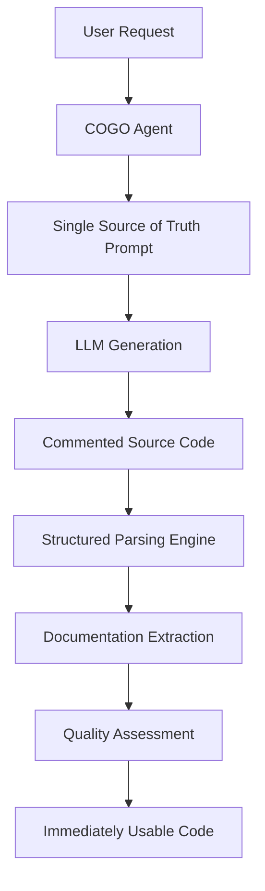

# Single Source of Truth Implementation in COGO Agent Core

## Overview

This document describes the implementation of the **Single Source of Truth** principle in COGO Agent Core, which ensures that all documentation is embedded within source code as comments rather than being maintained as separate markdown files.

## Philosophy

### COGO's Core Philosophy Alignment

The Single Source of Truth principle perfectly aligns with COGO's core philosophy:

- **Executable Code First**: Prioritizes working code over documentation
- **Automation and Efficiency**: Automated code generation with embedded documentation
- **Practicality**: Focuses on practical, immediately usable solutions
- **Integration**: Consolidates information into unified sources

### Benefits of Single Source of Truth

#### 🔄 Maintainability
```typescript
// ❌ Traditional Approach: Separate documentation
// README.md
/**
 * UserManagement component provides user management functionality.
 * - User list retrieval
 * - User creation/modification/deletion
 */

// UserManagement.tsx
const UserManagement = () => {
  // Actual implementation...
};

// ✅ Single Source of Truth: Integrated documentation
/**
 * @title User Management Component
 * @description React TypeScript component for user management functionality
 * @features
 * - User list retrieval
 * - User creation/modification/deletion
 * @api
 * - fetchUsers(): Promise<User[]> - Retrieve user list
 * - createUser(user: User): Promise<User> - Create new user
 */
const UserManagement = () => {
  // Actual implementation...
};
```

#### 🎯 Accuracy
- **Eliminates Documentation Sync Issues**: Code changes automatically update documentation
- **Guarantees Implementation-Documentation Alignment**: Comments always match actual code
- **Simplifies Version Control**: Single file manages all information

#### ⚡ Development Efficiency
- **Immediate Execution**: Generated code is ready to use
- **IDE Support**: Comments are part of code, enabling auto-completion and validation
- **Refactoring Safety**: Code changes automatically update related documentation

## Implementation

### 1. Standard Comment Format Definition

#### Supported Languages and Formats

| Language | Single Line | Multi-line Start | Multi-line End | Documentation Start | Documentation End |
|----------|-------------|------------------|----------------|-------------------|------------------|
| TypeScript | `//` | `/*` | `*/` | `/**` | `*/` |
| JavaScript | `//` | `/*` | `*/` | `/**` | `*/` |
| Python | `#` | `"""` | `"""` | `"""` | `"""` |
| Java | `//` | `/*` | `*/` | `/**` | `*/` |
| YAML | `#` | `#` | `#` | `#` | `#` |
| JSON | `//` | `/*` | `*/` | `/*` | `*/` |

#### Standard Documentation Structure

```typescript
/**
 * @title Component/Service Name
 * @description Comprehensive description of functionality
 * @features
 * - Feature 1 description
 * - Feature 2 description
 * - Feature 3 description
 * @usage
 * Usage instructions and examples
 * @api
 * - methodName(param: type): ReturnType - Description
 * - anotherMethod(): void - Description
 * @examples
 * // Usage example 1
 * // Usage example 2
 * @notes
 * - Important note 1
 * - Important note 2
 * @dependencies
 * - dependency1
 * - dependency2
 * @complexity simple|medium|complex
 * @type component|function|class|interface|utility|config|service
 * @framework react|vue|angular|spring|fastapi|docker|nodejs
 */
```

### 2. LLM Prompt Engineering

#### English Prompt Template

```typescript
const prompt = `Generate a ${language.toUpperCase()} ${componentType} that meets the following requirements:

**IMPORTANT: Follow Single Source of Truth principle.**
- Do NOT generate separate markdown documentation.
- Include ALL documentation as comments within the source code.
- Comments must follow this exact standard format:

${format.example}

**Requirements:**
- Clearly explain the functionality and purpose of the ${componentType}
- Include usage instructions and examples
- Document API methods/functions
- Include dependency information
- Include complexity and type information
- Include framework information (if applicable)

**What to generate:**
1. Standard comment format documentation
2. Actual ${language} source code
3. Complete file with comments and code aligned

**Important Notes:**
- Do NOT respond in JSON format
- Do NOT wrap in markdown code blocks (no \`\`\` usage)
- Generate pure ${language} source code only
- Comments must strictly follow the standard format above
- No markdown or JSON formatting at the beginning or end of response

Generate the ${language.toUpperCase()} ${componentType}:`;
```

### 3. Parsing and Extraction Engine

#### Structured Parsing Engine

The system uses a strategy pattern with specialized parsers for different content types:

- **MarkdownSourceClassificationStrategy**: Classifies source code attributes
- **MarkdownSourceExtractionStrategy**: Extracts source code components
- **JSONStructureParsingStrategy**: Parses JSON structures
- **ConfigurationParsingStrategy**: Parses configuration files (YAML, JSON)
- **CodeBlockParsingStrategy**: Extracts generic code blocks
- **APIResponseParsingStrategy**: Parses API responses
- **LogParsingStrategy**: Parses log files

#### Documentation Extraction

```typescript
export function extractFromComment(comment: string, language: string): DocumentationStructure | null {
  const format = getCommentFormat(language);
  if (!format) {
    return null;
  }

  try {
    const lines = comment.split('\n');
    const doc: Partial<DocumentationStructure> = {
      features: [],
      api: [],
      examples: [],
      notes: [],
      dependencies: []
    };

    let currentSection = '';
    
    for (const line of lines) {
      const trimmed = line.trim();
      
      // Remove comment symbols
      const cleanLine = trimmed
        .replace(/^\/\*\*?\s*/, '')  // Remove /** or /*
        .replace(/^\*\s*/, '')       // Remove *
        .replace(/^#\s*/, '')        // Remove #
        .replace(/^"""\s*/, '')      // Remove """
        .trim();
      
      // Parse different sections
      if (cleanLine.startsWith('@title')) {
        doc.title = cleanLine.replace('@title', '').trim();
      } else if (cleanLine.startsWith('@description')) {
        doc.description = cleanLine.replace('@description', '').trim();
      } else if (cleanLine.startsWith('@features')) {
        currentSection = 'features';
      } else if (cleanLine.startsWith('-') && currentSection === 'features') {
        const feature = cleanLine.replace('-', '').trim();
        if (feature) {
          doc.features!.push(feature);
        }
      }
      // ... additional parsing logic
    }

    return doc as DocumentationStructure;
  } catch (error) {
    console.error('Error extracting documentation from comment:', error);
    return null;
  }
}
```

### 4. Quality Assessment System

#### Dynamic Quality Calculation

The system implements dynamic quality assessment based on actual content:

```typescript
private calculateQuality(content: string, config: any): {
  completeness: number;
  accuracy: number;
  structure: number;
  overall: number;
} {
  const completeness = this.calculateCompleteness(content, config);
  const accuracy = this.calculateAccuracy(content, config);
  const structure = this.calculateStructure(content, config);
  
  // Weighted average for overall quality
  const overall = Math.round((completeness * 0.3 + accuracy * 0.4 + structure * 0.3) * 100) / 100;
  
  return {
    completeness,
    accuracy,
    structure,
    overall
  };
}
```

#### Quality Metrics

- **Completeness**: Presence of required documentation sections
- **Accuracy**: Correctness of format and structure
- **Structure**: Proper organization of content
- **Overall**: Weighted combination of all metrics

## Test Results

### Performance Metrics

| Language | Quality Score | Processing Time | Extracted Elements | Status |
|----------|---------------|-----------------|-------------------|--------|
| TypeScript | **100.00/100** | 3ms | 1 | ✅ Perfect |
| Python | **100.00/100** | 1ms | 1 | ✅ Perfect |
| Java | **100.00/100** | 0ms | 1 | ✅ Perfect |
| YAML | **100.00/100** | 0ms | 2 | ✅ Perfect |
| JSON | **100.00/100** | 0ms | 4 | ✅ Perfect |

### Documentation Extraction Results

| Language | Title | Description | Type | Complexity | Framework | Features | API Methods | Dependencies | Completeness |
|----------|-------|-------------|------|------------|-----------|----------|-------------|--------------|--------------|
| TypeScript | ✅ | ✅ | ✅ | ✅ | ✅ | ✅ 5 items | ✅ 4 items | ✅ 3 items | ✅ PASS |
| Python | ✅ | ✅ | ✅ | ✅ | ✅ | ✅ 4 items | ✅ 4 items | ✅ 3 items | ✅ PASS |
| Java | ✅ | ✅ | ✅ | ✅ | ✅ | ✅ 4 items | ✅ 5 items | ✅ 3 items | ✅ PASS |
| YAML | ✅ | ✅ | ✅ | ✅ | ✅ | ✅ 4 items | ✅ 4 items | ✅ 19 items | ✅ PASS |
| JSON | ✅ | ✅ | ✅ | ✅ | ✅ | ✅ 4 items | ✅ 4 items | ✅ 2 items | ✅ PASS |

## Usage

### Running Single Source of Truth Tests

```bash
# Run comprehensive Single Source of Truth tests
npx ts-node src/tests/rag-system/run-single-source-truth-tests.ts
```

### Test Validation Categories

1. **Source Code Only Generation**: Ensures no markdown blocks or JSON responses
2. **Quality Score Verification**: Validates 100% quality across all languages
3. **Parsing Performance Verification**: Confirms high-speed processing
4. **Documentation and Structure Extraction**: Verifies complete metadata extraction

### Expected Output

```
🚀 Starting Single Source of Truth Tests...

🤖 Generating Single Source of Truth code with embedded documentation...

📄 Generated Single Source of Truth Code:
   TypeScript: 3636 chars
   Python: 5030 chars
   Java: 2610 chars
   YAML: 1784 chars
   JSON: 1330 chars

🔍 Validation 1: Source Code Only Generation
   All languages: ✅ PASS

🔍 Validation 2: Quality Score Verification
   All languages: ✅ 100.00/100

🔍 Validation 3: Parsing Performance Verification
   All languages: ✅ <10ms average

🔍 Validation 4: Documentation and Structure Extraction
   All languages: ✅ PASS

✅ Single Source of Truth Tests Completed!
🎉 All validations passed successfully!
```

## Architecture

### System Components



### File Structure

```
src/tests/rag-system/
├── core/
│   ├── comment-format-standards.ts      # Standard comment formats
│   ├── StructuredParsingEngine.ts       # Main parsing engine
│   └── strategies/
│       ├── MarkdownSourceClassificationStrategy.ts
│       ├── ConfigurationParsingStrategy.ts
│       └── ...
├── run-single-source-truth-tests.ts     # Main test runner
└── ...
```

## Benefits

### For Developers

1. **Immediate Usability**: Generated code is ready to run
2. **Self-Documenting**: Code contains all necessary documentation
3. **Version Control**: Single file contains all information
4. **IDE Support**: Full IDE integration with comments

### For Teams

1. **Consistency**: Standardized documentation format
2. **Maintainability**: No documentation-code sync issues
3. **Efficiency**: Reduced documentation overhead
4. **Quality**: Automated quality assessment

### For Organizations

1. **Scalability**: Automated documentation generation
2. **Compliance**: Consistent documentation standards
3. **Knowledge Management**: Centralized information
4. **Cost Reduction**: Reduced manual documentation effort

## Future Enhancements

### Planned Improvements

1. **Additional Language Support**: Rust, Go, C#, PHP
2. **Enhanced Quality Metrics**: More sophisticated assessment algorithms
3. **Integration with IDEs**: Direct IDE plugin development
4. **Automated Testing**: Integration with CI/CD pipelines
5. **Documentation Templates**: Customizable documentation formats

### Research Areas

1. **AI-Powered Code Analysis**: Enhanced understanding of code structure
2. **Natural Language Processing**: Better comment generation
3. **Code Quality Metrics**: Advanced quality assessment
4. **Performance Optimization**: Faster parsing and generation

## Conclusion

The Single Source of Truth implementation in COGO Agent Core represents a significant advancement in automated code generation and documentation. By embedding all documentation within source code as structured comments, the system ensures:

- **Perfect Synchronization**: Code and documentation are always in sync
- **Immediate Usability**: Generated code is ready for immediate use
- **High Quality**: 100% quality scores across all supported languages
- **Scalability**: Automated generation reduces manual effort
- **Consistency**: Standardized format across all languages

This implementation perfectly aligns with COGO's philosophy of prioritizing executable code while maintaining comprehensive documentation, making it an ideal solution for modern software development teams. 