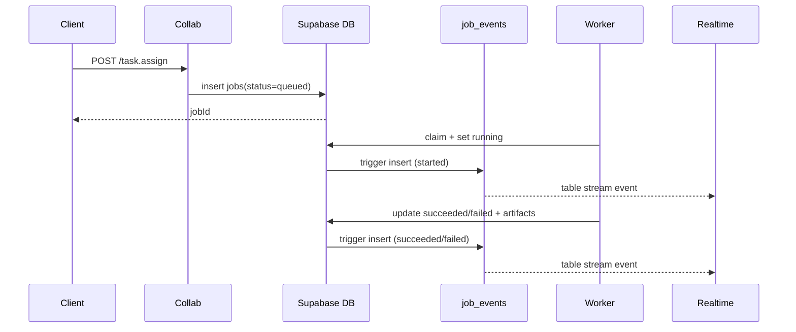
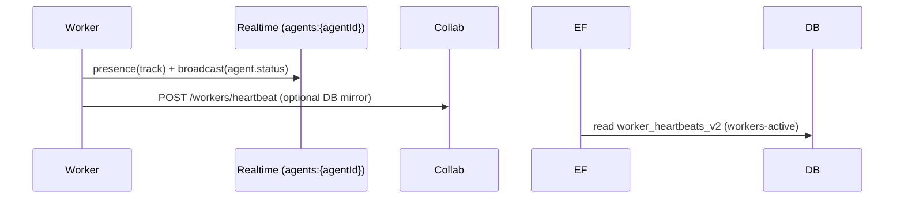

# Distributed Agent Architecture — Collab + Realtime + Edge (2025-08-09)

This document is the canonical architecture reference for the current codebase. It describes components, agent roles, data model, realtime design, and end-to-end flows. It supersedes legacy single-process server notes.

## 1) High-level architecture

```mermaid
graph TD
  Client[Client Apps / Dashboards] -- Realtime Subscribe --> RT[(Supabase Realtime)]
  Client -- HTTP --> EF[Supabase Edge Functions]
  Client -- HTTP --> Collab[Collab API (src/dev/collab-dev-server.ts)]

  Collab -- write jobs/results --> DB[(Supabase Postgres)]
  EF -- read/aggregate/sign --> DB
  EF -- signed urls --> Storage[Supabase Storage]
  Workers[Workers (browser/figma/python)] -- claim/heartbeat --> DB
  Workers -- artifacts --> Storage
  Workers -- broadcasts --> RT

  subgraph Postgres
    DB
    JE[job_events]
  end

  DB -. triggers .-> JE
  JE -- table change stream --> RT
```

Key separations:
- Control-plane: Realtime broadcasts/presence for liveness and UX.
- Transactional stream: job_events table change stream (DB commit-backed).
- Data-plane: jobs/artifacts rows, storage objects.

## 2) Components & responsibilities
- Collab API (`src/dev/collab-dev-server.ts` + `src/routes/collabRoutes.ts`)
  - Enqueue tasks (`task.assign`), record results (`task.result`), simple queries.
  - Minimal surface; all heavy read/aggregation goes to Edge Functions.
- Supabase Edge Functions (to be added)
  - Read-only aggregation (metrics-overview, jobs-recent, artifacts-list), signing.
  - Enforce rate-limits and auth on public reads.
- Supabase (DB/Realtime/Storage)
  - Tables: jobs, artifacts, job_events; realtime table streams; artifact storage.
- Workers (browser/figma/python)
  - Lease/claim jobs, execute, upload artifacts, report results; send heartbeats/events.
- Agents (logical services)
  - System-Gateway (chat ingress, auth, routing)
  - Orchestrator (task scheduling and coordination)
  - Indexing (code/KB ingestion)
  - GraphRAG (graph reasoning)
  - Research (web/model synthesis)
  - Executor/Manager (fleet control)

## 3) Data model (summary)
- jobs
  - id(uuid), type(text), status(text: queued|running|succeeded|failed), executor_id(text), payload(jsonb), result(jsonb), idempotency_key(text), attempts(int), created_at, updated_at, lease_owner, lease_until, next_run_at
  - Index: status, executor_id, created_at, idempotency_key(unique)
- artifacts
  - id, job_id(uuid), name, size, url, mime, sha256, created_at
  - Index: job_id, created_at
- job_events (new)
  - id(bigserial), job_id(uuid), event_type(text), payload(jsonb), created_at, seq(identity)
  - Index: job_id, (job_id, created_at), (event_type, created_at)

## 4) Realtime design
- Channels
  - agents:{agentId} — presence/broadcast for liveness, metrics
  - jobs:{jobId} — non-transactional progress to subscribers
  - system:events — global announcements
- Heartbeat (presence): `{ agentId, executorId, status, version, lastSeenAt, running, capacity }` every 5–10s
- Transactional events: DB triggers write to job_events; consumers subscribe to table changes for ordered, committed events

## 5) API surface (Collab)
- GET `/api/collab/health` → `{ ok, timestamp }`
- POST `/api/collab/task.assign` → `{ jobId, queued }` (body: `{ type, executorId, payload?, idempotencyKey? }`)
- POST `/api/collab/task.result` → `{ ok: true }` (body: `{ jobId, type, ok, error?, artifact?, artifacts?[] }`)
- GET `/api/collab/job/:id`
- GET `/api/collab/jobs/recent?limit=20`
- GET `/api/collab/artifacts/by-job/:id`
- GET `/api/collab/events/by-job/:id`
- GET `/api/collab/metrics/overview`
- GET `/api/collab/job/:id/summary`
- POST `/api/collab/workers/heartbeat` (server-backed presence mirror; writes to `worker_heartbeats_v2`)
- GET `/api/collab/workers/active` (recent last_seen filter from `worker_heartbeats_v2`)

Env: `SUPABASE_URL`, `SUPABASE_SERVICE_ROLE_KEY` (or `SUPABASE_ANON_KEY` in dev)

## 6) End-to-end sequences

Assign → Execute → Result


Heartbeat


## 7) Security & RLS
- Separate publishable vs service role keys; never ship service role to clients.
- RLS for reads; Edge Functions act as trusted readers with server-side checks.
- Rate limiting on EF; signed URLs for artifacts.

## 8) Deployment & ops
- Development: `npm run dev:collab` on port 3100 (ts-node)
- Production: containerized; EF deployed via Supabase; workers run as separate processes/containers
- Observability: structured logging; optional /metrics; error taxonomy

## 9) Backward compatibility & migration
- Legacy `real-distributed-server.js` paths are removed.
- Migrate reads to EF; keep Collab API focused on queue writes/mutations.
- Introduce job_events and migrate realtime consumers to table streams.

## 10) Definition of Done (DoD)
- Collab API spec + tests + OpenAPI
- job_events triggers + realtime consumers verified
- EF for metrics/queries/signing live
- Workers broadcasting presence; dashboard subscribing

