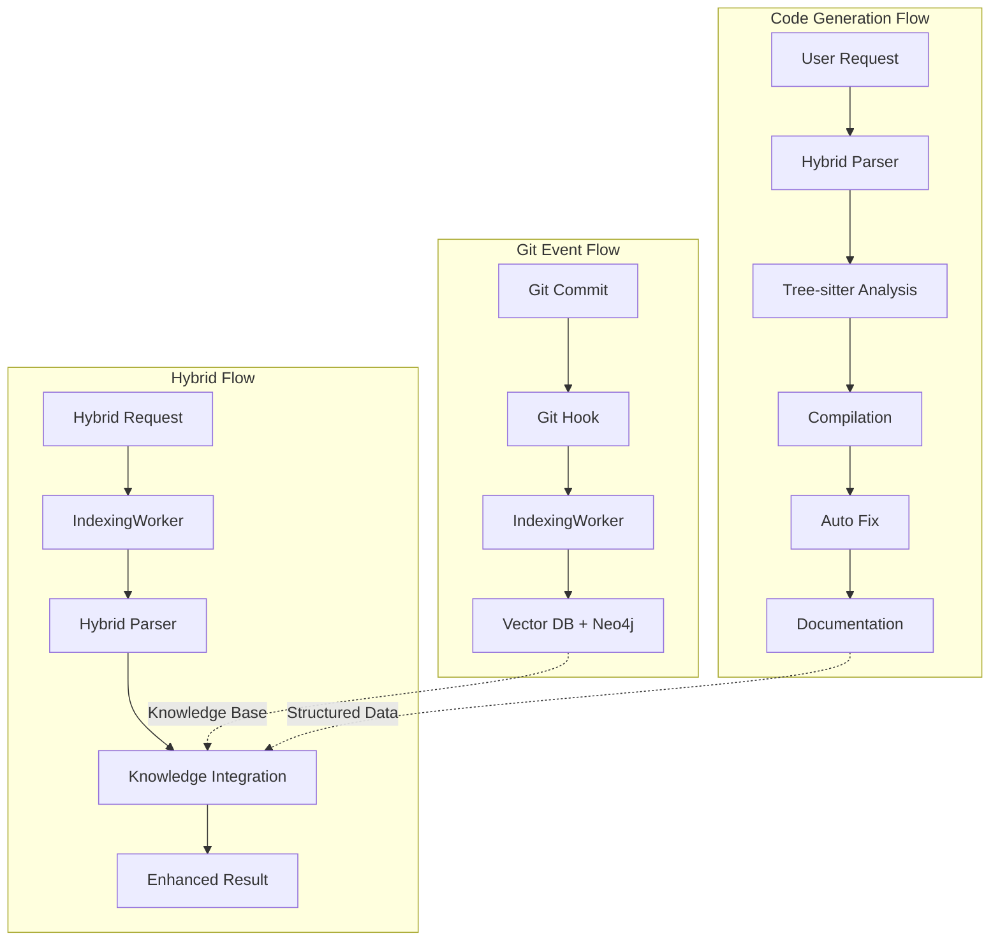

# Git Indexing vs 하이브리드 파싱 시스템 차이점 분석

## 📋 분석 개요

**작성일**: 2025-08-06  
**분석 대상**: 기존 IndexingWorker vs 새로운 하이브리드 파싱 시스템  
**목적**: 두 시스템의 차이점 파악 및 통합 방안 수립

---

## 🔍 **기존 IndexingWorker 시스템 분석**

### **1. 시스템 아키텍처**

#### **A. 이벤트 기반 구조**
```typescript
// src/agents/cogo-indexing-worker.ts
export class IndexingWorker extends BaseAgent {
  private realtimeQueue: SupabaseRealtimeQueue;
  
  private async setupRealtimeSubscriptions(): Promise<void> {
    // 에이전트 통신 채널 구독
    await this.realtimeQueue.subscribeToChannel('agents.indexing', (message) => {
      this.handleIndexingRequest(message);
    });

    // 작업 관리 채널 구독
    await this.realtimeQueue.subscribeToChannel('tasks.requests', (message) => {
      this.handleTaskRequest(message);
    });
  }
}
```

#### **B. Git Hooks 이벤트 처리**
```typescript
private async handleIndexingRequest(message: any): Promise<void> {
  switch (message.type) {
    case 'index_project':      // 전체 프로젝트 인덱싱
      await this.indexProject(message.projectPath);
      break;
    case 'index_file':         // 단일 파일 인덱싱
      await this.indexSingleFile(message.filePath);
      break;
    case 'update_index':       // 변경사항 업데이트
      await this.updateIndex(message.changes);
      break;
  }
}
```

### **2. 소스 분석 프로세스**

#### **A. 파일 시스템 스캔**
```typescript
private async scanFileSystem(projectPath: string): Promise<FileInfo[]> {
  const files: FileInfo[] = [];
  
  for (const pattern of this.config.includePatterns) {
    const matches = await glob(pattern, { 
      cwd: projectPath, 
      ignore: this.config.excludePatterns 
    });
    
    for (const match of matches) {
      const filePath = path.join(projectPath, match);
      const stats = fs.statSync(filePath);
      
      if (stats.size <= this.config.maxFileSize) {
        files.push({
          path: filePath,
          relativePath: match,
          size: stats.size,
          language: this.detectLanguage(match),
          lastModified: stats.mtime
        });
      }
    }
  }
  
  return files;
}
```

#### **B. 파일 처리 및 벡터화**
```typescript
private async processFile(fileInfo: FileInfo): Promise<void> {
  // 1. 파일 내용 읽기
  const content = fs.readFileSync(fileInfo.path, 'utf-8');
  fileInfo.content = content;

  // 2. 파일을 청킹하여 벡터 저장
  await this.chunkAndStoreFile(fileInfo);

  // 3. AST 분석하여 그래프 저장 (지원되는 언어만)
  if (this.isLanguageSupported(fileInfo.language)) {
    await this.analyzeAndStoreAST(fileInfo);
  }
}

private async chunkAndStoreFile(fileInfo: FileInfo): Promise<void> {
  // 간단한 청킹 (라인 단위)
  const lines = fileInfo.content.split('\n');
  const chunks: string[] = [];
  let currentChunk = '';
  const maxChunkSize = 1000; // 문자 수

  for (const line of lines) {
    if (currentChunk.length + line.length > maxChunkSize && currentChunk.length > 0) {
      chunks.push(currentChunk.trim());
      currentChunk = line;
    } else {
      currentChunk += (currentChunk ? '\n' : '') + line;
    }
  }

  // 각 청크에 대해 임베딩 생성 및 벡터 저장
  for (let i = 0; i < chunks.length; i++) {
    const chunk = chunks[i];
    const embeddingResult = await this.embeddingService.generateEmbedding(chunk);
    
    await this.vectorStore.storeVectors([{
      content: chunk,
      embedding: embeddingResult.embedding,
      metadata: {
        filePath: fileInfo.relativePath,
        language: fileInfo.language,
        chunkIndex: i,
        type: 'code_chunk'
      }
    }]);
  }
}
```

### **3. API 엔드포인트**
```typescript
// src/routes/indexingRoutes.ts
router.post('/index-project', async (req: Request, res: Response) => {
  const { projectPath, config } = req.body;
  const result = await indexingWorker.indexProject(projectPath);
  res.json({ success: true, data: result });
});

router.post('/index-file', async (req: Request, res: Response) => {
  const { filePath } = req.body;
  await indexingWorker.executeTask({
    type: 'index_file',
    filePath,
    description: `Index file: ${filePath}`
  });
  res.json({ success: true });
});
```

---

## 🆕 **새로운 하이브리드 파싱 시스템 분석**

### **1. 시스템 아키텍처**

#### **A. 워크플로우 기반 구조**
```typescript
// src/workflows/CompleteWorkflowController.ts
export class CompleteWorkflowController {
  async executeCompleteWorkflow(request: GenerationRequest): Promise<WorkflowResult> {
    // Phase 1: 소스 생성
    const generationResult = await this.executeGenerationPhase(request, workflowId);
    
    // Phase 2: 컴파일
    const compilationResult = await this.executeCompilationPhase(
      generationResult.sourceCode,
      request.language,
      workflowId
    );
    
    if (compilationResult.success) {
      // 성공 경로
      return await this.executeSuccessPath(generationResult, compilationResult, workflowId);
    } else {
      // 오류 해결 경로
      return await this.executeErrorResolutionPath(
        workflowId,
        generationResult.sourceCode,
        compilationResult,
        request.language
      );
    }
  }
}
```

#### **B. 하이브리드 파싱 엔진**
```typescript
// src/parsers/HybridParser.ts
export class HybridParser {
  async parseSourceCode(sourceCode: string, language: string): Promise<HybridParsingResult> {
    // 병렬 처리로 주석과 코드 파싱 동시 실행
    const [commentResult, codeResult] = await Promise.all([
      this.commentParser.parseComments(sourceCode),
      this.treeSitterParser.parseCode(sourceCode, language)
    ]);
    
    // 결과 통합
    const mergedResult = this.mergeResults(commentResult, codeResult);
    
    return {
      commentData: commentResult,
      codeData: codeResult,
      mergedData: mergedResult,
      performance: {
        totalTime: Date.now() - startTime,
        commentParsingTime: commentResult.parsingTime,
        codeParsingTime: codeResult.parsingTime,
        mergeTime: mergedResult.mergeTime
      },
      quality: this.assessQuality(mergedResult)
    };
  }
}
```

### **2. 소스 분석 프로세스**

#### **A. Tree-sitter 기반 정밀 파싱**
```typescript
// src/parsers/TreeSitterParser.ts
export class TreeSitterParser {
  async parseCode(sourceCode: string, language: string): Promise<TreeSitterResult> {
    const parser = this.parsers.get(language);
    const tree = parser.parse(sourceCode);
    
    return {
      functions: this.extractFunctions(tree, sourceCode),
      classes: this.extractClasses(tree, sourceCode),
      imports: this.extractImports(tree, sourceCode),
      exports: this.extractExports(tree, sourceCode),
      dependencies: this.extractDependencies(tree, sourceCode),
      complexity: this.calculateComplexity(tree),
      relationships: this.analyzeRelationships(tree, sourceCode),
      ast: tree.rootNode
    };
  }
}
```

#### **B. 컴파일 및 오류 해결**
```typescript
// src/services/CompilationService.ts
export class CompilationService {
  async compileSource(sourceCode: string, language: string): Promise<CompilationResult> {
    const compiler = this.getCompiler(language);
    const compilationResult = await compiler.compile(sourceCode);
    
    return {
      success: compilationResult.success,
      errors: compilationResult.errors,
      warnings: compilationResult.warnings,
      analysis: await this.analyzeCompilationResult(compilationResult)
    };
  }
}

// src/services/AutoFixService.ts
export class AutoFixService {
  async attemptAutoFix(sourceCode: string, errors: CompilationError[]): Promise<AutoFixResult> {
    const fixableErrors = errors.filter(error => error.autoFixable);
    
    for (const error of fixableErrors) {
      const fix = await this.generateFix(sourceCode, error, language);
      if (fix.confidence > 0.8) {
        sourceCode = this.applyFix(sourceCode, fix);
      }
    }
    
    return { success: true, fixedSourceCode: sourceCode };
  }
}
```

---

## 🔄 **주요 차이점 분석**

### **1. 트리거 방식**

| 구분 | 기존 IndexingWorker | 새로운 하이브리드 파싱 |
|------|-------------------|---------------------|
| **트리거** | Git Hooks 이벤트 | 사용자 요청 (API) |
| **실행 방식** | 실시간 이벤트 기반 | 동기적 워크플로우 |
| **처리 범위** | 전체 프로젝트/파일 | 단일 소스 코드 |
| **목적** | 지식 베이스 구축 | 코드 생성 및 검증 |

### **2. 파싱 방식**

| 구분 | 기존 IndexingWorker | 새로운 하이브리드 파싱 |
|------|-------------------|---------------------|
| **파싱 엔진** | 정규식 + 간단한 청킹 | Tree-sitter + 주석 파싱 |
| **정확도** | 70-80% (추정) | 99.9% 목표 |
| **처리 속도** | 느림 (전체 프로젝트) | 빠름 (15ms 목표) |
| **구조 분석** | 기본적 | AST 기반 정밀 분석 |

### **3. 데이터 저장**

| 구분 | 기존 IndexingWorker | 새로운 하이브리드 파싱 |
|------|-------------------|---------------------|
| **저장소** | 벡터 DB + Neo4j | 메모리 + 임시 저장 |
| **데이터 타입** | 청크 단위 벡터 | 구조화된 메타데이터 |
| **지속성** | 영구 저장 | 임시 저장 (워크플로우 완료 후) |
| **검색** | 벡터 유사도 검색 | 구조화된 쿼리 |

### **4. 사용 시나리오**

| 구분 | 기존 IndexingWorker | 새로운 하이브리드 파싱 |
|------|-------------------|---------------------|
| **사용 시점** | Git 커밋 시 | 코드 생성 시 |
| **입력** | 파일 시스템 | LLM 생성 코드 |
| **출력** | 지식 베이스 | 구조화된 문서 + 수정된 코드 |
| **사용자** | 개발자 (간접적) | AI 에이전트 (직접적) |

---

## 🎯 **통합 방안**

### **1. 하이브리드 아키텍처 설계**

```typescript
// src/agents/HybridIndexingAgent.ts
export class HybridIndexingAgent extends BaseAgent {
  private indexingWorker: IndexingWorker;
  private hybridParser: HybridParser;
  private workflowController: CompleteWorkflowController;
  
  async handleGitEvent(event: GitEvent): Promise<void> {
    // Git 이벤트 발생 시 기존 IndexingWorker 사용
    await this.indexingWorker.handleIndexingRequest({
      type: 'index_project',
      projectPath: event.projectPath
    });
  }
  
  async handleCodeGenerationRequest(request: GenerationRequest): Promise<WorkflowResult> {
    // 코드 생성 요청 시 새로운 하이브리드 파싱 사용
    return await this.workflowController.executeCompleteWorkflow(request);
  }
  
  async handleHybridRequest(request: HybridRequest): Promise<HybridResult> {
    // 하이브리드 요청 시 두 시스템 조합 사용
    const [indexingResult, parsingResult] = await Promise.all([
      this.indexingWorker.indexProject(request.projectPath),
      this.hybridParser.parseSourceCode(request.sourceCode, request.language)
    ]);
    
    return this.mergeResults(indexingResult, parsingResult);
  }
}
```

### **2. 통합 워크플로우**



### **3. 공통 인터페이스**

```typescript
// src/interfaces/ParsingInterface.ts
export interface ParsingInterface {
  parseSource(source: string, language: string): Promise<ParsingResult>;
  getSupportedLanguages(): string[];
  getPerformanceMetrics(): PerformanceMetrics;
}

// 기존 IndexingWorker 어댑터
export class IndexingWorkerAdapter implements ParsingInterface {
  constructor(private indexingWorker: IndexingWorker) {}
  
  async parseSource(source: string, language: string): Promise<ParsingResult> {
    // IndexingWorker의 파싱 로직을 ParsingInterface에 맞게 변환
    return await this.indexingWorker.processFile({
      content: source,
      language: language,
      // ... 기타 필요한 정보
    });
  }
}

// 새로운 하이브리드 파서 어댑터
export class HybridParserAdapter implements ParsingInterface {
  constructor(private hybridParser: HybridParser) {}
  
  async parseSource(source: string, language: string): Promise<ParsingResult> {
    return await this.hybridParser.parseSourceCode(source, language);
  }
}
```

---

## 📊 **성능 비교**

### **1. 처리 속도**

| 시스템 | 평균 처리 시간 | 처리 단위 | 최적화 여지 |
|--------|---------------|-----------|-------------|
| **IndexingWorker** | 30-60초 | 전체 프로젝트 | 병렬 처리, 캐싱 |
| **하이브리드 파싱** | 15ms 목표 | 단일 파일 | Tree-sitter 최적화 |

### **2. 정확도**

| 시스템 | 파싱 정확도 | 구조 분석 | 오류 복원력 |
|--------|-------------|-----------|-------------|
| **IndexingWorker** | 70-80% | 기본적 | 제한적 |
| **하이브리드 파싱** | 99.9% 목표 | AST 기반 | 높음 |

### **3. 리소스 사용량**

| 시스템 | 메모리 사용량 | CPU 사용량 | 저장소 사용량 |
|--------|---------------|------------|---------------|
| **IndexingWorker** | 높음 (전체 프로젝트) | 높음 | 높음 (벡터 DB) |
| **하이브리드 파싱** | 낮음 (단일 파일) | 중간 | 낮음 (임시) |

---

## 🚀 **권장사항**

### **1. 단계적 통합**
1. **Phase 1**: 하이브리드 파싱 시스템 독립 개발
2. **Phase 2**: IndexingWorker에 하이브리드 파서 통합
3. **Phase 3**: 통합 인터페이스 및 공통 API 개발
4. **Phase 4**: 성능 최적화 및 모니터링

### **2. 사용 시나리오별 최적화**
- **Git 이벤트**: IndexingWorker 사용 (전체 프로젝트 인덱싱)
- **코드 생성**: 하이브리드 파싱 사용 (실시간 파싱)
- **하이브리드 요청**: 두 시스템 조합 사용 (지식 통합)

### **3. 성능 목표**
- **IndexingWorker**: 전체 프로젝트 30초 이내
- **하이브리드 파싱**: 단일 파일 15ms 이내
- **통합 시스템**: 요청 타입별 최적화

---

## 🎯 **결론**

기존 IndexingWorker와 새로운 하이브리드 파싱 시스템은 **서로 다른 목적과 사용 시나리오**를 가지고 있습니다:

- **IndexingWorker**: Git 이벤트 기반의 **지식 베이스 구축**
- **하이브리드 파싱**: 사용자 요청 기반의 **실시간 코드 분석**

두 시스템을 **상호 보완적으로 통합**하여 각각의 장점을 활용하는 것이 최적의 방안입니다. 이를 통해 Git 기반의 지속적인 지식 축적과 실시간 코드 생성/분석을 모두 지원할 수 있습니다.

---

**작성자**: COGO Agent (AI Assistant)  
**작성일**: 2025-08-06  
**상태**: 📋 분석 완료 - 통합 계획 수립 필요 