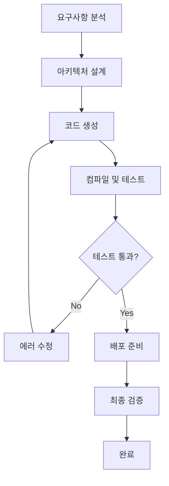
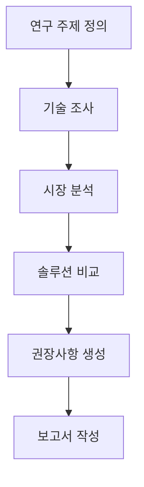

# COGO Agent Core - Orchestrator-Worker Architecture Analysis

## Table of Contents
1. [Overview](#overview)
2. [Agent Structure Comparison (AS-IS vs TO-BE)](#agent-structure-comparison-as-is-vs-to-be)
3. [Workflow Analysis](#workflow-analysis)
4. [Communication Patterns](#communication-patterns)
5. [Implementation Status](#implementation-status)
6. [Next Steps](#next-steps)

## Overview

이 문서는 COGO Agent Core의 새로운 Orchestrator-Worker 아키텍처를 분석하고, 기존 구조와의 비교, 워크플로우 설계, 그리고 통신 패턴을 상세히 설명합니다.

### Key Changes
- **중앙 집중식 조정**: `cogo-orchestrator-agent`가 지능형 검색과 세션 관리의 중심 역할
- **Worker Agent 전환**: 기존 Agent들이 전문화된 Worker Agent로 변환
- **역할 기반 실행**: 각 Worker Agent가 특정 역할에 특화된 기능 제공
- **실시간 통신**: Supabase Real-time을 통한 즉시 통신
- **구조화된 워크플로우**: LangGraph를 통한 복잡한 워크플로우 관리

## Agent Structure Comparison (AS-IS vs TO-BE)

### AS-IS (기존 Agent 구조)

기존 COGO Agent Core는 7개의 독립적인 Agent로 구성되어 있었습니다:

| Agent | 역할 | 주요 기능 |
|-------|------|-----------|
| **cogo-orchestrator-agent** | 중앙 조정 및 작업 분배 | • 작업 계획 및 분해<br>• Agent 조정 및 로드 밸런싱<br>• 워크플로우 오케스트레이션<br>• 의사결정 및 전략 |
| **cogo-executor-agent** | 작업 실행 및 관리 | • 작업 실행 및 모니터링<br>• 하위 작업 생성 및 관리<br>• 진행 상황 추적<br>• 결과 집계 |
| **cogo-codegen-service** | AI 코드 생성 | • 소스 코드 생성<br>• 코드 분석 및 최적화<br>• 언어별 코드 생성<br>• 코드 리뷰 및 품질 평가 |
| **cogo-sandbox-worker** | 보안 코드 실행 | • Docker 컨테이너 관리<br>• 코드 실행 및 테스트<br>• 보안 격리<br>• 리소스 모니터링 |
| **cogo-arch-gateway** | 시스템 아키텍처 관리 | • 아키텍처 분석 및 설계<br>• 시스템 통합 계획<br>• 기술 스택 권장<br>• 성능 최적화 |
| **cogo-system-gateway** | 시스템 전체 조정 및 관리 | • Agent 생명주기 관리<br>• 시스템 상태 모니터링<br>• 리소스 할당<br>• 전역 상태 관리 |
| **cogo-indexing-worker** | 지식 인덱싱 및 검색 | • 코드 및 문서 인덱싱<br>• 벡터 임베딩 생성<br>• 검색 최적화<br>• 지식 그래프 유지보수 |
| **cogo-research-worker** | 기술 연구 및 분석 | • 기술 트렌드 분석<br>• 모범 사례 연구<br>• 솔루션 비교<br>• 문서 수집 |

### TO-BE (새로운 Orchestrator-Worker 구조)

새로운 구조에서는 `cogo-orchestrator-agent`가 중심이 되고, 나머지 Agent들이 전문화된 Worker Agent로 변환됩니다:

| Agent | AS-IS 역할 | TO-BE 역할 | 주요 변화 |
|-------|------------|------------|-----------|
| **cogo-orchestrator-agent** | 중앙 조정 및 작업 분배 | 🧠 **중앙 지능형 검색 및 세션 관리** | • 지능형 검색 엔진 통합<br>• 세션 기반 워크플로우 관리<br>• 역할 기반 의사결정<br>• 실시간 상태 모니터링 |
| **cogo-executor-agent** | 작업 실행 및 관리 | 👔 **Worker Agent 작업 전달 및 실행 관리** | • Worker Agent에게 작업 전달<br>• 실행 상태 모니터링<br>• 결과 집계<br>• 작업 계획 수립 |
| **cogo-codegen-service** | AI 코드 생성 | ✍️ **AI 코드 생성 Worker Agent** | • BaseWorkerAgent 상속<br>• 오케스트레이터 지시 수신<br>• 역할 기반 코드 생성<br>• 다중 AI 모델 지원 |
| **cogo-sandbox-worker** | 보안 코드 실행 | 🦾 **Python 기반 샌드박스 Worker Agent** | • 컴파일 및 빌드 담당<br>• 보안 격리 환경<br>• 리소스 모니터링<br>• 다중 언어 런타임 지원 |
| **cogo-indexing-worker** | 지식 인덱싱 | 📚 **Git 이벤트 기반 지식 업데이트 Worker Agent** | • Git 이벤트 수신<br>• 소스 코드 분석<br>• 지식 그래프 업데이트<br>• 실시간 인덱싱 |
| **cogo-research-worker** | 기술 연구 | 🔬 **오케스트레이터 요청 기반 연구 Worker Agent** | • 오케스트레이터 요청 처리<br>• 기술 트렌드 분석<br>• 솔루션 비교<br>• 시장 분석 |

### 아키텍처 변화의 핵심

1. **중앙 집중식 의사결정**: `cogo-orchestrator-agent`가 모든 의사결정의 중심
2. **전문화된 Worker Agent**: 각 Agent가 특정 역할에 최적화
3. **역할 기반 실행**: 동적으로 역할을 할당받아 실행
4. **실시간 통신**: 즉시적인 피드백과 상태 업데이트
5. **확장 가능한 구조**: 새로운 Worker Agent 쉽게 추가 가능

## Workflow Analysis

### 2.1 코드 생성 Workflow

```
1. 사용자 요청 → cogo-orchestrator-agent
2. 오케스트레이터 분석 → 역할 선택 (code-generator)
3. cogo-codegen-service Worker Agent에게 지시
4. AI 모델을 통한 코드 생성
5. cogo-sandbox-worker Worker Agent에게 컴파일 요청
6. 컴파일 결과를 오케스트레이터에 보고
7. 최종 결과를 사용자에게 전달
```

**세부 단계:**
- **요구사항 분석**: 오케스트레이터가 사용자 요청을 분석
- **역할 선택**: 코드 생성에 적합한 Worker Agent 선택
- **코드 생성**: AI 모델을 활용한 소스 코드 생성
- **컴파일 검증**: 생성된 코드의 컴파일 및 테스트
- **품질 검증**: 코드 품질 및 보안 검사
- **결과 전달**: 최종 결과를 사용자에게 전달

### 2.2 작업 실행 Workflow

```
1. 복잡한 작업 요청 → cogo-orchestrator-agent
2. 작업 분석 및 분해 → cogo-executor-agent Worker Agent
3. 작업 계획 수립 및 Worker Agent들에게 분배
4. 각 Worker Agent들의 진행 상황 모니터링
5. 결과 집계 및 최종 보고
```

**세부 단계:**
- **작업 분석**: 복잡한 작업을 분석하고 분해
- **계획 수립**: 실행 계획 및 리소스 할당
- **작업 분배**: 적절한 Worker Agent들에게 작업 할당
- **진행 모니터링**: 실시간 진행 상황 추적
- **결과 집계**: 모든 Worker Agent의 결과를 통합
- **최종 보고**: 완성된 결과를 사용자에게 전달

### 2.3 지식 업데이트 Workflow

```
1. Git 이벤트 발생 → cogo-indexing-worker Worker Agent
2. 소스 코드 변경 감지 및 분석
3. AST 분석 및 벡터 임베딩 생성
4. 지식 그래프 업데이트
5. 오케스트레이터에 업데이트 완료 보고
```

**세부 단계:**
- **이벤트 감지**: Git push, commit 등의 이벤트 감지
- **변경 분석**: 수정된 파일 및 코드 변경사항 분석
- **구조 분석**: AST(Abstract Syntax Tree) 분석
- **임베딩 생성**: 벡터 임베딩 생성 및 저장
- **지식 업데이트**: Neo4j 지식 그래프 업데이트
- **검색 인덱스**: Supabase 벡터 검색 인덱스 업데이트

### 2.4 연구 및 분석 Workflow

```
1. 연구 요청 → cogo-orchestrator-agent
2. 연구 주제 분석 → cogo-research-worker Worker Agent
3. 기술 조사 및 시장 분석
4. 솔루션 비교 및 권장사항 생성
5. 보고서 작성 및 결과 전달
```

**세부 단계:**
- **요청 분석**: 연구 요청의 범위와 목적 분석
- **기술 조사**: 관련 기술 및 트렌드 조사
- **시장 분석**: 시장 상황 및 경쟁사 분석
- **솔루션 비교**: 다양한 솔루션의 장단점 비교
- **권장사항**: 최적의 솔루션 및 구현 방안 제시
- **보고서 작성**: 종합적인 연구 보고서 작성

## Communication Patterns

### 3.1 Real-time Communication Flow (실시간 통신)

#### **코드 생성 및 컴파일 워크플로우**
```
cogo-orchestrator-agent ←→ cogo-codegen-service ←→ cogo-sandbox-worker
     ↓                           ↓                        ↓
Real-time Channels:     orchestrator-instructions    worker-results
                       worker-results               worker-status
                       worker-status
```

**채널 구조:**
- `orchestrator-instructions`: 오케스트레이터 → Worker Agent 지시
- `worker-results`: Worker Agent → 오케스트레이터 결과
- `worker-status`: Worker Agent 상태 업데이트
- `worker-registration`: Worker Agent 등록/해제

**메시지 형식:**
```typescript
interface OrchestratorInstruction {
  instructionId: string;
  taskId: string;
  role: Role;
  context: RoleContext;
  priority: 'low' | 'medium' | 'high' | 'urgent';
  timeout: number;
  dependencies?: string[];
  expectedOutput: string;
  timestamp: Date;
}

interface AgentResult {
  resultId: string;
  instructionId: string;
  taskId: string;
  status: 'success' | 'partial' | 'failed';
  output: any;
  metadata: {
    processingTime: number;
    quality: number;
    confidence: number;
    errors?: string[];
  };
}
```

#### **작업 실행 워크플로우**
```
cogo-orchestrator-agent ←→ cogo-executor-agent ←→ [다른 Worker Agent들]
     ↓                           ↓
Real-time Channels:     orchestrator-instructions
                       worker-results
                       task-progress
```

#### **지식 업데이트 워크플로우**
```
Git Events → cogo-indexing-worker → Knowledge Graph → cogo-orchestrator-agent
     ↓              ↓                      ↓                ↓
Real-time Channels: indexing-requests, knowledge-updates, worker-results
```

### 3.2 LangGraph Flow (구조화된 워크플로우)

#### **복잡한 개발 프로젝트 워크플로우**


**LangGraph 노드 구성:**
- `requirement-analyzer`: 요구사항 분석 노드
- `architecture-designer`: 아키텍처 설계 노드
- `code-generator`: 코드 생성 노드
- `compiler-tester`: 컴파일 및 테스트 노드
- `error-fixer`: 에러 수정 노드
- `deployment-preparer`: 배포 준비 노드

#### **연구 및 분석 워크플로우**


### 3.3 업무별 분류

| 업무 유형 | 통신 방식 | 이유 | 예시 |
|-----------|-----------|------|------|
| **코드 생성** | Real-time | 빠른 피드백과 실시간 상태 업데이트 필요 | React 컴포넌트 생성, API 코드 생성 |
| **작업 실행** | Real-time | Worker Agent 간 협업과 진행 상황 모니터링 | 복잡한 개발 작업, 배포 프로세스 |
| **지식 업데이트** | Real-time | Git 이벤트 기반 즉시 처리 필요 | 소스 코드 변경, 문서 업데이트 |
| **복잡한 프로젝트** | LangGraph | 구조화된 단계별 워크플로우 필요 | 전체 애플리케이션 개발, 마이그레이션 |
| **연구 분석** | LangGraph | 체계적인 분석 단계와 의사결정 필요 | 기술 스택 선택, 아키텍처 설계 |
| **시스템 모니터링** | Real-time | 실시간 상태 및 알림 필요 | 성능 모니터링, 에러 추적 |

### 3.4 하이브리드 접근법

**실제 구현에서는 두 방식을 조합:**

```
1. LangGraph로 전체 워크플로우 구조 정의
2. 각 노드 내에서 Real-time 통신으로 Agent 간 협업
3. 워크플로우 진행 상황을 Real-time으로 모니터링
4. 예외 상황 발생 시 Real-time으로 즉시 대응
```

**장점:**
- **체계적 관리**: LangGraph로 복잡한 워크플로우 관리
- **실시간 협업**: Real-time으로 즉시적인 피드백
- **유연성**: 상황에 따라 적절한 통신 방식 선택
- **확장성**: 새로운 워크플로우와 Worker Agent 쉽게 추가

## Implementation Status

### 완료된 구현

1. **BaseWorkerAgent 클래스**
   - ✅ Worker Agent 기본 구조 구현
   - ✅ 오케스트레이터 통신 기능
   - ✅ 역할 기반 실행 인터페이스
   - ✅ 성능 메트릭 추적

2. **Mock Worker Agent들**
   - ✅ TaskExecutionWorkerAgent
   - ✅ CodeGenerationWorkerAgent
   - ✅ SandboxWorkerAgent
   - ✅ IndexingWorkerAgent
   - ✅ ResearchWorkerAgent

3. **통합 테스트 프레임워크**
   - ✅ Orchestrator-Worker 통합 테스트
   - ✅ 다양한 워크플로우 시나리오
   - ✅ 성능 측정 및 보고

### 구현 중인 부분

1. **cogo-orchestrator-agent 업데이트**
   - 🔄 Worker Agent 등록 및 관리
   - 🔄 실시간 통신 채널 설정
   - 🔄 역할 기반 작업 분배

2. **실제 Worker Agent 변환**
   - 🔄 기존 Agent들을 BaseWorkerAgent 상속으로 변환
   - 🔄 역할 기반 실행 메서드 구현
   - 🔄 오케스트레이터 통신 통합

### 향후 구현 계획

1. **LangGraph 워크플로우 엔진**
   - 📋 복잡한 워크플로우 정의
   - 📋 노드 간 의존성 관리
   - 📋 워크플로우 실행 엔진

2. **실시간 통신 최적화**
   - 📋 메시지 큐 최적화
   - 📋 에러 처리 및 재시도 로직
   - 📋 성능 모니터링

3. **Docker 배포**
   - 📋 Worker Agent 컨테이너화
   - 📋 오케스트레이션 설정
   - 📋 확장성 및 가용성

## Next Steps

### 단기 목표 (1-2주)

1. **통합 테스트 완료**
   - Mock Worker Agent들과 오케스트레이터 통합 테스트
   - 성능 및 안정성 검증
   - 버그 수정 및 최적화

2. **실제 Agent 변환**
   - 기존 Agent들을 Worker Agent로 변환
   - 역할 기반 실행 로직 구현
   - 오케스트레이터 통신 통합

### 중기 목표 (1개월)

1. **LangGraph 워크플로우 구현**
   - 복잡한 개발 워크플로우 정의
   - 워크플로우 실행 엔진 구현
   - 실시간 모니터링 통합

2. **성능 최적화**
   - 통신 지연 최소화
   - 리소스 사용량 최적화
   - 확장성 테스트

### 장기 목표 (2-3개월)

1. **프로덕션 배포**
   - Docker 컨테이너 배포
   - Kubernetes 오케스트레이션
   - 모니터링 및 로깅 시스템

2. **고급 기능 구현**
   - AI 기반 의사결정
   - 자동화된 워크플로우 생성
   - 예측 분석 및 최적화

---

**문서 버전**: 1.0  
**최종 업데이트**: 2025-01-27  
**작성자**: COGO Agent Core Development Team 