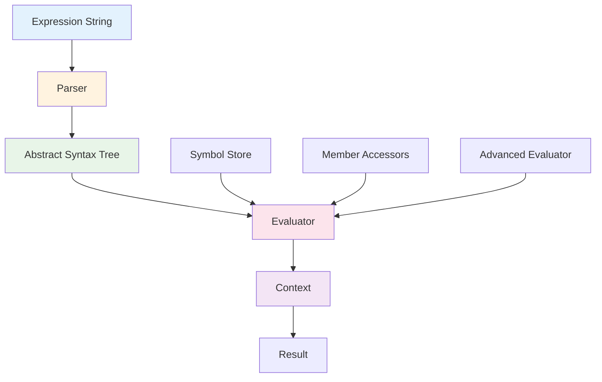
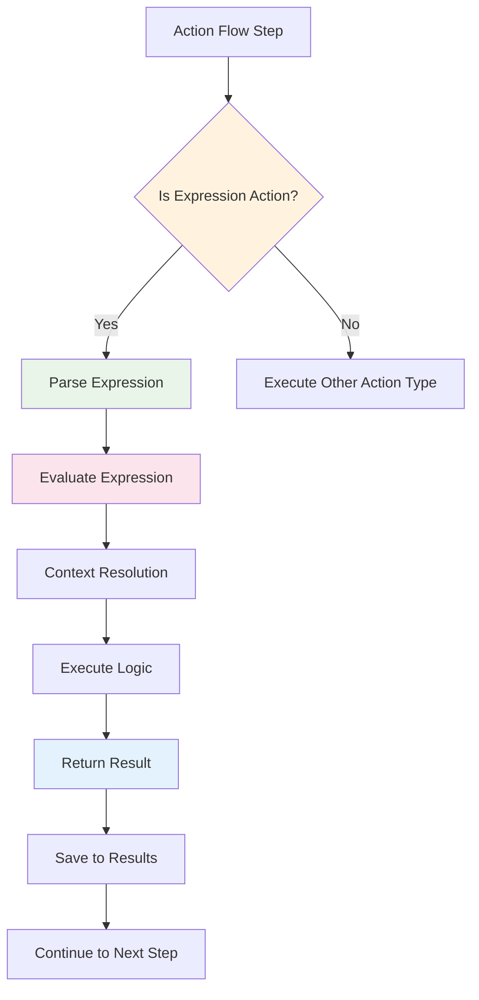
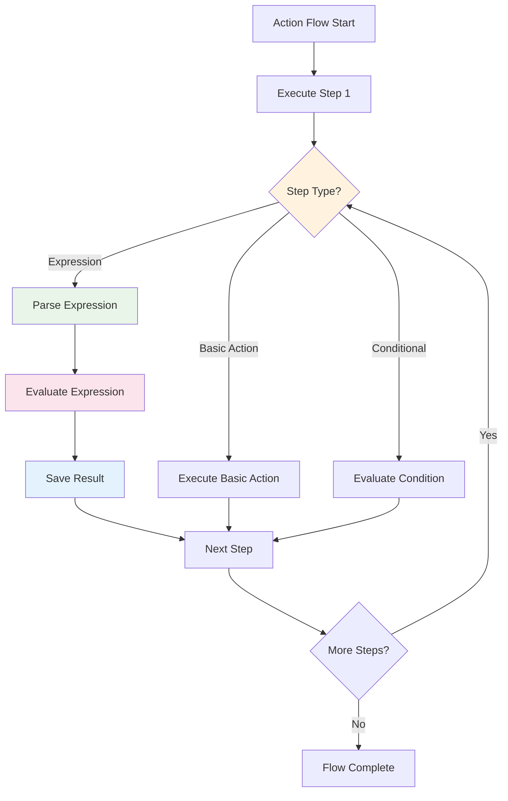

# CreateGo Expression System - Comprehensive Documentation

## Table of Contents
1. [Introduction](#introduction)
2. [What Are Expressions?](#what-are-expressions)
3. [Expression System Architecture](#expression-system-architecture)
4. [Expression Types and Syntax](#expression-types-and-syntax)
5. [Expression Actions in Action Flows](#expression-actions-in-action-flows)
6. [Expression Evaluation Engine](#expression-evaluation-engine)
7. [Built-in Functions and Methods](#built-in-functions-and-methods)
8. [Context and Variables](#context-and-variables)
9. [Integration with Action Manager](#integration-with-action-manager)
10. [Practical Examples](#practical-examples)
11. [Best Practices](#best-practices)
12. [Troubleshooting](#troubleshooting)
13. [Advanced Usage](#advanced-usage)

---

## Introduction

The Expression system in CreateGo is a powerful, embedded scripting engine that allows users to write dynamic, data-driven logic within action flows. It serves as the computational backbone that enables complex decision-making, data manipulation, and business logic execution without requiring traditional programming skills.

### Why Expressions Exist

Expressions exist in CreateGo to solve several critical needs:

1. **Dynamic Logic**: Enable conditional behavior based on runtime data
2. **Data Transformation**: Manipulate and transform data between actions
3. **Business Rules**: Implement complex business logic and calculations
4. **Flow Control**: Make decisions about which actions to execute next
5. **Data Validation**: Check data integrity and enforce business rules
6. **Integration**: Bridge different data sources and formats

---

## What Are Expressions?

Expressions in CreateGo are **Dart-like code snippets** that get evaluated at runtime within the context of an action flow. They are not full Dart programs but rather focused, single-purpose statements that can:

- Perform mathematical calculations
- Access and manipulate data
- Make logical decisions
- Call built-in functions
- Transform data structures
- Validate conditions

### Expression vs. Traditional Programming

| Aspect | Traditional Programming | CreateGo Expressions |
|--------|------------------------|---------------------|
| **Scope** | Full application | Single action step |
| **Complexity** | Unlimited | Limited to single statements |
| **Context** | Global application state | Action flow context |
| **Execution** | Compile-time | Runtime evaluation |
| **Debugging** | IDE debugging tools | Flow execution logs |

---

## Expression System Architecture

The Expression system is built on a multi-layered architecture that provides flexibility, performance, and extensibility.

### Core Components



#### 1. **Parser Layer** (`parser.dart`)
- Converts text expressions into structured data
- Uses PetitParser for robust parsing
- Handles syntax validation and error reporting
- Supports complex nested expressions

#### 2. **Expression Types** (`expressions.dart`)
- Defines the abstract syntax tree structure
- Supports literals, variables, operators, and function calls
- Implements precedence rules for operators
- Handles type safety and validation

#### 3. **Evaluation Engine** (`evaluator.dart`)
- Core execution logic for expressions
- Manages context and variable resolution
- Handles operator precedence and evaluation order
- Provides error handling and fallbacks

#### 4. **Advanced Evaluator** (`advanced_evaluator.dart`)
- Extends basic evaluation with built-in functions
- Provides accessors for common data types
- Implements utility functions and helpers
- Handles complex data transformations

#### 5. **Symbol Store** (`symbol_store.dart`)
- Global variable and constant management
- Cross-flow data sharing
- Built-in system variables
- Persistent state management

---

## Expression Types and Syntax

CreateGo expressions support a rich set of data types and operations, making them suitable for most business logic scenarios.

### Basic Data Types

#### **Literals**
```dart
// Numbers
42          // Integer
3.14        // Double
0xFF        // Hexadecimal

// Strings
"Hello"     // String literal
'World'     // Single quotes also work

// Booleans
true        // Boolean true
false       // Boolean false

// Null
null        // Null value

// Arrays
[1, 2, 3]  // List literal
["a", "b"] // String list

// Maps
{"key": "value"}  // Map literal
{1: "one", 2: "two"}  // Mixed types
```

#### **Variables**
```dart
// Simple variable reference
userName
counter
isActive

// Global symbols (prefixed with #)
#_currentResult
#_parentCallbacks
#currentItem
#listIndex
```

### Operators

#### **Arithmetic Operators**
```dart
a + b       // Addition
a - b       // Subtraction
a * b       // Multiplication
a / b       // Division
a % b       // Modulo
a ~/ b      // Integer division
a ** b      // Exponentiation (if supported)
```

#### **Comparison Operators**
```dart
a == b      // Equality
a != b      // Inequality
a < b       // Less than
a <= b      // Less than or equal
a > b       // Greater than
a >= b      // Greater than or equal
```

#### **Logical Operators**
```dart
a && b      // Logical AND
a || b      // Logical OR
!a          // Logical NOT
```

#### **Bitwise Operators**
```dart
a & b       // Bitwise AND
a | b       // Bitwise OR
a ^ b       // Bitwise XOR
a << b      // Left shift
a >> b      // Right shift
~a          // Bitwise NOT
```

### Complex Expressions

#### **Member Access**
```dart
user.name           // Object property access
user.profile.email  // Nested property access
data.items[0]       // Array element access
data.config["key"]  // Map value access
```

#### **Function Calls**
```dart
calculateTotal(items)
formatDate(date, "yyyy-MM-dd")
user.hasPermission("admin")
```

#### **Conditional Expressions**
```dart
age >= 18 ? "adult" : "minor"
isActive ? user.name : "Unknown"
```

#### **Lambda Expressions**
```dart
x => x * 2                    // Single parameter
(x, y) => x + y              // Multiple parameters
item => item.isActive         // Boolean return
```

---

## Expression Actions in Action Flows

Expression Actions are one of the core action types in CreateGo that allow you to execute expressions as part of your action flow.

### Expression Action Structure

```dart
class ExpressionAction extends ActionCommon implements ActBase {
  String expressionExecute;  // The expression to execute
  
  // ... other properties
}
```

### Creating Expression Actions

#### **Via UI**
1. Open the Action Flow editor
2. Click "Add Action" → "Expression"
3. Enter your expression in the popup
4. Configure parameters and execution mode
5. Save and connect to other actions

#### **Via Code**
```dart
ExpressionAction expAction = ExpressionAction(
  id: "unique_id",
  label: "Calculate Total",
  actionType: ActionType.expressionAct,
  actionId: 'expression',
  description: 'Calculate order total with tax',
  params: null,
  executionMode: ExecutionMode.asyncMode,
  expressionExecute: 'order.subtotal * (1 + taxRate)',
);
```

### Expression Action Execution Flow



### Expression Action Parameters

Expression Actions can accept parameters that become available in the expression context:

```dart
ExpressionAction(
  // ... other properties
  params: {
    "taxRate": 0.08,
    "discountCode": "SAVE10",
    "shippingCost": 5.99
  },
  expressionExecute: 'calculateTotal(subtotal, taxRate, discountCode, shippingCost)',
)
```

---

## Expression Evaluation Engine

The evaluation engine is responsible for executing expressions and managing their execution context.

### Evaluation Process

#### **1. Parsing Phase**
```dart
// Convert string to AST
Expression cond = Expression.parse(expressionExecute);
```

#### **2. Context Resolution**
```dart
// Merge action parameters with flow context
Map<String, dynamic> merged = _mergeParams(execParams, params);
```

#### **3. Expression Execution**
```dart
// Evaluate the parsed expression
dynamic evalResult = evaluator.evalExpressions(condExpr, merged, assignable: params);
```

#### **4. Result Handling**
```dart
// Save result for future reference
await _saveResult(params, expressionAction.actionId, Right(evalResult));
```

### Context Management

The evaluation context provides access to:

- **Action Parameters**: Values passed to the action
- **Flow Variables**: Data shared across the entire flow
- **Global Symbols**: System-wide variables and constants
- **Previous Results**: Outputs from previous action steps
- **Built-in Functions**: Utility functions and helpers

### Error Handling

The evaluation engine provides robust error handling:

```dart
try {
  List<Expression> condExpr = Expression.parseExpressions(expressionAction.expressionExecute);
  dynamic evalResult = evaluator.evalExpressions(condExpr, merged, assignable: params);
  result = Right(evalResult);
} catch (e) {
  result = Left('ExpressionAction error: ${e.toString()}');
}
```

---

## Built-in Functions and Methods

CreateGo provides a rich set of built-in functions and methods that can be used in expressions.

### String Functions

```dart
// String manipulation
"Hello World".toUpperCase()           // "HELLO WORLD"
"Hello World".toLowerCase()           // "hello world"
"Hello World".substring(0, 5)        // "Hello"
"Hello World".replaceAll("o", "0")   // "Hell0 W0rld"
"  Hello  ".trim()                   // "Hello"
"Hello World".contains("World")      // true
"Hello World".length                 // 11
"Hello,World".split(",")             // ["Hello", "World"]
"Hello World".startsWith("Hello")    // true
```

### List Functions

```dart
// List operations
[1, 2, 3].map(x => x * 2)           // [2, 4, 6]
[1, 2, 3].filter(x => x > 1)        // [2, 3]
[1, 2, 3].length                    // 3
[1, 2, 3].contains(2)               // true
[1, 2, 3].first                     // 1
[1, 2, 3].last                      // 3
[1, 2, 3].join(", ")                // "1, 2, 3"
[1, 2, 3].sort((a, b) => a - b)     // [1, 2, 3]
```

### Map Functions

```dart
// Map operations
{"a": 1, "b": 2}.keys              // ["a", "b"]
{"a": 1, "b": 2}.values            // [1, 2]
{"a": 1, "b": 2}.length            // 2
{"a": 1, "b": 2}.containsKey("a")  // true
{"a": 1, "b": 2}.isEmpty            // false
```

### Date/Time Functions

```dart
// DateTime operations
now.year                            // Current year
now.month                           // Current month
now.day                             // Current day
now.format("yyyy-MM-dd")           // Formatted date string
```

### Utility Functions

```dart
// Mathematical functions
Math.max(a, b)                      // Maximum of two values
Math.min(a, b)                      // Minimum of two values
Math.abs(-5)                        // Absolute value
Math.round(3.7)                     // Rounded value

// Type conversion
toString(value)                     // Convert to string
parseInt("42")                      // Parse string to int
parseDouble("3.14")                 // Parse string to double
```

---

## Context and Variables

Understanding how variables and context work is crucial for writing effective expressions.

### Variable Scope

#### **1. Local Variables (Action Parameters)**
```dart
// Variables defined in the action's params
params: {
  "userName": "John",
  "age": 25,
  "isActive": true
}

// Access in expression
expressionExecute: 'userName + " is " + age + " years old"'
```

#### **2. Flow Variables (Shared Context)**
```dart
// Variables shared across the entire flow
#_results          // Results from previous actions
#_parentCallbacks  // Callback functions
#currentItem       // Current item in loops
#listIndex         // Current index in loops
```

#### **3. Global Symbols (System Variables)**
```dart
// System-wide variables (prefixed with #)
#appVersion        // Application version
#currentUser       // Currently logged-in user
#deviceInfo        // Device information
```

### Context Merging

The system automatically merges different context layers:

```dart
// 1. Flow context (highest priority)
Map<String, dynamic> flowContext = {
  "#_results": {...},
  "#currentItem": {...}
};

// 2. Action parameters
Map<String, dynamic> actionParams = {
  "taxRate": 0.08,
  "discount": 0.10
};

// 3. Runtime parameters
Map<String, dynamic> runtimeParams = {
  "orderTotal": 100.0
};

// Final merged context
Map<String, dynamic> finalContext = {
  ...flowContext,
  ...actionParams,
  ...runtimeParams
};
```

### Variable Resolution Order

1. **Action Parameters** (highest priority)
2. **Flow Variables** (medium priority)
3. **Global Symbols** (lowest priority)
4. **Built-in Functions** (always available)

---

## Integration with Action Manager

The Expression system is tightly integrated with the Action Manager, which orchestrates the execution of all actions and flows.

### Action Manager Integration Points

#### **1. Expression Registration**
```dart
class ActionManager {
  late final AdvancedExpressionEvaluator evaluator;
  
  ActionManager._internal() {
    evaluator = AdvancedExpressionEvaluator();
    _registerExpressionActions();
  }
}
```

#### **2. Expression Execution**
```dart
Future<Either<String, dynamic>> _handleExpression(
    ExpressionAction expressionAction,
    Map<String, dynamic> params,
    BuildContext? context) async {
  
  Map<String, dynamic> execParams = _replaceVariables(expressionAction.params ?? {}, params);
  Map<String, dynamic> merged = _mergeParams(execParams, params);
  
  try {
    List<Expression> condExpr = Expression.parseExpressions(expressionAction.expressionExecute);
    dynamic evalResult = evaluator.evalExpressions(condExpr, merged, assignable: params);
    return Right(evalResult);
  } catch (e) {
    return Left('ExpressionAction error: ${e.toString()}');
  }
}
```

#### **3. Result Management**
```dart
// Save expression results for future reference
await _saveResult(params, expressionAction.actionId, Right(evalResult));

// Results are stored in the flow context
params['#_results'][expressionAction.actionId] = evalResult;
```

### Flow Execution Integration

Expressions are executed as part of the overall action flow:



---

## Practical Examples

Let's explore real-world examples of how expressions are used in CreateGo applications.

### Example 1: E-commerce Order Processing

#### **Flow Structure**
```json
{
  "id": "processOrder",
  "steps": [
    {
      "id": "validateOrder",
      "actionType": "expression",
      "expressionExecute": "order.items.length > 0 && order.total > 0"
    },
    {
      "id": "calculateTax",
      "actionType": "expression",
      "expressionExecute": "order.subtotal * taxRate"
    },
    {
      "id": "applyDiscount",
      "actionType": "expression",
      "expressionExecute": "order.total * (1 - discountRate)"
    }
  ]
}
```

#### **Expression Breakdown**
```dart
// Step 1: Validate Order
"order.items.length > 0 && order.total > 0"
// Checks if order has items and positive total

// Step 2: Calculate Tax
"order.subtotal * taxRate"
// Multiplies subtotal by tax rate

// Step 3: Apply Discount
"order.total * (1 - discountRate)"
// Reduces total by discount percentage
```

### Example 2: User Authentication Flow

#### **Flow Structure**
```json
{
  "id": "authenticateUser",
  "steps": [
    {
      "id": "validateCredentials",
      "actionType": "expression",
      "expressionExecute": "user.email.contains('@') && user.password.length >= 8"
    },
    {
      "id": "checkUserRole",
      "actionType": "expression",
      "expressionExecute": "user.role in ['admin', 'user', 'guest']"
    },
    {
      "id": "generateSession",
      "actionType": "expression",
      "expressionExecute": "generateToken(user.id, user.role, now)"
    }
  ]
}
```

### Example 3: Data Processing Pipeline

#### **Flow Structure**
```json
{
  "id": "processData",
  "steps": [
    {
      "id": "filterData",
      "actionType": "expression",
      "expressionExecute": "data.filter(item => item.status == 'active')"
    },
    {
      "id": "transformData",
      "actionType": "expression",
      "expressionExecute": "filteredData.map(item => ({...item, processed: true, timestamp: now}))"
    },
    {
      "id": "aggregateData",
      "actionType": "expression",
      "expressionExecute": "transformedData.reduce((sum, item) => sum + item.value, 0)"
    }
  ]
}
```

### Example 4: Conditional Navigation

#### **Flow Structure**
```json
{
  "id": "navigateBasedOnRole",
  "steps": [
    {
      "id": "checkUserRole",
      "actionType": "conditional",
      "conditionExecute": "user.role == 'admin'",
      "isTrue": [
        {
          "id": "navigateToAdmin",
          "actionType": "basic",
          "actionId": "navigate",
          "params": {"route": "/admin/dashboard"}
        }
      ],
      "isFalse": [
        {
          "id": "navigateToUser",
          "actionType": "basic",
          "actionId": "navigate",
          "params": {"route": "/user/profile"}
        }
      ]
    }
  ]
}
```

---

## Best Practices

Following these best practices will help you write more effective and maintainable expressions.

### 1. **Keep Expressions Simple**
```dart
// ❌ Complex, hard to read
"user.orders.filter(o => o.status == 'completed' && o.total > 100).map(o => o.id).join(',')"

// ✅ Break into multiple steps
"getCompletedOrders(user.orders)"
"filterHighValueOrders(completedOrders, 100)"
"extractOrderIds(highValueOrders)"
"joinOrderIds(orderIds, ',')"
```

### 2. **Use Descriptive Variable Names**
```dart
// ❌ Unclear variable names
"a * b + c"

// ✅ Clear, descriptive names
"order.subtotal * taxRate + shippingCost"
```

### 3. **Handle Edge Cases**
```dart
// ❌ No null checking
"user.profile.email.length > 0"

// ✅ Safe with null checking
"user.profile?.email?.length > 0"
```

### 4. **Use Built-in Functions**
```dart
// ❌ Manual string manipulation
"firstName + ' ' + lastName"

// ✅ Use built-in functions
"formatFullName(firstName, lastName)"
```

### 5. **Document Complex Logic**
```dart
// Add comments for complex expressions
"// Calculate total with tax and discount
// Formula: (subtotal + tax) * (1 - discountRate)
(subtotal + (subtotal * taxRate)) * (1 - discountRate)"
```

### 6. **Test Expressions Thoroughly**
```dart
// Test with various data scenarios
"user.age >= 18"  // Test with: 17, 18, 19, null, "invalid"
"order.total > 0" // Test with: -1, 0, 1, null, "abc"
```

---

## Troubleshooting

Common issues and their solutions when working with expressions.

### 1. **Parsing Errors**

#### **Syntax Error**
```dart
// ❌ Invalid syntax
"user.name = 'John'"

// ✅ Correct syntax
"user.name == 'John'"
```

#### **Missing Quotes**
```dart
// ❌ Missing quotes around string
"user.name == John"

// ✅ Properly quoted string
"user.name == 'John'"
```

### 2. **Runtime Errors**

#### **Null Reference Error**
```dart
// ❌ Potential null reference
"user.profile.email.length"

// ✅ Safe null checking
"user.profile?.email?.length ?? 0"
```

#### **Type Mismatch Error**
```dart
// ❌ Type mismatch
"user.age + ' years old'"

// ✅ Proper type conversion
"user.age.toString() + ' years old'"
```

### 3. **Context Issues**

#### **Variable Not Found**
```dart
// ❌ Variable not in context
"calculateTax(order.total)"

// ✅ Use available context
"order.total * taxRate"
```

#### **Scope Issues**
```dart
// ❌ Accessing out-of-scope variable
"previousStep.result"

// ✅ Use flow context
"#_results.previousStepId"
```

### 4. **Performance Issues**

#### **Complex Expressions**
```dart
// ❌ Complex nested operations
"data.items.filter(i => i.status == 'active').map(i => i.value).reduce((a, b) => a + b, 0)"

// ✅ Break into steps
"getActiveItems(data.items)"
"extractValues(activeItems)"
"sumValues(values)"
```

### 5. **Debugging Techniques**

#### **Use Print Statements**
```dart
"print('Debug: user = ' + user.toString())"
"print('Debug: order total = ' + order.total.toString())"
```

#### **Check Context**
```dart
"print('Available context: ' + Object.keys(context).join(', '))"
```

#### **Validate Data Types**
```dart
"print('User type: ' + user.runtimeType)"
"print('Order total type: ' + order.total.runtimeType)"
```

---

## Advanced Usage

For power users, CreateGo expressions support advanced features and patterns.

### 1. **Custom Functions**

#### **Defining Custom Functions**
```dart
// Register custom function in AdvancedExpressionEvaluator
final _customFunctions = {
  'calculateTax': (context) => (amount, rate) => amount * rate,
  'formatCurrency': (context) => (amount) => '\$${amount.toStringAsFixed(2)}',
  'validateEmail': (context) => (email) => email.contains('@') && email.contains('.'),
};
```

#### **Using Custom Functions**
```dart
"calculateTax(order.subtotal, 0.08)"
"formatCurrency(order.total)"
"validateEmail(user.email)"
```

### 2. **Advanced Data Transformations**

#### **Complex Filtering**
```dart
"users.filter(u => u.age >= 18 && u.isActive && u.role in ['admin', 'user'])"
```

#### **Data Aggregation**
```dart
"orders.reduce((acc, order) => {
  acc.total += order.amount;
  acc.count += 1;
  return acc;
}, {total: 0, count: 0})"
```

#### **Nested Data Access**
```dart
"user.orders.filter(o => o.status == 'completed')
           .map(o => o.items)
           .flat()
           .filter(item => item.category == 'electronics')
           .map(item => item.price)
           .reduce((sum, price) => sum + price, 0)"
```

### 3. **Conditional Logic Patterns**

#### **Ternary Operators**
```dart
"user.role == 'admin' ? 'Admin Panel' : 'User Dashboard'"
"order.total > 100 ? 'Free Shipping' : 'Standard Shipping'"
```

#### **Multiple Conditions**
```dart
"user.age >= 18 && user.hasVerifiedEmail && user.isActive ? 'Full Access' : 'Limited Access'"
```

#### **Fallback Values**
```dart
"user.displayName ?? user.firstName ?? 'Anonymous'"
"order.discount ?? 0"
```

### 4. **Error Handling Patterns**

#### **Safe Navigation**
```dart
"user?.profile?.email ?? 'No email'"
"order?.items?[0]?.name ?? 'Unknown item'"
```

#### **Type Validation**
```dart
"typeof(user.age) == 'number' ? user.age : 0"
"Array.isArray(order.items) ? order.items.length : 0"
```

#### **Default Values**
```dart
"order.total || 0"
"user.preferences?.theme || 'light'"
```

### 5. **Performance Optimization**

#### **Lazy Evaluation**
```dart
"user.isActive && expensiveCalculation(user.data)"
```

#### **Caching Results**
```dart
"#_cachedResult ?? (expensiveCalculation(data), #_cachedResult = result)"
```

#### **Batch Operations**
```dart
"processBatch(items, batchSize)"
```

---

## Conclusion

The Expression system in CreateGo is a powerful tool that bridges the gap between no-code visual programming and traditional scripting. It provides the flexibility and power needed for complex business logic while maintaining the simplicity and accessibility of the visual flow editor.

### Key Takeaways

1. **Expressions are Dart-like code snippets** that execute within action flows
2. **The system provides a rich set of built-in functions** for common operations
3. **Context management** allows expressions to access flow data and parameters
4. **Error handling** ensures robust execution even with invalid expressions
5. **Performance optimization** techniques help with complex operations
6. **Best practices** ensure maintainable and readable expressions

### When to Use Expressions

- **Data validation and transformation**
- **Complex business logic and calculations**
- **Conditional flow control**
- **Data aggregation and processing**
- **Integration with external systems**
- **Custom business rules and formulas**

### When to Avoid Expressions

- **Simple data passing** (use basic actions instead)
- **Complex algorithms** (break into multiple steps)
- **UI-specific logic** (use page actions instead)
- **External API calls** (use callback actions instead)

By understanding and effectively using the Expression system, you can create powerful, dynamic applications that handle complex business logic while maintaining the visual simplicity that makes CreateGo accessible to users of all skill levels.
