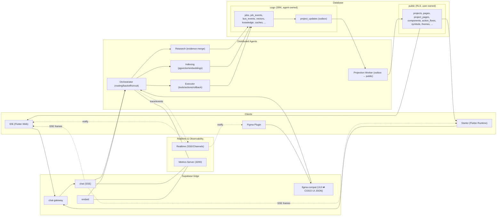

## COGO Platform Big Picture Architecture

Date: 2025-08-25

### Domains and Responsibility

- public (user-owned application data)
  - projects, pages, project_pages, components, action_flows, symbols, themes, assets
  - RLS on; authored by IDE/end-users
  - source for Flutter rendering engines (Starter/IDE runtime)

- cogo (agent/platform internals)
  - jobs, job_events, bus_events, project_updates(outbox), vectors, knowledge/evidence, caches
  - SRK/service-only writes; agents orchestrate pipelines and store canonical machine state
  - feeds projections into public domain

### Ingress and APIs

- Supabase Edge Functions
  - chat (SSE), chat-gateway (proxy), embed, figma-compat (UUI/COGO JSON), figma-plugin
  - CORS, HMAC/JWT (dev: relaxed), idempotency

- Realtime
  - streams for traces, events, task progress; SSE to plugins/clients

### Processing Units (Distributed Agents)

- Orchestrator → routes requests, backoff/retry, circuit-breaker
- Research/Indexing → evidence merge, pgvector, embeddings
- Executor → tools, actions, compensation(rollback)
- Projection Worker → consumes cogo.project_updates → materializes into public.*

### Data Flows (E2E)

1) Figma Plugin → figma-compat → cogo (AST/COGO UI JSON) → outbox → projection → public.* → IDE/Starter render
2) Chat/Embed → Edge → Agents → vectors/knowledge updates in cogo → metric/trace SSE
3) IDE/Starter (read-only) → public.* (RLS) for projects/components/pages

### Security and Policies

- Secrets in env/manager; no keys in code
- RLS on public; SRK on cogo
- Dev: Edge auth optional; Prod: JWT short-lived, HMAC as needed

### Observability

- Metrics server (port 3200), trace endpoints, alerts
- Artifacts: logs under ARTIFACTS_BASE, served via /artifacts

### Migration Strategy

- Stop agent writes to public.*
- Create/extend cogo.* + project_updates outbox
- Build projection worker, keep IDE reading public.*
- Remove legacy views; finalize CQRS

### Diagram

