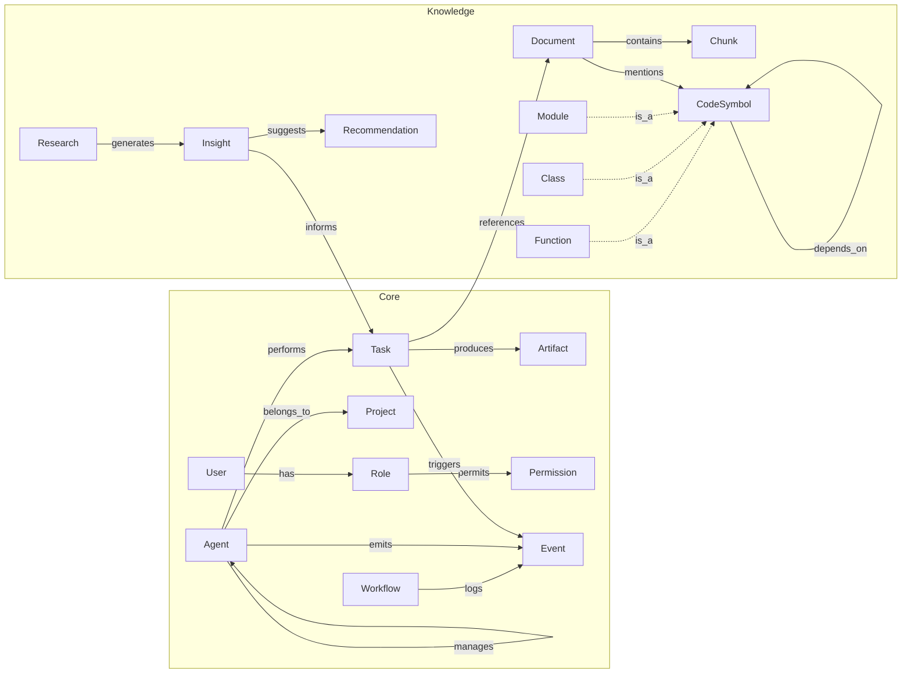

## Neo4j Ontology – Core Labels and Relationships

This document outlines a concise ontology used by the distributed agents and knowledge subsystems. It represents core operational entities and knowledge artifacts, including code and research results.

### Core Labels
- Agent, Task, Artifact, Project, User, Role, Permission, Workflow, Event
- Document, Chunk, Insight, Recommendation, Research
- CodeSymbol (subtypes: Function, Class, Module)

### Key Relationships
- (Agent)-[:MANAGES]->(Agent)
- (Agent)-[:PERFORMS]->(Task)
- (Task)-[:PRODUCES]->(Artifact)
- (Agent)-[:BELONGS_TO]->(Project)
- (Task)-[:REFERENCES]->(Document)
- (Document)-[:CONTAINS]->(Chunk)
- (Research)-[:GENERATES]->(Insight)
- (Insight)-[:SUGGESTS]->(Recommendation)
- (CodeSymbol)-[:DEPENDS_ON]->(CodeSymbol)
- (User)-[:HAS]->(Role)
- (Role)-[:PERMITS]->(Permission)
- (Workflow)-[:LOGS]->(Event)
- (Agent)-[:EMITS]->(Event)
- (Task)-[:TRIGGERS]->(Event)
- (Document)-[:MENTIONS]->(CodeSymbol)
- (Insight)-[:INFORMS]->(Task)

### Mermaid Diagram (High-level)

### Notes
- Research/Indexing agents integrate results by creating (Insight), (Recommendation), (CodeSymbol) nodes and linking them to (Task) and (Document) contexts.
- GraphRAG queries combine semantic search with traversal; reasoning paths and evidence can be modeled as (Event) or dedicated nodes with properties.

