# COGO System Database Design and Namespace Classification

## Overview

This document defines the scalable database architecture for the COGO system. It is designed with emphasis on **scalability, clarity, and traceability**.

---

## 1. Database Model Design Principles

### 1.1 Core Principles

1. **Normalization**: Each table has a single, clear purpose. Metadata of conversations, actual message content, and task status are managed in separate tables to minimize redundancy and maintain data consistency.

2. **Relationship Definition**: Foreign Keys clearly define how each table is connected, ensuring data integrity.

3. **Performance Consideration**: Indexes are created on frequently queried columns (especially foreign keys and status values) to enable fast queries even with large amounts of data.

### 1.2 Namespace Classification System

```
cogo/
├── conversations/          # User conversation management
│   ├── sessions/          # Conversation sessions
│   └── messages/          # Conversation messages
├── tasks/                 # Agent task management
│   ├── agent_tasks/       # Task metadata
│   └── task_steps/        # Task step logs
├── knowledge/             # Knowledge management
│   ├── code/              # Code-related knowledge
│   ├── concepts/          # Conceptual knowledge
│   └── patterns/          # Pattern knowledge
├── agents/                # Agent management
│   ├── profiles/          # Agent profiles
│   ├── capabilities/      # Agent capabilities
│   └── performance/       # Performance metrics
└── system/                # System management
    ├── configs/           # Configurations
    ├── logs/              # Logs
    └── metrics/           # Metrics
```

---

## 2. User Conversation Management

Records interactions with users.

### 2.1 `ConversationSessions` Table

Metadata of conversations, similar to the cover of a 'consultation card'.

| Column Name | Type | Constraints | Description |
|-------------|------|-------------|-------------|
| **id** | `UUID` | **PK** | Unique identifier for conversation session |
| user_id | `TEXT` | `NOT NULL` | User identification ID (e.g., UUID from Auth service) |
| title | `TEXT` | | Title of conversation (e.g., "Server deployment script generation") |
| created_at | `TIMESTAMPTZ` | `NOT NULL` | Session creation time (UTC) |
| updated_at | `TIMESTAMPTZ` | `NOT NULL` | Last message received/sent time (UTC) |
| metadata | `JSONB` | | Additional information (e.g., model used, summary, etc.) |

### 2.2 `ConversationMessages` Table

Actual conversation content, similar to a 'consultation transcript'.

| Column Name | Type | Constraints | Description |
|-------------|------|-------------|-------------|
| **id** | `BIGSERIAL` | **PK** | Sequential unique identifier for message |
| **session_id** | `UUID` | **FK** | Reference to `id` in `ConversationSessions` table |
| role | `TEXT` | `NOT NULL` | Message sender (`user` or `assistant`) |
| content | `TEXT` | `NOT NULL` | Actual content of message |
| created_at | `TIMESTAMPTZ` | `NOT NULL` | Message creation time (UTC) |
| token_count | `INTEGER` | | Token count of message (for cost calculation) |

---

## 3. Agent Task Management

Records specific tasks executed by CIO.

### 3.1 `AgentTasks` Table

Similar to a summary of a 'Work Order'.

| Column Name | Type | Constraints | Description |
|-------------|------|-------------|-------------|
| **id** | `UUID` | **PK** | Unique identifier for agent task (task_id) |
| **session_id** | `UUID` | **FK** | `id` of `ConversationSessions` that triggered this task |
| title | `TEXT` | | Title of task (e.g., "Deploy script generation for production") |
| status | `task_status` | `NOT NULL` | Current status of task |
| final_output | `JSONB` | | Final result of task (code on success, error on failure) |
| created_at | `TIMESTAMPTZ` | `NOT NULL` | Task creation time (UTC) |
| started_at | `TIMESTAMPTZ` | | Actual task start time (UTC) |
| completed_at | `TIMESTAMPTZ` | | Task completion/failure time (UTC) |

### 3.2 `TaskSteps` Table

Detailed 'work log' recording what steps a task went through. Very important for debugging and progress display.

| Column Name | Type | Constraints | Description |
|-------------|------|-------------|-------------|
| **id** | `BIGSERIAL` | **PK** | Sequential unique identifier for task step |
| **task_id** | `UUID` | **FK** | Reference to `id` in `AgentTasks` table |
| step_name | `TEXT` | | Name of step (e.g., `Knowledge Search`, `Sandbox Execution`) |
| details | `JSONB` | | Detailed information of step (tools called, parameters used, results, etc.) |
| created_at | `TIMESTAMPTZ` | `NOT NULL` | Step recording time (UTC) |

---

## 4. SQL DDL (PostgreSQL Standard)

### 4.1 ENUM Type Definition

```sql
-- Create ENUM type for managing status values
CREATE TYPE task_status AS ENUM (
    'PENDING',    -- Waiting
    'RUNNING',    -- Running
    'COMPLETED',  -- Successfully completed
    'FAILED',     -- Failed due to error
    'CANCELLED'   -- Cancelled by user
);
```

### 4.2 Table Creation

```sql
-- Conversation sessions table
CREATE TABLE "ConversationSessions" (
    "id" UUID PRIMARY KEY DEFAULT gen_random_uuid(),
    "user_id" TEXT NOT NULL,
    "title" TEXT,
    "created_at" TIMESTAMPTZ NOT NULL DEFAULT now(),
    "updated_at" TIMESTAMPTZ NOT NULL DEFAULT now(),
    "metadata" JSONB
);

-- Conversation messages table
CREATE TABLE "ConversationMessages" (
    "id" BIGSERIAL PRIMARY KEY,
    "session_id" UUID NOT NULL REFERENCES "ConversationSessions"("id") ON DELETE CASCADE,
    "role" TEXT NOT NULL CHECK (role IN ('user', 'assistant')),
    "content" TEXT NOT NULL,
    "created_at" TIMESTAMPTZ NOT NULL DEFAULT now(),
    "token_count" INTEGER
);

-- Agent tasks table
CREATE TABLE "AgentTasks" (
    "id" UUID PRIMARY KEY DEFAULT gen_random_uuid(),
    "session_id" UUID REFERENCES "ConversationSessions"("id") ON DELETE SET NULL,
    "title" TEXT,
    "status" task_status NOT NULL DEFAULT 'PENDING',
    "final_output" JSONB,
    "created_at" TIMESTAMPTZ NOT NULL DEFAULT now(),
    "started_at" TIMESTAMPTZ,
    "completed_at" TIMESTAMPTZ
);

-- Task step logs table
CREATE TABLE "TaskSteps" (
    "id" BIGSERIAL PRIMARY KEY,
    "task_id" UUID NOT NULL REFERENCES "AgentTasks"("id") ON DELETE CASCADE,
    "step_name" TEXT,
    "details" JSONB,
    "created_at" TIMESTAMPTZ NOT NULL DEFAULT now()
);
```

### 4.3 Index Creation

```sql
-- Create indexes for performance improvement
CREATE INDEX idx_messages_session_id ON "ConversationMessages" ("session_id");
CREATE INDEX idx_tasks_session_id ON "AgentTasks" ("session_id");
CREATE INDEX idx_tasks_status ON "AgentTasks" ("status");
CREATE INDEX idx_steps_task_id ON "TaskSteps" ("task_id");
```

---

## 5. Knowledge Graph Model (Neo4j)

A knowledge graph model that works complementarily with relational databases to store and infer complex **'relationships'** and **'context'** of code.

### 5.1 Core Design Principles

1. **Structural Representation of Code**: Clearly define containment and call relationships between files, classes, and functions to understand code structure at a glance.

2. **Conceptual Connection**: Connect abstract concepts like "authentication" or "data serialization" with actual code implementations to enable semantic-based search beyond simple text search.

3. **Change History Tracking**: Connect Git commits and agent tasks with code changes to track "what task changed what code and why?"

4. **Integration with Relational DB**: Connect with the `AgentTasks` table in the relational database through `task_id` to bridge specific tasks and code knowledge.

### 5.2 Node Label Definitions

| Node Label | Description | Key Properties |
|------------|-------------|----------------|
| 🧑‍💻 **`CodeFile`** | Source code file | `path` (unique identifier), `language`, `summary` |
| ⚙️ **`Function`** | Function defined in file | `name`, `signature`, `docstring`, `code_hash` |
| 🏛️ **`Class`** | Class defined in file | `name`, `docstring`, `code_hash` |
| 📚 **`Library`** | Externally `import`ed library/module | `name` (unique identifier), `version` |
| 💡 **`Concept`** | Abstract programming or domain concept | `name` (unique identifier), `description` |
| 📝 **`Task`** | Task connected to `AgentTasks` table | `task_id` (unique identifier, FK in RDB), `prompt`, `status` |
| 🌿 **`Commit`** | Git commit information | `hash` (unique identifier), `message`, `author`, `timestamp` |

### 5.3 Relationship Type Definitions

| Relationship Type | Start Node → End Node | Description |
|-------------------|---------------------|-------------|
| **`CONTAINS`** | `CodeFile` → `Function`, `Class` | File contains function/class |
| **`CALLS`** | `Function` → `Function` | Function calls another function |
| **`IMPORTS`** | `CodeFile` → `Library` | File imports library |
| **`USES`** | `Function`, `Class` → `Library` | Function/class uses library |
| **`IMPLEMENTS`** | `Function`, `Class` → `Concept` | Function/class implements specific concept |
| **`RELATED_TO`** | `Concept` → `Concept` | Concept is related to another concept |
| **`MODIFIED_IN`** | `CodeFile` → `Commit` | File was modified in specific commit |
| **`AFFECTS`** | `Commit` → `Function`, `Class` | Commit affects specific function/class |
| **`GENERATED_BY`** | `CodeFile`, `Function`... → `Task` | Code object was generated/modified by specific agent task |

### 5.4 Knowledge Graph Model Visualization

```mermaid
graph TD
    subgraph "Code Structure"
        File[🧑‍💻 CodeFile] -- CONTAINS --> Func[⚙️ Function]
        File -- CONTAINS --> Cls[🏛️ Class]
        Func -- CALLS --> Func2[⚙️ Function]
        File -- IMPORTS --> Lib[📚 Library]
        Func -- USES --> Lib
    end

    subgraph "Conceptual Layer"
        Func -- IMPLEMENTS --> Concept[💡 Concept]
        Cls -- IMPLEMENTS --> Concept
        Concept -- RELATED_TO --> Concept2[💡 Concept]
    end

    subgraph "Task & Versioning"
        Task[📝 Task] -- GENERATED_BY --> File
        Task -- GENERATED_BY --> Func
        Commit[🌿 Commit] -- MODIFIED_IN --> File
        Commit -- AFFECTS --> Func
    end

    style File fill:#cde4ff
    style Func fill:#e1fec7
    style Cls fill:#e1fec7
    style Lib fill:#fef9c3
    style Concept fill:#ffe4e1
    style Task fill:#f3e8ff
    style Commit fill:#e0e7ff
```



---

## 6. Utilization in Knowledge Circulation Workflow

LangGraph's `KnowledgeTool` utilizes this knowledge graph as follows.

### 6.1 Knowledge Reading (Read)

**Situation**: Received a request "Refactor all functions related to authentication functionality."

**`KnowledgeTool`'s role (Cypher query example)**:
```cypher
MATCH (c:Concept {name: "Authentication"})<-[:IMPLEMENTS]-(f:Function)
RETURN f.name, f.signature, f.docstring
```

Through this query, LangGraph obtains a list and information of all functions implementing the 'Authentication' concept and provides it as context to the LLM.

### 6.2 Knowledge Writing (Write)

**Situation**: Agent completed refactoring work and generated new `refresh_token` function. (`task_id: 'abc-123'`)

**`KnowledgeTool`'s role (Cypher query example)**:
```cypher
// 1. Create Task node if it doesn't exist
MERGE (t:Task {task_id: 'abc-123'})
  ON CREATE SET t.prompt = '...'

// 2. Create new Function node
CREATE (f:Function {name: 'refresh_token', signature: '...', docstring: '...'})

// 3. Connect relationships
MATCH (file:CodeFile {path: '/src/auth.py'})
MATCH (concept:Concept {name: "Authentication"})
MERGE (file)-[:CONTAINS]->(f)
MERGE (f)-[:IMPLEMENTS]->(concept)
MERGE (t)<-[:GENERATED_BY]-(f) // Connect to which task generated it
```

This query connects the newly generated function with code structure, concepts, and the agent task that triggered the work, enriching the knowledge.

---

## 7. pgvector Utilization Strategy

### 7.1 Vector Embedding Storage

```sql
-- Store vector embedding of message content
ALTER TABLE "ConversationMessages" 
ADD COLUMN content_embedding vector(1536);

-- Store vector embedding of code file content
CREATE TABLE "CodeEmbeddings" (
    "id" BIGSERIAL PRIMARY KEY,
    "file_path" TEXT NOT NULL,
    "content" TEXT NOT NULL,
    "embedding" vector(1536),
    "created_at" TIMESTAMPTZ NOT NULL DEFAULT now()
);
```

### 7.2 Semantic-based Search

```sql
-- Find similar conversations
SELECT cm.content, cm.content_embedding <=> $1 as distance
FROM "ConversationMessages" cm
WHERE cm.content_embedding IS NOT NULL
ORDER BY distance
LIMIT 5;

-- Find similar code
SELECT ce.file_path, ce.content, ce.embedding <=> $1 as distance
FROM "CodeEmbeddings" ce
ORDER BY distance
LIMIT 10;
```

---

## 8. Implementation Priority

### Phase 1: Basic Structure (1-2 weeks)
- [ ] PostgreSQL table creation
- [ ] Basic CRUD API implementation
- [ ] Agent task logging system

### Phase 2: Knowledge Graph (2-3 weeks)
- [ ] Neo4j schema setup
- [ ] Code parsing and graph construction
- [ ] Basic knowledge search functionality

### Phase 3: Vector Search (1-2 weeks)
- [ ] pgvector setup
- [ ] Embedding generation and storage
- [ ] Hybrid search implementation

### Phase 4: Integration and Optimization (1-2 weeks)
- [ ] System integration
- [ ] Performance optimization
- [ ] Monitoring and logging

---

## 9. Conclusion

Through this design, the COGO system can grow beyond simply generating code to become a true AI development partner that **understands the context of the entire codebase, tracks change history, and accumulates and evolves knowledge on its own**.

**Scalability**: New agent types or knowledge domains can be easily added.
**Clarity**: The role and relationships of each component are clearly defined.
**Traceability**: All tasks and changes can be tracked, making debugging and improvement easy. 