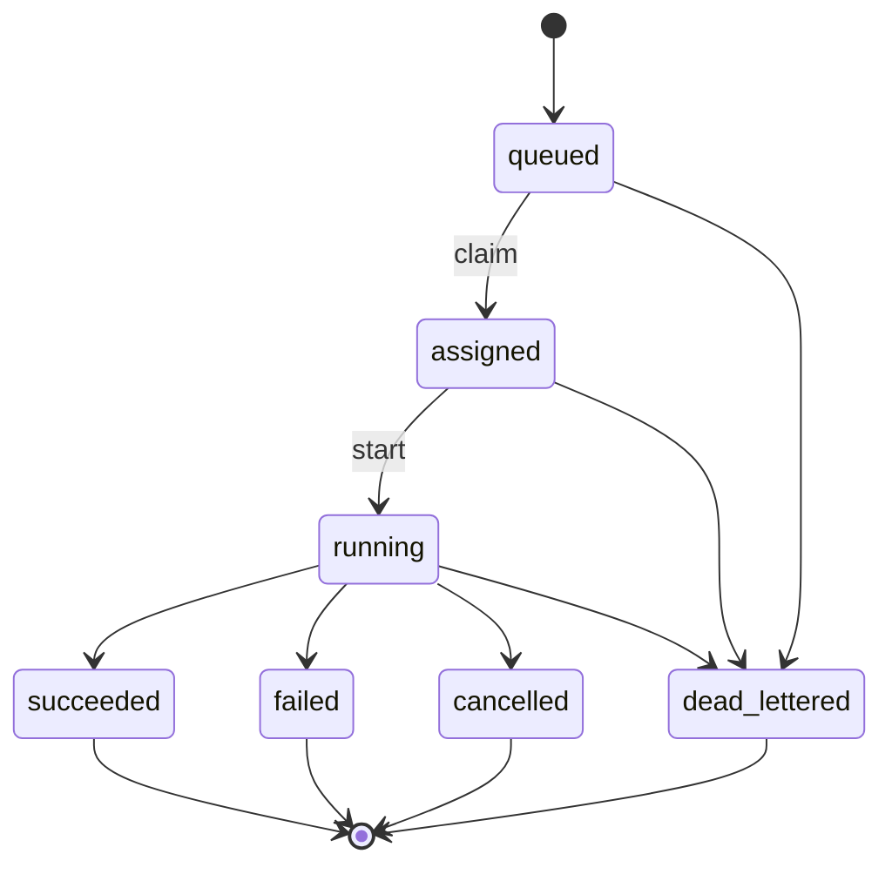

## Job State Machine v1 (Distributed Reliability)

Purpose
- Define canonical job lifecycle, invariants, transition rules, and event logging to eliminate double-claims and ensure consistent recovery under failures.

Scope
- Applies to all distributed workers (indexing, research, execution, QA). Covers leases, retries, DLQ handoff, and cancellation.

States
- queued: Job is enqueued and visible to schedulers.
- assigned: A worker has claimed the job and acquired a lease.
- running: The worker has started execution within lease window.
- succeeded: Job finished successfully; artifacts emitted.
- failed: Job failed permanently (no more retries or non-retryable error).
- cancelled: Job was cancelled by user/system policy before completion.
- dead_lettered: Job moved to DLQ with staged reason for offline handling.

Allowed Transitions
- queued → assigned (claim succeeds, lease acquired)
- assigned → running (worker acknowledges start; first heartbeat)
- running → succeeded | failed | cancelled
- queued | assigned | running → dead_lettered (hard policy violation, corrupted payload, or infra failure)

Invariants
- Single active owner per job: at most one active lease.
- Monotonic transitions: no backward transitions (e.g., running → queued is forbidden).
- Event integrity: exactly one event per state transition; event order strictly follows transition order.
- Idempotency: repeated transition requests with the same idempotency key have no side effects.
- Lease validity: worker must renew lease before expiry; otherwise ownership is forfeited.

Lease & Heartbeats
- Lease duration: 30–120s configurable by job type; renew at 50% of remaining TTL.
- Heartbeat interval: 10–30s; missing 2 consecutive intervals marks job as orphaned and eligible for re-claim.
- Ownership loss: if lease expires, job returns to queued (or DLQ if max attempts exceeded).

Retries & Backoff
- Retryable errors follow exponential backoff with jitter (base=2, max interval configurable).
- Max attempts per job type; exceeding max attempts transitions to failed or dead_lettered per policy.

Cancellation
- Soft cancel: signal delivered; worker should checkpoint and terminate gracefully.
- Hard cancel: immediate termination; job transitions to cancelled; partial artifacts may be discarded.

DLQ (Dead Letter Queue)
- Staged reasons: parse_error, validation_failed, dependency_unavailable, timeout, exhausted_retries, policy_violation, infrastructure_failure, compensation_failed.
- Required fields: reason_code, last_error, attempts, last_owner, last_lease_expires_at, correlation_id.

Events (Job Lifecycle)
- Event types: job_claimed, job_started, job_lease_renewed, job_heartbeat, job_succeeded, job_failed, job_cancelled, job_dead_lettered, job_compensated.
- Minimal event schema: { id, job_id, type, ts, actor, correlation_id, cause, payload, version }.
- Indexes: (job_id, ts), (type, ts), (correlation_id), and TTL on non-critical verbose payloads.

Concurrency Rules
- claim_one_job must enforce: row-level lock, state=queued, lease acquisition, and idempotent return of the winning claim.
- Double-claim tests must pass under N=64 concurrent claimers.

Observability
- Metrics: claims, claim_conflicts, lease_renewals, lease_expiries, retries, failures, DLQ_count, p50/p95 per job type.
- Tracing: propagate trace_id and correlation_id from scheduler → worker → RPC.

Compliance Checklist (Acceptance)
- No backward transitions under chaos tests.
- Zero double-claims; lease expiries correctly requeue jobs.
- Exactly-one event per transition; counts match transitions for 1K jobs load test.

Appendix: Mermaid Diagram (conceptual)

## Job State Machine v1

Purpose: Provide a consistent, minimal job lifecycle across all agents and workers.

States
- queued: Accepted into the system, awaiting assignment.
- assigned: Claimed by a worker (lease acquired), not yet executing user code.
- running: Actively processed by a worker.
- succeeded: Completed successfully; all side effects committed.
- failed: Irrecoverable failure after retries/backoff; forwarded to DLQ as applicable.
- cancelled: Explicitly cancelled by user/system policy.

Valid Transitions
- queued → assigned (claim ok, lease active)
- assigned → running (pre‑execution checks ok)
- running → succeeded (no errors)
- running → failed (error after final retry)
- queued/assigned/running → cancelled (policy/user action)

Invariants
- A job has at most one active lease at a time.
- State transitions are append‑only; no direct succeeded/failed → running.
- Idempotency keys prevent duplicate assignment/execution.
- Each transition records: timestamp, actor, reason, correlation_id.

Leases
- lease_ttl_sec ≥ processing SLA; renewed periodically (e.g., 50% of ttl).
- On lease expiry, another worker may claim; idempotency prevents double execution.

Retries / Backoff / DLQ
- Retry strategy: exponential backoff with jitter. Example: base=500ms, factor=2, max=60s.
- Staged DLQ: capture failure stage and reason (fetch/input/exec/output/commit).

Observability
- Emit metrics on transitions and lease renewals (counters/histograms).
- Propagate trace_id and correlation_id across all related events.

Error Classes (examples)
- ValidationError, TransientError (retryable), PermanentError (non‑retryable), LeaseConflictError.

Versioning
- This is v1. Backward‑compatible extensions will add optional fields/states only.

