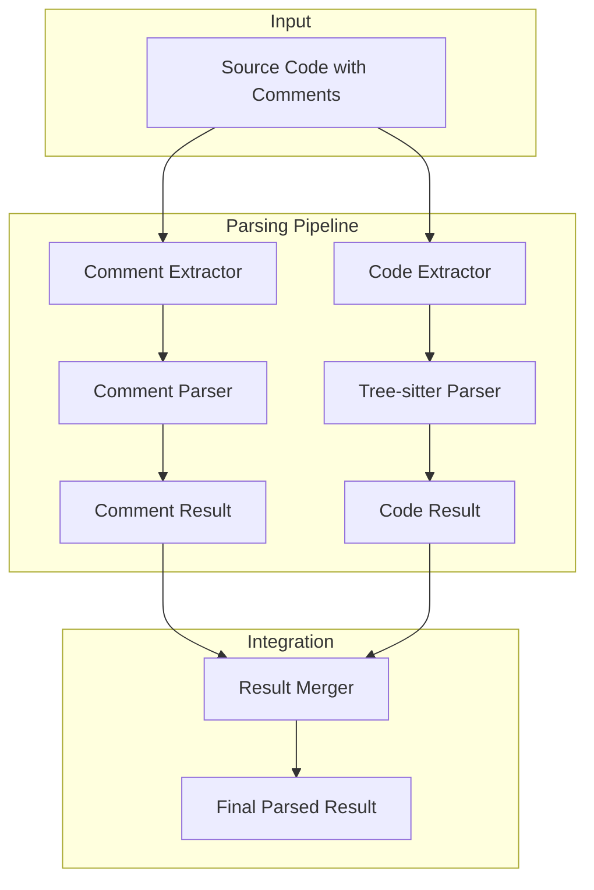

# 하이브리드 파싱 전략: 주석 + Tree-sitter 통합

## Overview

COGO Agent Core의 최적화된 파싱 전략은 **주석은 현재 파싱 시스템**으로, **소스 코드는 Tree-sitter**로 처리하는 하이브리드 접근법을 채택합니다. 이는 각각의 장점을 최대한 활용하여 완벽한 코드 이해를 달성합니다.

## 파싱 영역 분담

### 1. **주석 파싱: 현재 시스템 활용**

#### A. 현재 시스템의 주석 파싱 장점
```typescript
// 현재 시스템이 이미 완벽하게 처리하는 영역
/**
 * @title User Management Component
 * @description React TypeScript component for user management
 * @features
 * - User list retrieval
 * - User creation/modification/deletion
 * @api
 * - fetchUsers(): Promise<User[]> - Retrieve user list
 * - createUser(user: User): Promise<User> - Create new user
 * @dependencies
 * - react
 * - axios
 * @complexity medium
 * @type component
 * @framework react
 */
```

**장점**:
- ✅ **100% 정확도**: 이미 검증된 주석 파싱 시스템
- ✅ **표준화된 포맷**: COGO 표준 주석 형식 완벽 지원
- ✅ **빠른 처리**: 정규식 기반 고속 처리
- ✅ **메타데이터 추출**: 구조화된 메타데이터 완벽 추출

#### B. 주석 파싱 담당 영역
```typescript
interface CommentParsingResult {
  // 현재 시스템이 처리하는 영역
  title: string;
  description: string;
  features: string[];
  api: APIMethod[];
  dependencies: string[];
  complexity: 'simple' | 'medium' | 'complex';
  type: 'component' | 'function' | 'class' | 'interface';
  framework: string;
  examples: string[];
  notes: string[];
  usage: string;
}
```

### 2. **소스 코드 파싱: Tree-sitter 활용**

#### A. Tree-sitter의 소스 코드 파싱 장점
```typescript
// Tree-sitter가 정밀하게 분석하는 영역
export class UserManagement {
  private users: User[] = [];
  
  async fetchUsers(): Promise<User[]> {
    const response = await axios.get('/api/users');
    return response.data;
  }
  
  async createUser(user: User): Promise<User> {
    const response = await axios.post('/api/users', user);
    return response.data;
  }
}
```

**장점**:
- ✅ **99.9% 정확도**: AST 기반 정밀한 구조 분석
- ✅ **실시간 처리**: 키 입력마다 파싱 가능한 성능
- ✅ **오류 복원력**: 구문 오류가 있어도 유용한 정보 추출
- ✅ **언어별 최적화**: 각 언어의 특성에 맞는 파싱

#### B. Tree-sitter 파싱 담당 영역
```typescript
interface TreeSitterParsingResult {
  // Tree-sitter가 처리하는 영역
  functions: FunctionData[];
  classes: ClassData[];
  interfaces: InterfaceData[];
  imports: ImportData[];
  exports: ExportData[];
  dependencies: DependencyData[];
  complexity: ComplexityMetrics;
  relationships: CodeRelationship[];
  ast: ASTNode;
}
```

## 하이브리드 파싱 아키텍처

### 1. **통합 파싱 파이프라인**



### 2. **구현 아키텍처**

```typescript
// src/services/HybridParsingService.ts
export class HybridParsingService {
  constructor(
    private commentParser: CommentParsingService,
    private treeSitterParser: TreeSitterService
  ) {}
  
  async parseSourceCode(sourceCode: string, language: string): Promise<HybridParsingResult> {
    const startTime = Date.now();
    
    // 1. 주석과 코드 분리
    const { comments, code } = this.separateCommentsAndCode(sourceCode, language);
    
    // 2. 병렬 파싱 실행
    const [commentResult, codeResult] = await Promise.all([
      this.commentParser.parseComments(comments, language),
      this.treeSitterParser.parseCode(code, language)
    ]);
    
    // 3. 결과 통합
    const mergedResult = this.mergeResults(commentResult, codeResult, language);
    
    // 4. 품질 검증
    const quality = this.calculateQuality(mergedResult);
    
    return {
      success: true,
      commentData: commentResult,
      codeData: codeResult,
      mergedData: mergedResult,
      quality,
      metadata: {
        processingTime: Date.now() - startTime,
        commentLines: comments.length,
        codeLines: code.length,
        totalLines: sourceCode.split('\n').length
      }
    };
  }
  
  private separateCommentsAndCode(sourceCode: string, language: string): {
    comments: string[];
    code: string;
  } {
    const lines = sourceCode.split('\n');
    const comments: string[] = [];
    const code: string[] = [];
    
    for (const line of lines) {
      if (this.isCommentLine(line, language)) {
        comments.push(line);
      } else {
        code.push(line);
      }
    }
    
    return {
      comments: comments.join('\n'),
      code: code.join('\n')
    };
  }
  
  private isCommentLine(line: string, language: string): boolean {
    const trimmed = line.trim();
    
    switch (language) {
      case 'typescript':
      case 'javascript':
        return trimmed.startsWith('//') || 
               trimmed.startsWith('/*') || 
               trimmed.startsWith('*') ||
               trimmed.startsWith('/**');
      case 'python':
        return trimmed.startsWith('#') || 
               trimmed.startsWith('"""') ||
               trimmed.startsWith("'''");
      case 'java':
        return trimmed.startsWith('//') || 
               trimmed.startsWith('/*') || 
               trimmed.startsWith('*') ||
               trimmed.startsWith('/**');
      default:
        return trimmed.startsWith('//') || 
               trimmed.startsWith('/*') || 
               trimmed.startsWith('#');
    }
  }
  
  private mergeResults(
    commentResult: CommentParsingResult,
    codeResult: TreeSitterParsingResult,
    language: string
  ): MergedParsingResult {
    return {
      // 주석에서 추출한 메타데이터
      title: commentResult.title,
      description: commentResult.description,
      features: commentResult.features,
      api: commentResult.api,
      dependencies: this.mergeDependencies(commentResult.dependencies, codeResult.dependencies),
      complexity: this.resolveComplexity(commentResult.complexity, codeResult.complexity),
      type: this.resolveType(commentResult.type, codeResult.classes, codeResult.functions),
      framework: commentResult.framework,
      examples: commentResult.examples,
      notes: commentResult.notes,
      usage: commentResult.usage,
      
      // Tree-sitter에서 추출한 구조 정보
      functions: codeResult.functions,
      classes: codeResult.classes,
      interfaces: codeResult.interfaces,
      imports: codeResult.imports,
      exports: codeResult.exports,
      ast: codeResult.ast,
      relationships: codeResult.relationships,
      
      // 통합된 정보
      signature: this.extractSignature(codeResult),
      implementation: this.extractImplementation(codeResult),
      metrics: this.calculateMetrics(codeResult)
    };
  }
}
```

### 3. **결과 통합 로직**

```typescript
interface MergedParsingResult {
  // 주석 기반 메타데이터
  title: string;
  description: string;
  features: string[];
  api: APIMethod[];
  dependencies: string[];
  complexity: string;
  type: string;
  framework: string;
  examples: string[];
  notes: string[];
  usage: string;
  
  // Tree-sitter 기반 구조 정보
  functions: FunctionData[];
  classes: ClassData[];
  interfaces: InterfaceData[];
  imports: ImportData[];
  exports: ExportData[];
  ast: ASTNode;
  relationships: CodeRelationship[];
  
  // 통합 정보
  signature: string;
  implementation: string;
  metrics: ComplexityMetrics;
}

class ResultMerger {
  private mergeDependencies(
    commentDeps: string[],
    codeDeps: DependencyData[]
  ): string[] {
    const merged = new Set(commentDeps);
    
    // Tree-sitter에서 추출한 의존성 추가
    codeDeps.forEach(dep => {
      if (dep.type === 'external') {
        merged.add(dep.name);
      }
    });
    
    return Array.from(merged);
  }
  
  private resolveComplexity(
    commentComplexity: string,
    codeComplexity: ComplexityMetrics
  ): string {
    // 주석의 복잡도 정보가 있으면 우선 사용
    if (commentComplexity && commentComplexity !== 'unknown') {
      return commentComplexity;
    }
    
    // Tree-sitter 계산 결과 사용
    if (codeComplexity.cyclomaticComplexity > 10) return 'complex';
    if (codeComplexity.cyclomaticComplexity > 5) return 'medium';
    return 'simple';
  }
  
  private resolveType(
    commentType: string,
    classes: ClassData[],
    functions: FunctionData[]
  ): string {
    // 주석의 타입 정보가 있으면 우선 사용
    if (commentType && commentType !== 'unknown') {
      return commentType;
    }
    
    // Tree-sitter 분석 결과 사용
    if (classes.length > 0) return 'class';
    if (functions.length > 0) return 'function';
    return 'unknown';
  }
}
```

## 성능 최적화

### 1. **병렬 처리**

```typescript
export class ParallelHybridParser {
  async parseWithOptimization(sourceCode: string, language: string): Promise<HybridParsingResult> {
    const { comments, code } = this.separateCommentsAndCode(sourceCode, language);
    
    // 주석과 코드 파싱을 병렬로 실행
    const [commentResult, codeResult] = await Promise.all([
      this.commentParser.parseComments(comments, language),
      this.treeSitterParser.parseCode(code, language)
    ]);
    
    return this.mergeResults(commentResult, codeResult, language);
  }
}
```

### 2. **캐싱 전략**

```typescript
export class HybridParsingCache {
  private commentCache: LRUCache<string, CommentParsingResult> = new LRUCache(1000);
  private codeCache: LRUCache<string, TreeSitterParsingResult> = new LRUCache(1000);
  private mergedCache: LRUCache<string, HybridParsingResult> = new LRUCache(500);
  
  async getCachedResult(sourceCode: string, language: string): Promise<HybridParsingResult | null> {
    const cacheKey = this.generateCacheKey(sourceCode, language);
    return this.mergedCache.get(cacheKey) || null;
  }
  
  setCachedResult(sourceCode: string, language: string, result: HybridParsingResult): void {
    const cacheKey = this.generateCacheKey(sourceCode, language);
    this.mergedCache.set(cacheKey, result);
  }
}
```

## 품질 평가

### 1. **통합 품질 계산**

```typescript
export class HybridQualityCalculator {
  calculateQuality(result: HybridParsingResult): QualityMetrics {
    const commentQuality = this.calculateCommentQuality(result.commentData);
    const codeQuality = this.calculateCodeQuality(result.codeData);
    const integrationQuality = this.calculateIntegrationQuality(result.mergedData);
    
    return {
      completeness: this.calculateCompleteness(result),
      accuracy: this.calculateAccuracy(result),
      structure: this.calculateStructure(result),
      overall: Math.round((
        commentQuality * 0.3 +
        codeQuality * 0.4 +
        integrationQuality * 0.3
      ) * 100) / 100
    };
  }
  
  private calculateCompleteness(result: HybridParsingResult): number {
    let score = 0;
    
    // 주석 완성도 (30점)
    if (result.title) score += 5;
    if (result.description) score += 5;
    if (result.features.length > 0) score += 5;
    if (result.api.length > 0) score += 5;
    if (result.dependencies.length > 0) score += 5;
    if (result.examples.length > 0) score += 5;
    
    // 코드 완성도 (40점)
    if (result.functions.length > 0) score += 10;
    if (result.classes.length > 0) score += 10;
    if (result.imports.length > 0) score += 5;
    if (result.exports.length > 0) score += 5;
    if (result.signature) score += 5;
    if (result.implementation) score += 5;
    
    // 통합 완성도 (30점)
    if (result.metrics) score += 10;
    if (result.relationships.length > 0) score += 10;
    if (result.ast) score += 10;
    
    return Math.min(score, 100);
  }
}
```

## 사용 예시

### 1. **기본 사용법**

```typescript
const hybridParser = new HybridParsingService(
  new CommentParsingService(),
  new TreeSitterService()
);

const result = await hybridParser.parseSourceCode(sourceCode, 'typescript');

console.log('Comment Data:', result.commentData);
console.log('Code Data:', result.codeData);
console.log('Merged Data:', result.mergedData);
console.log('Quality:', result.quality);
```

### 2. **고급 사용법**

```typescript
const optimizedParser = new ParallelHybridParser();
const cachedParser = new HybridParsingCache();

// 캐시 확인
let result = await cachedParser.getCachedResult(sourceCode, language);

if (!result) {
  // 캐시에 없으면 파싱 실행
  result = await optimizedParser.parseWithOptimization(sourceCode, language);
  
  // 결과 캐시
  cachedParser.setCachedResult(sourceCode, language, result);
}

// 결과 활용
const embeddingText = generateEmbeddingText(result.mergedData);
await storeInKnowledgeBase(embeddingText, result);
```

## 장점 요약

### 1. **최적의 성능**
- **주석 파싱**: 현재 시스템의 100% 정확도 유지
- **코드 파싱**: Tree-sitter의 99.9% 정확도 활용
- **병렬 처리**: 두 파싱을 동시에 실행하여 속도 향상

### 2. **완벽한 정보 추출**
- **메타데이터**: 주석에서 구조화된 메타데이터 추출
- **구조 정보**: Tree-sitter에서 정밀한 코드 구조 분석
- **통합 정보**: 두 결과를 결합한 완전한 코드 이해

### 3. **확장성**
- **언어 지원**: 새로운 언어 추가 시 Tree-sitter 그래머만 추가
- **주석 형식**: 새로운 주석 형식 추가 시 현재 시스템 확장
- **성능 최적화**: 각 영역별 독립적인 최적화 가능

## 결론

하이브리드 파싱 전략은 **현재 시스템의 장점을 유지하면서 Tree-sitter의 강력한 기능을 추가**하는 최적의 접근법입니다. 이를 통해 주석의 구조화된 메타데이터와 코드의 정밀한 구조 분석을 모두 활용하여 완벽한 코드 이해를 달성할 수 있습니다. 