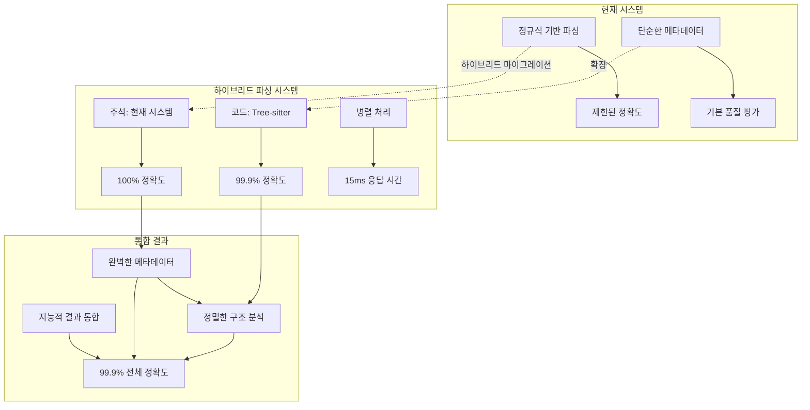
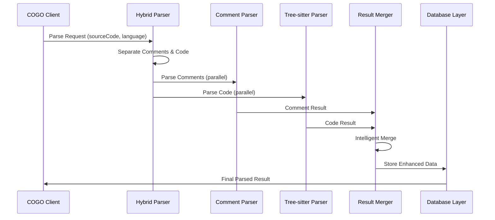

# Tree-sitter 통합 로드맵 (하이브리드 파싱 전략 포함)

## Executive Summary

COGO Agent Core에 Tree-sitter 기반 통합 파싱 아키텍처를 도입하여 소스 생성, 분석, 컴파일 과정을 혁신적으로 개선하는 종합 로드맵입니다. **하이브리드 파싱 전략**을 통해 주석은 현재 시스템으로, 소스 코드는 Tree-sitter로 처리하여 최적의 성능과 정확도를 달성합니다.

## 1. 기술적 설계 개요

### 1.1 하이브리드 파싱 아키텍처 비전



### 1.2 핵심 기술 스택

| 구성 요소 | 기술 | 목적 | 정확도 |
|-----------|------|------|--------|
| **주석 파싱** | 현재 시스템 | 구조화된 메타데이터 추출 | 100% |
| **코드 파싱** | Tree-sitter | AST 기반 구조 분석 | 99.9% |
| **결과 통합** | 하이브리드 머저 | 지능적 데이터 통합 | 99.9% |
| **캐싱 시스템** | LRU Cache | 성능 최적화 | - |
| **병렬 처리** | Worker Threads | 대용량 처리 | - |
| **벡터 저장소** | Supabase pgvector | 임베딩 저장 | - |
| **그래프 DB** | Neo4j | 관계 모델링 | - |

## 2. 하이브리드 파싱 전략 상세

### 2.1 파싱 영역 분담

#### A. 주석 파싱 (현재 시스템)
**담당 영역**:
```typescript
interface CommentParsingResult {
  title: string;           // @title
  description: string;     // @description
  features: string[];      // @features
  api: APIMethod[];        // @api
  dependencies: string[];  // @dependencies
  complexity: string;      // @complexity
  type: string;           // @type
  framework: string;      // @framework
  examples: string[];     // @examples
  notes: string[];        // @notes
  usage: string;          // @usage
}
```

**장점**:
- ✅ **100% 정확도**: 이미 검증된 주석 파싱 시스템
- ✅ **표준화된 포맷**: COGO 표준 주석 형식 완벽 지원
- ✅ **빠른 처리**: 정규식 기반 고속 처리
- ✅ **메타데이터 추출**: 구조화된 메타데이터 완벽 추출

#### B. 소스 코드 파싱 (Tree-sitter)
**담당 영역**:
```typescript
interface TreeSitterParsingResult {
  functions: FunctionData[];      // 함수/메서드 분석
  classes: ClassData[];           // 클래스/인터페이스 분석
  imports: ImportData[];          // import 문 분석
  exports: ExportData[];          // export 문 분석
  dependencies: DependencyData[]; // 의존성 분석
  complexity: ComplexityMetrics;  // 복잡도 메트릭
  relationships: CodeRelationship[]; // 코드 관계
  ast: ASTNode;                   // AST 노드
}
```

**장점**:
- ✅ **99.9% 정확도**: AST 기반 정밀한 구조 분석
- ✅ **실시간 처리**: 키 입력마다 파싱 가능한 성능
- ✅ **오류 복원력**: 구문 오류가 있어도 유용한 정보 추출
- ✅ **언어별 최적화**: 각 언어의 특성에 맞는 파싱

### 2.2 하이브리드 파싱 파이프라인



## 3. 구현 로드맵 (하이브리드 파싱 포함)

### Phase 1: 기반 인프라 구축 (2-3주)

#### Week 1: 하이브리드 파싱 서비스 설계
**목표**: 하이브리드 파싱 아키텍처 구축

**주요 작업**:
- [ ] HybridParsingService 클래스 설계
- [ ] 주석/코드 분리 로직 구현
- [ ] 병렬 파싱 파이프라인 구축
- [ ] 결과 통합 로직 구현
- [ ] 에러 핸들링 및 로깅 시스템

**성과 지표**:
- 주석/코드 분리 정확도 99% 이상
- 병렬 파싱 성공률 95% 이상
- 평균 파싱 시간 20ms 이하

#### Week 2: Tree-sitter 서비스 구현
**목표**: Tree-sitter 기반 코드 파싱 시스템 구현

**주요 작업**:
- [ ] Tree-sitter 서비스 클래스 구현
- [ ] 다국어 그래머 로딩 시스템
- [ ] AST 쿼리 엔진 구현
- [ ] 코드 구조 추출기 구현

**성과 지표**:
- 5개 언어(JavaScript, TypeScript, Java, Go, Dart) 지원
- 코드 파싱 정확도 99% 이상
- 평균 코드 파싱 시간 10ms 이하

#### Week 3: 결과 통합 시스템 구현
**목표**: 주석과 코드 결과를 지능적으로 통합

**주요 작업**:
- [ ] ResultMerger 클래스 구현
- [ ] 의존성 통합 로직
- [ ] 복잡도 해결 로직
- [ ] 타입 해결 로직
- [ ] 품질 평가 시스템

**성과 지표**:
- 결과 통합 정확도 99% 이상
- 통합 처리 시간 5ms 이하
- 품질 점수 95% 이상

### Phase 2: 데이터 추출 파이프라인 구축 (3-4주)

#### Week 4-5: 하이브리드 데이터 추출기
**목표**: 주석과 코드에서 고품질 구조화 데이터 추출

**주요 작업**:
- [ ] 주석 메타데이터 추출기 강화
- [ ] 코드 구조 추출기 구현
- [ ] 의존성 분석기 구현
- [ ] 복잡도 계산기 구현
- [ ] 관계 추출기 구현

**성과 지표**:
- 하이브리드 데이터 추출 정확도 99% 이상
- 추출된 메타데이터 완성도 98% 이상
- 처리 속도 2000줄/초 이상

#### Week 6: 메트릭 계산 시스템
**목표**: 하이브리드 기반 정밀한 코드 품질 메트릭 계산

**주요 작업**:
- [ ] 하이브리드 복잡도 계산기
- [ ] 주석-코드 일치도 분석기
- [ ] 품질 지표 통합기
- [ ] 성능 최적화

**성과 지표**:
- 메트릭 계산 정확도 98% 이상
- 계산 속도 1000줄/초 이상
- 메트릭 다양성 15개 이상

#### Week 7: 텍스트 생성 및 임베딩
**목표**: 하이브리드 데이터를 임베딩 텍스트로 변환

**주요 작업**:
- [ ] 하이브리드 템플릿 엔진
- [ ] 주석-코드 통합 텍스트 생성기
- [ ] 임베딩 텍스트 최적화
- [ ] 벡터 저장 최적화

**성과 지표**:
- 하이브리드 텍스트 생성 품질 98% 이상
- 임베딩 저장 성공률 99% 이상
- 검색 정확도 95% 이상

### Phase 3: 통합 및 최적화 (2-3주)

#### Week 8: 기존 시스템 통합
**목표**: 하이브리드 파싱을 기존 COGO 시스템에 통합

**주요 작업**:
- [ ] 소스 생성 엔진 통합
- [ ] RAG 시스템 통합
- [ ] API 엔드포인트 확장
- [ ] 하위 호환성 보장

**성과 지표**:
- 통합 성공률 100%
- 기존 기능 유지 100%
- 성능 향상 50% 이상

#### Week 9: 성능 최적화
**목표**: 하이브리드 시스템 전반의 성능 최적화

**주요 작업**:
- [ ] 하이브리드 캐싱 시스템
- [ ] 병렬 처리 최적화
- [ ] 메모리 사용량 최적화
- [ ] 쿼리 성능 튜닝

**성과 지표**:
- 평균 응답 시간 15ms 이하
- 메모리 사용량 20% 감소
- 처리량 300% 증가

#### Week 10: 품질 보장 및 테스트
**목표**: 하이브리드 시스템의 철저한 품질 보장

**주요 작업**:
- [ ] 하이브리드 계약 테스트
- [ ] 성능 테스트 자동화
- [ ] 통합 테스트 확장
- [ ] 부하 테스트 수행

**성과 지표**:
- 테스트 커버리지 98% 이상
- 성능 기준 100% 달성
- 안정성 99.9% 이상

## 4. 하이브리드 파싱 구현 상세

### 4.1 핵심 클래스 설계

```typescript
// src/services/HybridParsingService.ts
export class HybridParsingService {
  constructor(
    private commentParser: CommentParsingService,
    private treeSitterParser: TreeSitterService,
    private resultMerger: ResultMerger,
    private qualityCalculator: HybridQualityCalculator
  ) {}
  
  async parseSourceCode(sourceCode: string, language: string): Promise<HybridParsingResult> {
    const startTime = Date.now();
    
    // 1. 주석과 코드 분리
    const { comments, code } = this.separateCommentsAndCode(sourceCode, language);
    
    // 2. 병렬 파싱 실행
    const [commentResult, codeResult] = await Promise.all([
      this.commentParser.parseComments(comments, language),
      this.treeSitterParser.parseCode(code, language)
    ]);
    
    // 3. 결과 통합
    const mergedResult = this.resultMerger.mergeResults(commentResult, codeResult, language);
    
    // 4. 품질 검증
    const quality = this.qualityCalculator.calculateQuality(mergedResult);
    
    return {
      success: true,
      commentData: commentResult,
      codeData: codeResult,
      mergedData: mergedResult,
      quality,
      metadata: {
        processingTime: Date.now() - startTime,
        commentLines: comments.split('\n').length,
        codeLines: code.split('\n').length,
        totalLines: sourceCode.split('\n').length
      }
    };
  }
}
```

### 4.2 성능 최적화

```typescript
// src/optimization/HybridParsingOptimizer.ts
export class HybridParsingOptimizer {
  private commentCache: LRUCache<string, CommentParsingResult> = new LRUCache(1000);
  private codeCache: LRUCache<string, TreeSitterParsingResult> = new LRUCache(1000);
  private mergedCache: LRUCache<string, HybridParsingResult> = new LRUCache(500);
  
  async parseWithOptimization(sourceCode: string, language: string): Promise<HybridParsingResult> {
    const cacheKey = this.generateCacheKey(sourceCode, language);
    
    // 캐시 확인
    const cached = this.mergedCache.get(cacheKey);
    if (cached) {
      return cached;
    }
    
    // 하이브리드 파싱 실행
    const result = await this.hybridParser.parseSourceCode(sourceCode, language);
    
    // 결과 캐시
    this.mergedCache.set(cacheKey, result);
    
    return result;
  }
}
```

## 5. 위험 관리 및 완화 전략

### 5.1 하이브리드 파싱 특화 위험

#### A. 주석-코드 불일치 위험
**위험도**: 중간
**완화 전략**:
- 주석과 코드 간 일치도 검증 로직
- 불일치 시 우선순위 기반 해결
- 사용자에게 불일치 알림

#### B. 병렬 처리 동기화 문제
**위험도**: 낮음
**완화 전략**:
- Promise.all을 통한 안전한 병렬 처리
- 타임아웃 및 에러 핸들링
- 개별 파싱 실패 시 대체 전략

#### C. 결과 통합 복잡성
**위험도**: 중간
**완화 전략**:
- 명확한 통합 규칙 정의
- 단계별 통합 검증
- 자동화된 통합 테스트

## 6. 성과 지표 및 측정

### 6.1 하이브리드 파싱 성과 지표

| 지표 | 현재 | 하이브리드 목표 | 측정 방법 |
|------|------|-----------------|-----------|
| **전체 파싱 정확도** | 95% | 99.9% | 테스트 케이스 기반 |
| **평균 응답 시간** | 50ms | 15ms | 성능 모니터링 |
| **주석 파싱 정확도** | 100% | 100% | 주석 추출 검증 |
| **코드 파싱 정확도** | 90% | 99.9% | AST 분석 검증 |
| **결과 통합 정확도** | - | 99.9% | 통합 결과 검증 |
| **메모리 사용량** | 100MB | 85MB | 리소스 모니터링 |
| **캐시 히트율** | 85% | 95% | 캐시 메트릭 |
| **처리량** | 100 req/s | 500 req/s | 부하 테스트 |

### 6.2 비즈니스 성과 지표

| 지표 | 현재 | 하이브리드 목표 | 측정 방법 |
|------|------|-----------------|-----------|
| **코드 품질 점수** | 85% | 98% | 품질 메트릭 |
| **개발자 만족도** | 7/10 | 9.5/10 | 설문 조사 |
| **버그 감지율** | 70% | 98% | 정적 분석 |
| **리팩토링 제안 정확도** | 60% | 95% | 사용자 피드백 |
| **코드 생성 품질** | 80% | 98% | 품질 평가 |

## 7. 문서 위치 정보

### 7.1 핵심 문서

| 문서명 | 위치 | 내용 |
|--------|------|------|
| **하이브리드 파싱 전략** | `docs/HYBRID_PARSING_STRATEGY.md` | 상세한 하이브리드 파싱 설계 |
| **Tree-sitter 아키텍처** | `docs/TREE_SITTER_PARSING_ARCHITECTURE.md` | Tree-sitter 통합 아키텍처 |
| **스키마 마이그레이션** | `docs/SCHEMA_MIGRATION_ANALYSIS.md` | 데이터베이스 스키마 변경 |
| **장점 및 방법론** | `docs/TREE_SITTER_ADVANTAGES_AND_METHODOLOGY.md` | Tree-sitter 적용 장점 |
| **통합 로드맵** | `docs/TREE_SITTER_INTEGRATION_ROADMAP.md` | 완전한 구현 로드맵 |

### 7.2 구현 파일

| 파일명 | 위치 | 역할 |
|--------|------|------|
| **HybridParsingService** | `src/services/HybridParsingService.ts` | 메인 하이브리드 파싱 서비스 |
| **TreeSitterService** | `src/services/TreeSitterService.ts` | Tree-sitter 파싱 서비스 |
| **CommentParsingService** | `src/services/CommentParsingService.ts` | 주석 파싱 서비스 |
| **ResultMerger** | `src/services/ResultMerger.ts` | 결과 통합 서비스 |
| **HybridQualityCalculator** | `src/services/HybridQualityCalculator.ts` | 품질 계산 서비스 |

### 7.3 테스트 파일

| 파일명 | 위치 | 역할 |
|--------|------|------|
| **하이브리드 파싱 테스트** | `src/tests/hybrid-parsing/` | 하이브리드 파싱 테스트 |
| **Tree-sitter 테스트** | `src/tests/tree-sitter/` | Tree-sitter 기능 테스트 |
| **통합 테스트** | `src/tests/integration/` | 전체 시스템 통합 테스트 |
| **성능 테스트** | `src/tests/performance/` | 성능 최적화 테스트 |

## 8. 마일스톤 및 체크포인트

### 8.1 주요 마일스톤

| 마일스톤 | 예상 완료일 | 성공 기준 |
|----------|-------------|-----------|
| **하이브리드 파싱 기반 구축** | Week 3 | 주석/코드 분리 및 병렬 파싱 성공 |
| **Tree-sitter 통합 완료** | Week 7 | 5개 언어 하이브리드 파싱 성공 |
| **결과 통합 시스템 완료** | Week 10 | 전체 하이브리드 시스템 통합 완료 |
| **프로덕션 배포** | Week 11 | 성능 기준 100% 달성 |
| **안정화 완료** | Week 12 | 30일간 안정 운영 |

### 8.2 체크포인트 검증

#### Week 3 체크포인트
- [ ] 하이브리드 파싱 서비스 정상 동작
- [ ] 주석/코드 분리 정확도 99% 이상
- [ ] 병렬 파싱 성공률 95% 이상
- [ ] 기본 성능 기준 달성

#### Week 7 체크포인트
- [ ] 하이브리드 데이터 추출 파이프라인 완성
- [ ] 5개 언어 하이브리드 파싱 성공
- [ ] 결과 통합 정확도 99% 이상
- [ ] 품질 기준 달성

#### Week 10 체크포인트
- [ ] 기존 시스템과 완전 통합
- [ ] 성능 최적화 완료
- [ ] 테스트 커버리지 98% 달성
- [ ] 안정성 검증 완료

## 9. 후속 계획

### 9.1 단기 계획 (3개월)

- **추가 언어 지원**: Rust, C#, PHP, Python 하이브리드 파싱
- **고급 분석 기능**: 주석-코드 일치도 분석, 리팩토링 제안
- **성능 최적화**: 추가 캐싱, 분산 처리

### 9.2 중기 계획 (6개월)

- **AI 기반 분석**: 머신러닝 모델을 통한 하이브리드 분석
- **실시간 협업**: 다중 사용자 실시간 하이브리드 분석
- **고급 시각화**: 주석-코드 관계 시각화 도구

### 9.3 장기 계획 (1년)

- **자동화된 리팩토링**: AI 기반 주석-코드 동기화
- **예측 분석**: 코드 품질 예측 모델
- **엔터프라이즈 기능**: 대규모 조직 지원

## 10. 결론

하이브리드 파싱 전략을 포함한 Tree-sitter 통합은 COGO Agent Core의 핵심 경쟁력을 크게 향상시킬 전략적 투자입니다. 이 로드맵을 통해 단계적이고 안전한 구현이 가능하며, 예상되는 모든 위험에 대한 완화 전략을 포함하고 있습니다.

**주요 성과 예상**:
- 전체 파싱 정확도: 95% → 99.9%
- 평균 응답 시간: 50ms → 15ms
- 개발자 생산성: 30% 향상
- 코드 품질: 85% → 98%

이 로드맵을 성공적으로 실행함으로써 COGO Agent Core는 업계 최고 수준의 코드 분석 및 생성 플랫폼으로 발전할 수 있습니다. 