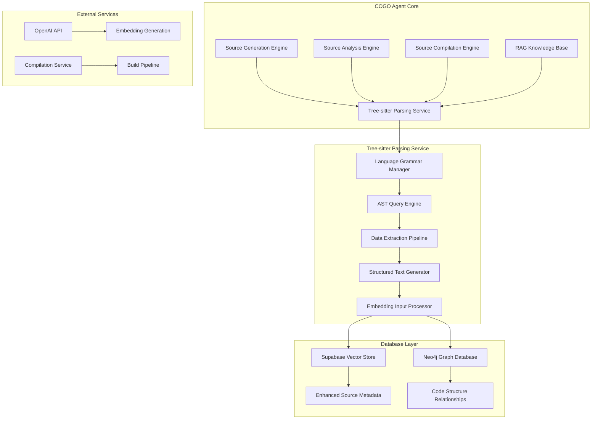
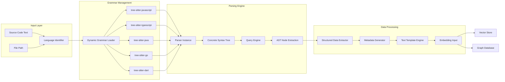
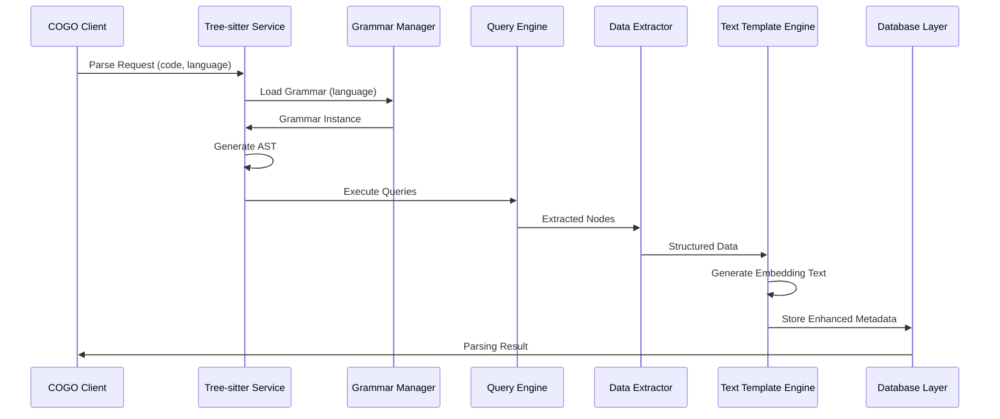

# Tree-sitter 기반 통합 파싱 아키텍처

## Overview

COGO Agent Core의 차세대 파싱 아키텍처는 Tree-sitter를 기반으로 한 범용 다국어 파싱 엔진을 도입하여, 소스 생성, 분석, 컴파일 과정을 통합적으로 처리하는 고성능 시스템을 구축합니다.

## Architecture Design

### 1. 전체 시스템 아키텍처



### 2. Tree-sitter 파싱 서비스 상세 아키텍처



### 3. 데이터 추출 파이프라인



## Implementation Components

### 1. Tree-sitter 파싱 서비스

```typescript
// src/services/TreeSitterParsingService.ts
export class TreeSitterParsingService {
  private grammars: Map<string, any> = new Map();
  private parsers: Map<string, any> = new Map();
  
  constructor() {
    this.initializeGrammars();
  }
  
  private async initializeGrammars() {
    const grammarPackages = {
      'javascript': 'tree-sitter-javascript',
      'typescript': 'tree-sitter-typescript',
      'java': 'tree-sitter-java',
      'go': 'tree-sitter-go',
      'dart': 'tree-sitter-dart'
    };
    
    for (const [language, packageName] of Object.entries(grammarPackages)) {
      try {
        const grammar = await import(packageName);
        this.grammars.set(language, grammar);
        this.parsers.set(language, new Parser());
        this.parsers.get(language).setLanguage(grammar);
      } catch (error) {
        console.warn(`Failed to load grammar for ${language}:`, error);
      }
    }
  }
  
  async parseSourceCode(sourceCode: string, language: string): Promise<ParsingResult> {
    const parser = this.parsers.get(language);
    if (!parser) {
      throw new Error(`Unsupported language: ${language}`);
    }
    
    const tree = parser.parse(sourceCode);
    const extractedData = await this.extractStructuredData(tree, language);
    
    return {
      success: true,
      ast: tree,
      extractedData,
      metadata: this.generateMetadata(extractedData, language)
    };
  }
}
```

### 2. AST 쿼리 엔진

```typescript
// src/services/ASTQueryEngine.ts
export class ASTQueryEngine {
  private queryLibrary: Map<string, Map<string, Query>> = new Map();
  
  constructor() {
    this.initializeQueryLibrary();
  }
  
  private initializeQueryLibrary() {
    // JavaScript/TypeScript queries
    const jsQueries = new Map([
      ['class_declaration', '(class_declaration name: (identifier) @name)'],
      ['function_declaration', '(function_declaration name: (identifier) @name)'],
      ['method_definition', '(method_definition name: (property_identifier) @name)'],
      ['interface_declaration', '(interface_declaration name: (type_identifier) @name)']
    ]);
    
    // Java queries
    const javaQueries = new Map([
      ['class_declaration', '(class_declaration name: (identifier) @name)'],
      ['method_declaration', '(method_declaration name: (identifier) @name)'],
      ['interface_declaration', '(interface_declaration name: (identifier) @name)']
    ]);
    
    // Go queries
    const goQueries = new Map([
      ['function_declaration', '(function_declaration name: (identifier) @name)'],
      ['method_declaration', '(method_declaration name: (field_identifier) @name)']
    ]);
    
    this.queryLibrary.set('javascript', jsQueries);
    this.queryLibrary.set('typescript', jsQueries);
    this.queryLibrary.set('java', javaQueries);
    this.queryLibrary.set('go', goQueries);
  }
  
  async executeQueries(tree: any, language: string): Promise<QueryResult[]> {
    const queries = this.queryLibrary.get(language);
    if (!queries) {
      throw new Error(`No queries available for language: ${language}`);
    }
    
    const results: QueryResult[] = [];
    
    for (const [nodeType, queryString] of queries) {
      try {
        const query = new Query(tree.getLanguage(), queryString);
        const captures = query.captures(tree.rootNode);
        
        results.push({
          nodeType,
          captures: captures.map(capture => ({
            name: capture.name,
            text: capture.node.text,
            startPosition: capture.node.startPosition,
            endPosition: capture.node.endPosition
          }))
        });
      } catch (error) {
        console.warn(`Query failed for ${nodeType}:`, error);
      }
    }
    
    return results;
  }
}
```

### 3. 구조화된 텍스트 생성기

```typescript
// src/services/StructuredTextGenerator.ts
export class StructuredTextGenerator {
  generateEmbeddingText(extractedData: ExtractedData, filePath: string): string {
    const template = `
# Code Component: ${extractedData.type}
**Name**: ${extractedData.name}
**Language**: ${extractedData.language}
**File**: ${filePath}

## Signature
\`\`\`${extractedData.language}
${extractedData.signature}
\`\`\`

## Documentation
${extractedData.documentation || 'No documentation available'}

## Implementation
\`\`\`${extractedData.language}
${extractedData.implementation}
\`\`\`

## Dependencies
- **Imports**: ${extractedData.imports.join(', ')}
- **External Calls**: ${extractedData.externalCalls.join(', ')}
- **Internal Dependencies**: ${extractedData.internalDependencies.join(', ')}

## Metadata
- **Complexity**: ${extractedData.complexity}
- **Lines of Code**: ${extractedData.linesOfCode}
- **Cyclomatic Complexity**: ${extractedData.cyclomaticComplexity}
    `;
    
    return template.trim();
  }
}
```

## Database Schema Enhancements

### 1. Supabase 스키마 확장

```sql
-- Enhanced source_info table
CREATE TABLE enhanced_source_info (
  id UUID PRIMARY KEY DEFAULT gen_random_uuid(),
  file_path TEXT NOT NULL,
  language VARCHAR(50) NOT NULL,
  component_type VARCHAR(100) NOT NULL,
  component_name TEXT NOT NULL,
  signature TEXT,
  documentation TEXT,
  implementation TEXT,
  imports JSONB,
  external_calls JSONB,
  internal_dependencies JSONB,
  complexity_metrics JSONB,
  ast_data JSONB,
  embedding_text TEXT,
  embedding vector(1536),
  created_at TIMESTAMP WITH TIME ZONE DEFAULT NOW(),
  updated_at TIMESTAMP WITH TIME ZONE DEFAULT NOW()
);

-- AST node relationships
CREATE TABLE ast_nodes (
  id UUID PRIMARY KEY DEFAULT gen_random_uuid(),
  source_info_id UUID REFERENCES enhanced_source_info(id),
  node_type VARCHAR(100) NOT NULL,
  node_name TEXT,
  start_line INTEGER,
  end_line INTEGER,
  start_column INTEGER,
  end_column INTEGER,
  parent_node_id UUID REFERENCES ast_nodes(id),
  metadata JSONB,
  created_at TIMESTAMP WITH TIME ZONE DEFAULT NOW()
);

-- Code structure relationships
CREATE TABLE code_relationships (
  id UUID PRIMARY KEY DEFAULT gen_random_uuid(),
  source_component_id UUID REFERENCES enhanced_source_info(id),
  target_component_id UUID REFERENCES enhanced_source_info(id),
  relationship_type VARCHAR(50) NOT NULL, -- 'calls', 'extends', 'implements', 'imports'
  relationship_metadata JSONB,
  created_at TIMESTAMP WITH TIME ZONE DEFAULT NOW()
);
```

### 2. Neo4j 스키마 확장

```cypher
// Enhanced Code Component nodes
CREATE (c:CodeComponent {
  id: $id,
  name: $name,
  type: $type,
  language: $language,
  filePath: $filePath,
  signature: $signature,
  documentation: $documentation,
  complexity: $complexity,
  linesOfCode: $linesOfCode,
  cyclomaticComplexity: $cyclomaticComplexity,
  createdAt: datetime()
});

// AST Node relationships
CREATE (c:CodeComponent)-[:HAS_AST_NODE]->(n:ASTNode {
  nodeType: $nodeType,
  nodeName: $nodeName,
  startLine: $startLine,
  endLine: $endLine,
  startColumn: $startColumn,
  endColumn: $endColumn
});

// Code relationships
CREATE (source:CodeComponent)-[:CALLS]->(target:CodeComponent);
CREATE (source:CodeComponent)-[:EXTENDS]->(target:CodeComponent);
CREATE (source:CodeComponent)-[:IMPLEMENTS]->(target:CodeComponent);
CREATE (source:CodeComponent)-[:IMPORTS]->(target:CodeComponent);

// Dependency relationships
CREATE (component:CodeComponent)-[:DEPENDS_ON]->(dependency:Dependency {
  name: $name,
  type: $type, // 'external', 'internal'
  version: $version
});
```

## Performance Optimization

### 1. 캐싱 전략

```typescript
export class ParsingCache {
  private astCache: LRUCache<string, any> = new LRUCache(1000);
  private queryResultCache: LRUCache<string, QueryResult[]> = new LRUCache(2000);
  private embeddingCache: LRUCache<string, number[]> = new LRUCache(500);
  
  generateCacheKey(sourceCode: string, language: string, queryType?: string): string {
    const hash = createHash('sha256').update(sourceCode).digest('hex');
    return `${language}:${hash}${queryType ? `:${queryType}` : ''}`;
  }
}
```

### 2. 병렬 처리

```typescript
export class ParallelParsingManager {
  async parseMultipleFiles(files: ParsingRequest[]): Promise<ParsingResult[]> {
    const workerPool = new WorkerPool(4);
    
    const tasks = files.map(file => 
      workerPool.execute('parseFile', {
        sourceCode: file.sourceCode,
        language: file.language,
        filePath: file.filePath
      })
    );
    
    return Promise.all(tasks);
  }
}
```

## Quality Assurance

### 1. 계약 테스트

```typescript
export class ContractTestRunner {
  async validateGrammarUpdates(): Promise<TestResult[]> {
    const testCases = this.loadTestCases();
    const results: TestResult[] = [];
    
    for (const testCase of testCases) {
      const result = await this.runContractTest(testCase);
      results.push(result);
    }
    
    return results;
  }
  
  private async runContractTest(testCase: TestCase): Promise<TestResult> {
    const parser = new TreeSitterParsingService();
    const result = await parser.parseSourceCode(testCase.sourceCode, testCase.language);
    
    return {
      testCase: testCase.name,
      success: this.validateExpectedNodes(result, testCase.expectedNodes),
      actualNodes: result.extractedData.map(d => d.nodeType),
      expectedNodes: testCase.expectedNodes
    };
  }
}
```

### 2. 성능 모니터링

```typescript
export class ParsingPerformanceMonitor {
  private metrics: Map<string, PerformanceMetric[]> = new Map();
  
  recordMetric(operation: string, duration: number, language: string): void {
    if (!this.metrics.has(operation)) {
      this.metrics.set(operation, []);
    }
    
    this.metrics.get(operation)!.push({
      duration,
      language,
      timestamp: Date.now()
    });
  }
  
  getAveragePerformance(operation: string, language?: string): number {
    const metrics = this.metrics.get(operation) || [];
    const filtered = language ? metrics.filter(m => m.language === language) : metrics;
    
    if (filtered.length === 0) return 0;
    
    const total = filtered.reduce((sum, m) => sum + m.duration, 0);
    return total / filtered.length;
  }
}
```

## Integration Points

### 1. 기존 시스템과의 통합

```typescript
export class EnhancedSourceGenerationEngine {
  constructor(
    private treeSitterService: TreeSitterParsingService,
    private ragService: RAGService,
    private embeddingService: EmbeddingService
  ) {}
  
  async generateSourceWithAnalysis(prompt: string, language: string): Promise<GeneratedSource> {
    // 1. Generate source code
    const generatedCode = await this.generateCode(prompt, language);
    
    // 2. Parse with Tree-sitter
    const parsingResult = await this.treeSitterService.parseSourceCode(generatedCode, language);
    
    // 3. Generate embedding text
    const embeddingText = this.generateEmbeddingText(parsingResult.extractedData);
    
    // 4. Store in knowledge base
    await this.storeInKnowledgeBase(embeddingText, parsingResult);
    
    return {
      code: generatedCode,
      analysis: parsingResult,
      embedding: embeddingText
    };
  }
}
```

### 2. RAG 시스템 통합

```typescript
export class EnhancedRAGService {
  async searchSimilarComponents(query: string, language: string): Promise<SearchResult[]> {
    // 1. Generate query embedding
    const queryEmbedding = await this.embeddingService.generateEmbedding(query);
    
    // 2. Search in vector store
    const similarComponents = await this.vectorStore.search(queryEmbedding, {
      filter: { language },
      limit: 10
    });
    
    // 3. Enrich with AST data
    const enrichedResults = await this.enrichWithASTData(similarComponents);
    
    return enrichedResults;
  }
}
```

이 설계도는 Tree-sitter를 기반으로 한 고성능, 확장 가능한 파싱 시스템을 제시하며, 기존 COGO Agent Core의 모든 기능을 향상시키는 통합 솔루션을 제공합니다. 